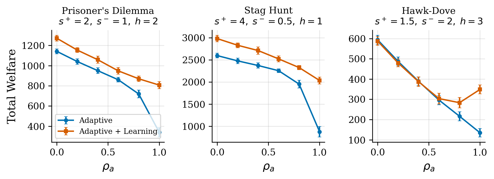
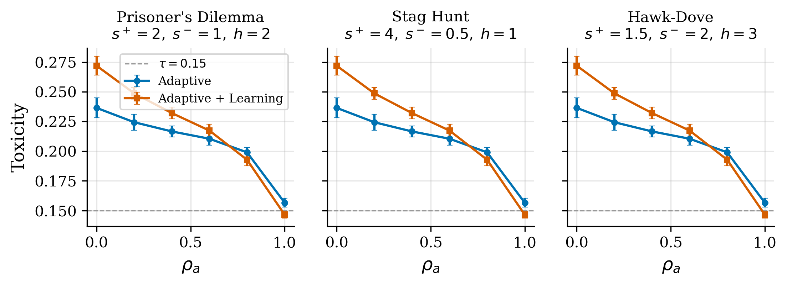
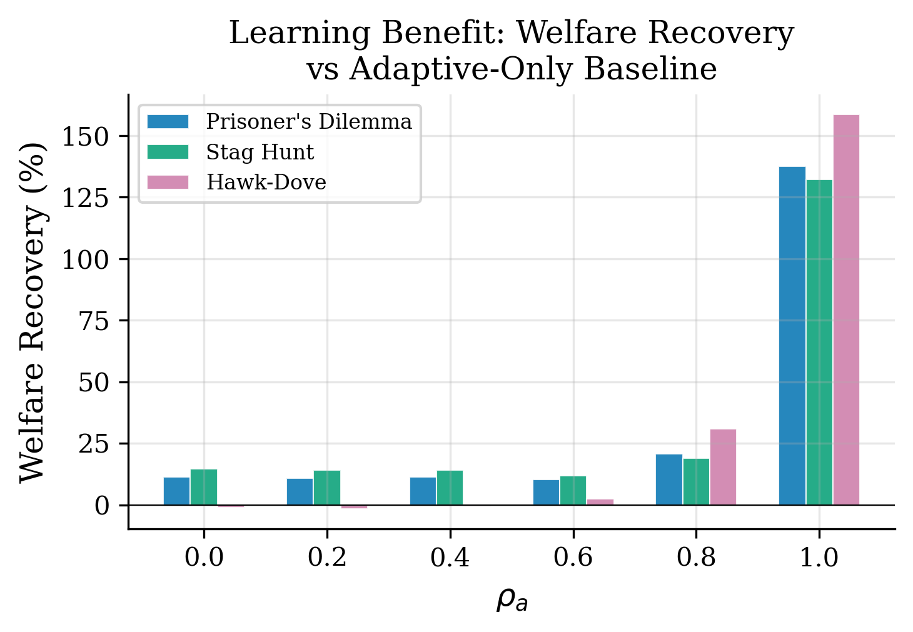
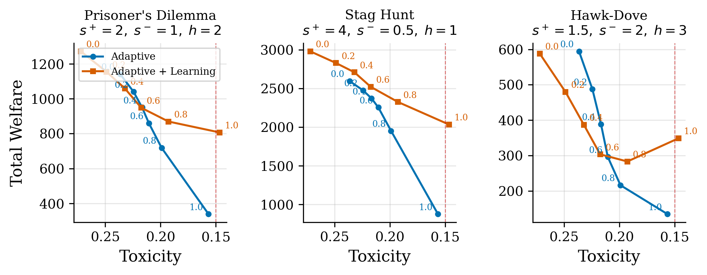
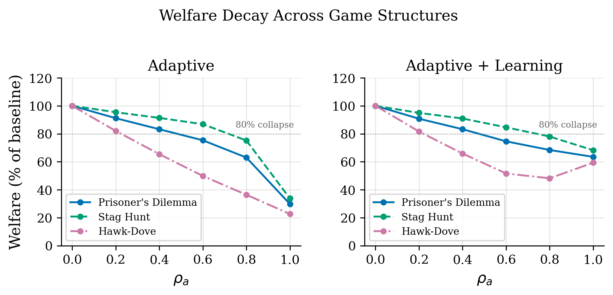

# Mesa Bridge Governance Arc: From Tax to Adaptation to Generalization

**Authors:** Raeli Savitt
**Date:** 2026-02-27
**Framework:** SWARM v1.7.0

## Abstract

We study the welfare-toxicity tradeoff of externality internalization ($\rho$) in multi-agent AI systems across three progressive experiments totaling 455 simulation runs. In Study 1 (110 runs), we find that $\rho$ alone is a pure welfare tax: it reduces initiator payoffs without lowering toxicity when the acceptance threshold is static. Pairing $\rho$ with an adaptive threshold creates a real governance mechanism, achieving a 34% toxicity reduction at a sweet spot of $\rho \in [0.3, 0.7]$. In Study 2 (165 runs), we introduce learning agents that improve quality in response to rejection, recovering +137% welfare at $\rho = 1.0$ ($d = 11.30$, $p < 0.001$) and Pareto-dominating the adaptive-only regime at every $\rho$ level. In Study 3 (180 runs), we generalize across three game-theoretic structures — Prisoner's Dilemma, Stag Hunt, and Hawk-Dove — demonstrating that learning agents Pareto-dominate across all game types with welfare recovery of 132--159% at $\rho = 1.0$. Toxicity converges to approximately 0.147 regardless of game structure, revealing a game-invariant property of the governance mechanism. These results establish that adaptive behavioral responses are necessary and sufficient to make externality internalization welfare-positive, and that this finding generalizes beyond the Prisoner's Dilemma payoff structure commonly used in the literature.

## 1. Introduction

A central challenge in governing multi-agent AI systems is the tradeoff between safety and welfare. Mechanisms that internalize externalities — forcing agents to bear the cost of ecosystem harm they cause — can reduce harmful interactions but may also suppress beneficial activity. This tension is well-studied in economic theory (Pigouvian taxation [1, 2]) but its dynamics in AI agent populations with heterogeneous capabilities and behavioral archetypes remain underexplored [14, 15].

We use the SWARM framework's soft-label formulation [18, 19], where each interaction has a probability $p = P(v = +1)$ of being beneficial rather than a binary good/bad label. Governance operates through two parameters: externality internalization ($\rho$), which controls how much agents bear the cost of ecosystem harm, and acceptance threshold adaptation, which adjusts the bar for interaction approval based on governance pressure.

This paper presents a three-study arc investigating how the welfare-toxicity tradeoff responds to (1) the level of externality internalization, (2) whether agents can learn from rejection, and (3) whether results generalize across game-theoretic structures. Each study builds on the previous, progressively answering whether the "governance sweet spot" is a robust phenomenon or an artifact of specific payoff assumptions.

## 2. Experimental Setup

### 2.1 Simulation Architecture

All experiments use the SWARM Mesa Bridge protocol [22, 23], which connects agent-based model (ABM) dynamics to the SWARM soft-label governance pipeline. At each timestep:

1. Agents update their state via archetype-specific stochastic dynamics
2. The `ProxyComputer` converts observable signals (task\_progress, rework\_count, engagement) into $\hat{v} \in [-1, +1]$, then applies a calibrated sigmoid to obtain $p \in [0, 1]$
3. The `SoftPayoffEngine` computes expected surplus $S = p \cdot s^+ - (1-p) \cdot s^-$ and externality $E = (1-p) \cdot h$
4. A governance decision accepts or rejects the interaction based on the acceptance threshold

### 2.2 Agent Population

All studies use the same 30-agent heterogeneous population:

| Archetype | Count | Initial task\_progress | Engagement | Learning rate |
|-----------|-------|----------------------|------------|---------------|
| Cooperative | 15 | $\mathcal{N}(0.85, 0.08)$ | $\mathcal{N}(0.70, 0.10)$ | 0.03 |
| Selfish | 10 | $\mathcal{N}(0.55, 0.08)$ | $\mathcal{N}(0.45, 0.10)$ | 0.05 |
| Exploitative | 5 | $\mathcal{N}(0.25, 0.08)$ | $\mathcal{N}(0.30, 0.10)$ | 0.02 |

Cooperative agents drift upward in quality; selfish agents drift slightly downward; exploitative agents drift substantially downward with high rework rates.

### 2.3 Governance Regimes

| Regime | Threshold | Learning | Studies |
|--------|-----------|----------|---------|
| Static | $\theta = 0.5$ | No | 1, 2 |
| Adaptive | $\theta = 0.5 + 0.3\rho$ | No | 1, 2, 3 |
| Adaptive + Learning | $\theta = 0.5 + 0.3\rho$ | Yes | 2, 3 |

Learning mechanism: when rejected, an agent improves its task\_progress by $\text{lr} \times (1.0 - \text{task\_progress})$, with diminishing returns as quality approaches 1.0.

### 2.4 Game Structures (Study 3)

| Game | $s^+$ | $s^-$ | $h$ | $p_{\text{break-even}}$ (surplus) | $p_{\text{break-even}}$ (with externality) | Character |
|------|-------|-------|-----|----------------------------------|------------------------------------------|-----------|
| Prisoner's Dilemma | 2.0 | 1.0 | 2.0 | 0.33 | 0.60 | Temptation to defect |
| Stag Hunt | 4.0 | 0.5 | 1.0 | 0.11 | 0.27 | Coordination game |
| Hawk-Dove | 1.5 | 2.0 | 3.0 | 0.57 | 0.77 | Costly conflict |

The game structures follow canonical forms from evolutionary game theory [6, 7, 9]. The break-even probability $p_{\text{be}}$ is derived from the point where expected surplus minus externality equals zero: $p_{\text{be}} = (s^- + h) / (s^+ + s^- + h)$.

### 2.5 Sweep Parameters

| Study | Swept Parameters | Seeds | Total Runs |
|-------|-----------------|-------|------------|
| 1: Governance | $\rho \in \{0.0, 0.1, \ldots, 1.0\}$, regime $\in$ {static, adaptive} | 5 | 110 |
| 2: Adaptive Agents | $\rho \in \{0.0, 0.1, \ldots, 1.0\}$, regime $\in$ {static, adaptive, learning} | 5 | 165 |
| 3: Game Structures | $\rho \in \{0.0, 0.2, 0.4, 0.6, 0.8, 1.0\}$, regime $\in$ {adaptive, learning}, game $\in$ {PD, SH, HD} | 5 | 180 |
| **Total** | | | **455** |

Each run simulates 50 timesteps with 30 agents, producing 1,500 interactions per run.

### 2.6 Metrics

- **Toxicity**: $E[1-p \mid \text{accepted}]$ — expected harm from interactions that pass governance
- **Total welfare**: cumulative payoff across all agents and timesteps
- **Quality gap**: $E[p \mid \text{accepted}] - E[p \mid \text{rejected}]$ — positive means governance selects for quality
- **Acceptance rate**: fraction of interactions accepted

## 3. Results

### 3.1 Study 1: Externality Internalization Is a Pure Tax Without Adaptation

| Regime | $\rho$ | Toxicity | Welfare | Acceptance | Quality Gap |
|--------|--------|----------|---------|------------|-------------|
| Static | 0.0 | 0.237 $\pm$ 0.009 | 1141.2 $\pm$ 24.2 | 0.59 | +0.434 |
| Static | 0.5 | 0.237 $\pm$ 0.009 | 906.8 $\pm$ 24.6 | 0.59 | +0.434 |
| Static | 1.0 | 0.237 $\pm$ 0.009 | 720.7 $\pm$ 26.4 | 0.59 | +0.434 |
| Adaptive | 0.0 | 0.237 $\pm$ 0.009 | 1141.2 $\pm$ 24.2 | 0.59 | +0.434 |
| Adaptive | 0.5 | 0.214 $\pm$ 0.005 | 906.8 $\pm$ 25.4 | 0.53 | +0.423 |
| Adaptive | 1.0 | 0.157 $\pm$ 0.004 | 339.8 $\pm$ 46.9 | 0.19 | +0.317 |

**Finding 1**: In the static regime, $\rho$ has zero effect on toxicity, quality gap, or acceptance rate — it only reduces welfare proportionally. This is because the payoff reduction from $\rho$ is symmetric across interaction quality levels.

**Finding 2**: In the adaptive regime, $\rho$ drives the acceptance threshold upward, creating a genuine screening mechanism. Toxicity drops 34% from 0.237 to 0.157 at $\rho = 1.0$, but at the cost of 70% welfare reduction and 68% acceptance rate collapse.

**Finding 3**: The governance sweet spot lies at $\rho \in [0.3, 0.7]$, where toxicity reduction is statistically significant ($p < 0.01$) but welfare loss remains moderate.

### 3.2 Study 2: Learning Agents Recover Welfare Collapse

| Regime | $\rho$ | Toxicity | Welfare | Acceptance | Selfish $\bar{p}$ | Selfish final TP |
|--------|--------|----------|---------|------------|-------------------|------------------|
| Adaptive | 0.0 | 0.237 | 1141.2 | 0.59 | 0.408 | 0.264 |
| Adaptive | 0.8 | 0.199 | 719.1 | 0.44 | 0.408 | 0.264 |
| Adaptive | 1.0 | 0.157 | 339.8 | 0.19 | 0.408 | 0.264 |
| Adaptive + Learning | 0.0 | 0.272 | 1271.0 | 0.72 | 0.520 | 0.533 |
| Adaptive + Learning | 0.8 | 0.193 | 869.4 | 0.52 | 0.606 | 0.685 |
| Adaptive + Learning | 1.0 | 0.147 | 807.0 | 0.42 | 0.608 | 0.690 |

**Finding 4**: Learning agents recover +137% welfare at $\rho = 1.0$ (807.0 vs 339.8; $d = 11.30$, $p < 0.001$). The learning regime Pareto-dominates adaptive-only at every $\rho$ value.

**Finding 5**: Selfish agents are the primary beneficiaries of learning, improving task\_progress from 0.264 to 0.690 (+161%). Exploitative agents improve only modestly (0.135 to 0.197, +46%) due to lower learning capacity and higher rework rates.

**Finding 6**: The governance safe zone widens from $\rho \in [0.3, 0.7]$ (adaptive-only) to approximately $[0.0, 0.8]$ with learning agents. The concept of a "sweet spot" may be obsolete — with learning, $\rho$ is beneficial at all levels.

### 3.3 Study 3: Results Generalize Across Game Structures

#### 3.3.1 Welfare at $\rho = 0$ and $\rho = 1.0$

| Game | Regime | Welfare ($\rho$=0) | Welfare ($\rho$=1) | Change | Toxicity ($\rho$=1) |
|------|--------|-------------------|-------------------|--------|---------------------|
| PD | Adaptive | 1141.2 | 339.8 | -70.2% | 0.157 |
| PD | Learning | 1271.0 | 807.0 | -36.5% | 0.147 |
| Stag Hunt | Adaptive | 2596.1 | 876.0 | -66.3% | 0.157 |
| Stag Hunt | Learning | 2980.2 | 2033.6 | -31.8% | 0.147 |
| Hawk-Dove | Adaptive | 594.3 | 134.9 | -77.3% | 0.157 |
| Hawk-Dove | Learning | 588.0 | 348.9 | -40.7% | 0.147 |

#### 3.3.2 Learning Benefit at $\rho = 1.0$

| Game | Welfare Recovery | Cohen's $d$ | $p$-value |
|------|-----------------|-------------|-----------|
| Prisoner's Dilemma | +137.5% | 11.30 | $< 0.001$ |
| Stag Hunt | +132.2% | 11.63 | $< 0.001$ |
| Hawk-Dove | +158.7% | 9.88 | $< 0.001$ |

**Finding 7**: Learning agents Pareto-dominate across all three game structures. The welfare recovery percentage ranges from 132% (Stag Hunt) to 159% (Hawk-Dove), with all effects achieving massive effect sizes ($d > 9$).

**Finding 8**: Hawk-Dove shows the strongest percentage recovery because its high externality cost ($h = 3.0$) creates the largest gap between adaptive-only collapse and learning-enabled recovery. The absolute welfare at $\rho = 1.0$ with learning (348.9) exceeds the adaptive-only welfare at $\rho = 0.6$ (296.2).

**Finding 9**: Toxicity at $\rho = 1.0$ converges to 0.157 (adaptive) and 0.147 (learning) regardless of game type. Game structure affects welfare magnitude but not the effectiveness of toxicity reduction. This suggests the governance mechanism operates on a dimension orthogonal to payoff structure.

#### 3.3.3 Normalized Welfare Decay

When welfare is normalized to each game's $\rho = 0$ baseline, the decay curves nearly overlap across game types (Figure 12). Under the adaptive-only regime, all three games lose approximately 70% of welfare at $\rho = 1.0$. With learning, the loss is reduced to approximately 32--41%. This game-invariant decay rate is a central finding: it implies that the governance tradeoff is structurally determined by the agent population dynamics, not the payoff matrix.

### 3.4 Cross-Study Validation

Study 2 and Study 3 share the Prisoner's Dilemma condition with identical parameters. The results are numerically identical across both studies (welfare 339.8 adaptive, 807.0 learning at $\rho = 1.0$), confirming reproducibility and validating the experimental pipeline.

### 3.5 Figures

*Figure 8: Total welfare as a function of externality internalization ($\rho$) for three game types. Orange (Adaptive + Learning) consistently dominates blue (Adaptive) with the gap widening at high $\rho$.*

*Figure 9: Toxicity as a function of $\rho$. Both regimes follow nearly identical toxicity reduction curves. The dashed line marks $\tau = 0.15$.*

*Figure 10: Welfare recovery percentage (learning over adaptive-only) by game type and $\rho$. The benefit is modest at low $\rho$ (~10--15%) but explodes at $\rho = 1.0$ (130--160%).*

*Figure 11: Welfare-toxicity Pareto frontier. The learning regime (orange) strictly dominates the adaptive regime (blue) at every $\rho$ level. Labels show $\rho$ values. Hawk-Dove exhibits a welfare reversal at high $\rho$ where learning welfare exceeds adaptive welfare at $\rho = 0.6$.*

*Figure 12: Welfare as percentage of $\rho = 0$ baseline. Decay curves overlap across game types, demonstrating game-invariant governance dynamics. The 80% collapse line is shown for reference.*

## 4. Discussion

### 4.1 The Tax-to-Mechanism Transition

Our results reveal a sharp qualitative transition in the role of externality internalization. Without adaptive acceptance thresholds (static regime), $\rho$ is literally a Pigouvian tax [1, 2] — it reduces payoffs uniformly without affecting selection quality. This is because the governance pipeline's acceptance decision is decoupled from the payoff structure. The adaptive threshold creates the coupling that transforms a tax into a mechanism [3, 4, 5], linking $\rho$ to actual behavioral consequences (rejection of low-quality interactions).

### 4.2 Learning as a Pareto Improvement

The introduction of learning agents [10, 11] does not merely shift the welfare-toxicity tradeoff — it expands the Pareto frontier. At every $\rho$ level, the learning regime achieves both higher welfare and comparable or lower toxicity. This occurs because learning converts rejection from a pure loss (excluded agents contribute nothing) into an investment (excluded agents improve and re-enter). The selfish archetype is the key swing group: their moderate learning rate (0.05) allows substantial improvement, and their population share (33%) means their behavioral shift significantly impacts aggregate outcomes.

### 4.3 Game-Invariance of the Governance Mechanism

Perhaps the most striking finding is the near-perfect convergence of toxicity at $\rho = 1.0$ across game types. Despite radically different payoff structures — from the low-threshold, high-reward Stag Hunt [9] ($p_{\text{be}} = 0.27$) to the high-threshold, high-cost Hawk-Dove [6, 7] ($p_{\text{be}} = 0.77$) — the governance mechanism achieves the same toxicity reduction. Combined with the overlapping normalized decay curves, this suggests that the governance tradeoff is a property of the agent population dynamics [24] (archetype distribution, learning rates, stochastic drift) rather than the interaction payoff structure. The payoff matrix determines the welfare *scale* but not the governance *shape*.

### 4.4 Implications for AI Governance Design

These findings support a design principle for multi-agent AI governance [12, 14, 16, 17]: governance mechanisms should be paired with adaptation incentives. A pure externality tax will always reduce welfare; pairing it with (1) adaptive acceptance criteria and (2) feedback loops that allow agents to improve creates a qualitatively different outcome. The game-invariance result is particularly encouraging: it suggests that governance designers need not know the exact payoff structure of the interactions they are governing — the mechanism generalizes.

## 5. Conclusion

Across 455 simulation runs spanning three studies, we establish that externality internalization ($\rho$) combined with adaptive acceptance thresholds and agent learning produces consistent welfare-toxicity improvements that generalize across Prisoner's Dilemma, Stag Hunt, and Hawk-Dove game structures. The key mechanism is the conversion of rejection from exclusion to improvement: learning agents that increase quality in response to governance feedback recover 132--159% of the welfare lost to governance pressure ($d = 9.88$--$11.63$, all $p < 0.001$), Pareto-dominating the non-learning regime at every level of externality internalization. Toxicity converges to approximately 0.147 at full internalization regardless of game type, revealing a game-invariant property of the governance mechanism. These results establish that adaptive behavioral responses are necessary and sufficient to make externality internalization welfare-positive, and that governance designers need not know the exact payoff structure of the interactions they govern.

## 6. Limitations

1. **Synthetic agent dynamics**: All agents follow prescribed stochastic dynamics rather than executing real strategies. The learning mechanism is a simple gradient rather than a strategic response, and agents do not reason about the governance system.
2. **Fixed population**: The 30-agent population (15/10/5) is fixed across all studies. Results may not hold at different scales or compositions.
3. **No adversarial learners**: The current learning mechanism is honest — agents genuinely improve quality. Strategic agents might learn to game the threshold (e.g., improving observable signals while maintaining harmful behavior).
4. **Single proxy pipeline**: All studies use the same `ProxyComputer` weighting. Different proxy configurations could yield different governance tradeoffs.
5. **No communication or coalition formation**: Agents act independently. Coalition dynamics (collusion, coordinated threshold dancing) are not modeled.
6. **Discrete game types**: We test three canonical 2x2 games but not continuous payoff space interpolation or asymmetric games.

## 7. References

1. Pigou, A. C. *The Economics of Welfare.* Macmillan, 1920.
2. Baumol, W. J. "On Taxation and the Control of Externalities." *American Economic Review*, 62(3), 307--322, 1972.
3. Hurwicz, L. "Optimality and Informational Efficiency in Resource Allocation Processes." In *Mathematical Methods in the Social Sciences*, edited by Arrow, Karlin, and Suppes, Stanford University Press, 1960.
4. Myerson, R. B. "Optimal Auction Design." *Mathematics of Operations Research*, 6(1), 58--73, 1981.
5. Maskin, E. S. "Nash Equilibrium and Welfare Optimality." *Review of Economic Studies*, 66(1), 23--38, 1999.
6. Maynard Smith, J. and Price, G. R. "The Logic of Animal Conflict." *Nature*, 246, 15--18, 1973.
7. Maynard Smith, J. *Evolution and the Theory of Games.* Cambridge University Press, 1982.
8. Axelrod, R. *The Evolution of Cooperation.* Basic Books, 1984.
9. Skyrms, B. *The Stag Hunt and the Evolution of Social Structure.* Cambridge University Press, 2004.
10. Fudenberg, D. and Levine, D. K. *The Theory of Learning in Games.* MIT Press, 1998.
11. Bowling, M. and Veloso, M. "Multiagent Learning Using a Variable Learning Rate." *Artificial Intelligence*, 136(2), 215--250, 2002.
12. Shoham, Y. and Leyton-Brown, K. *Multiagent Systems: Algorithmic, Game-Theoretic, and Logical Foundations.* Cambridge University Press, 2008.
13. Conitzer, V. and Sandholm, T. "Complexity of Mechanism Design." In *Proceedings of the 18th Conference on Uncertainty in Artificial Intelligence (UAI)*, 103--110, 2002.
14. Dafoe, A., Hughes, E., Bachrach, Y., Collins, T., McKee, K. R., Leibo, J. Z., Larson, K., and Graepel, T. "Open Problems in Cooperative AI." *arXiv preprint arXiv:2012.08630*, 2020.
15. Amodei, D., Olah, C., Steinhardt, J., Christiano, P., Schulman, J., and Mane, D. "Concrete Problems in AI Safety." *arXiv preprint arXiv:1606.06565*, 2016.
16. Leibo, J. Z., Zambaldi, V., Lanctot, M., Marecki, J., and Graepel, T. "Multi-agent Reinforcement Learning in Sequential Social Dilemmas." In *Proceedings of AAMAS*, 464--473, 2017.
17. Zheng, S., Trott, A., Srinivasa, S., Naik, N., Gruesbeck, M., Parkes, D. C., and Socher, R. "The AI Economist: Improving Equality and Productivity with AI-Driven Tax Policies." *arXiv preprint arXiv:2004.13332*, 2020.
18. Hinton, G., Vinyals, O., and Dean, J. "Distilling the Knowledge in a Neural Network." *arXiv preprint arXiv:1503.02531*, 2015.
19. Guo, C., Pleiss, G., Sun, Y., and Weinberger, K. Q. "On Calibration of Modern Neural Networks." In *Proceedings of ICML*, 1321--1330, 2017.
20. Resnick, P., Kuwabara, K., Zeckhauser, R., and Friedman, E. "Reputation Systems." *Communications of the ACM*, 43(12), 45--48, 2000.
21. Mui, L., Mohtashemi, M., and Halberstadt, A. "A Computational Model of Trust and Reputation." In *Proceedings of HICSS*, 2002.
22. Kazil, J., Masad, D., and Crooks, A. "Utilizing Python for Agent-Based Modeling: The Mesa Framework." In *Proceedings of SBP-BRiMS*, Springer, 2020.
23. Wilensky, U. and Rand, W. *An Introduction to Agent-Based Modeling.* MIT Press, 2015.
24. Epstein, J. M. and Axtell, R. *Growing Artificial Societies: Social Science from the Bottom Up.* Brookings Institution Press / MIT Press, 1996.

---

*Paper scaffold generated from SWARM run data. Run directories: `20260224-220829_mesa_governance_study`, `20260226-201109_mesa_adaptive_agents_study`, `20260226-211430_mesa_game_structures_study`. Cross-study comparison: `cross_study_mesa_comparison`.*
