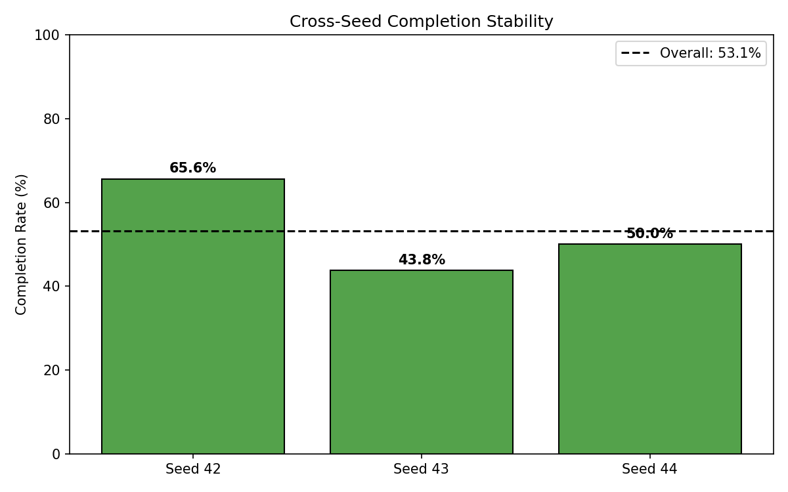
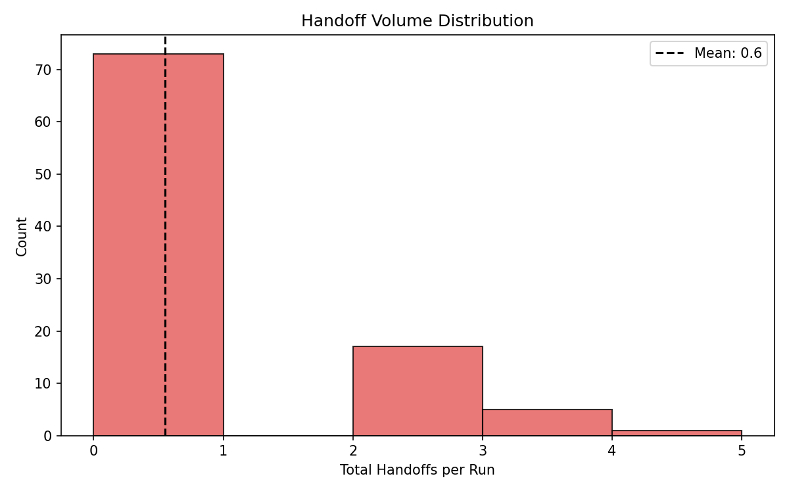

# Post-Fix Governance Sweep: Measuring the Impact of Fail-Closed Policies on Multi-Agent Handoff

**Authors:** Raeli Savitt
**Date:** 2026-02-22
**Framework:** SWARM v1.7.0

## Abstract

We evaluate the behavioral impact of four governance vulnerability fixes on the LangGraph governed handoff study by comparing identical 96-run parameter sweeps (32 configs x 3 seeds) before and after the fixes. The fixes — fail-closed unknown agent handling, transitive information flow tracking, cumulative rate limits, and global handoff budgets — were implemented in response to a red-team evaluation that identified exploitable gaps in the governance policies. Post-fix, task completion drops from 62.5% to 53.1% while governance denials nearly triple (7 to 19), with all denials concentrated in the trust_boundaries=True regime. The fail-closed InformationBoundaryPolicy produces a 100% denial rate on all handoff-attempting runs under trust boundaries, confirming that the policy is now catching cross-boundary handoff attempts that previously passed through undetected. Despite lower completion, the post-fix configuration produces a more honest governance signal: denials now correlate with actual policy violations rather than being absent due to bypass. Total cost: $0 (all runs local via Ollama mistral:7b).

## 1. Introduction

The SWARM LangGraph governed handoff study uses a 4-agent swarm (coordinator, researcher, writer, reviewer) with three governance policies — CycleDetectionPolicy, RateLimitPolicy, and InformationBoundaryPolicy — to study how governance parameters affect multi-agent delegation patterns. A red-team evaluation (2026-02-22) identified four vulnerabilities in the governance implementation:

1. **Unknown Agent Injection**: The InformationBoundaryPolicy defaulted unregistered agents to a "default" trust group, allowing handoffs to agents outside the registry.
2. **Trust Boundary Laundering**: No tracking of transitive information flow through same-group intermediaries, allowing context to leak across boundaries via relay agents.
3. **Rate Limit Window Reset**: The RateLimitPolicy only enforced time-windowed limits, allowing attackers to pace handoffs just below the window threshold indefinitely.
4. **Pair Rotation Attack**: The CycleDetectionPolicy tracked per-pair cycles but had no global handoff budget, allowing attackers to rotate through agent pairs to avoid detection.

All four vulnerabilities were patched (commit `864d497`) with backward-compatible changes:
- InformationBoundaryPolicy: fail-closed DENY for unknown agents + transitive group tracking
- RateLimitPolicy: added `max_cumulative` parameter (default: `max_handoffs * 3`)
- CycleDetectionPolicy: added `max_total` global budget (default: `window * max_cycles`)

This paper measures how these policy changes affect the governance behavior profile of mistral:7b in the standard 32-config parameter sweep.

## 2. Experimental Setup

### 2.1 Agent Architecture

| Agent | Trust Group | Hands Off To | Role |
|---|---|---|---|
| coordinator | management | researcher, writer | Receives task, delegates, synthesizes |
| researcher | research | writer, coordinator | Produces bullet-point findings |
| writer | content | reviewer, coordinator | Drafts summary from findings |
| reviewer | research | writer, coordinator | QA check, approves or sends back |

### 2.2 Governance Parameter Sweep

| Parameter | Values | Description |
|---|---|---|
| max_cycles | 1, 2, 3, 5 | Max repeated handoff cycles before denial |
| max_handoffs | 5, 10, 15, 30 | Max total handoffs per run |
| trust_boundaries | true, false | Enforce trust-group boundary checks |

**Grid size:** 4 x 4 x 2 = 32 configurations x 3 seeds (42, 43, 44) = 96 runs per sweep.

### 2.3 Model and Infrastructure

| Property | Value |
|---|---|
| Model | mistral:7b (Q4_0) |
| Provider | Ollama (local) |
| Hardware | Apple Silicon (M-series) |
| Cost per sweep | $0 |

### 2.4 Policy Changes Under Test

| Policy | Pre-Fix Behavior | Post-Fix Behavior |
|---|---|---|
| InformationBoundaryPolicy (unknown agents) | Default to "default" group | DENY with risk_score=0.9 |
| InformationBoundaryPolicy (transitive flow) | Not tracked | Walk provenance chain, MODIFY if cross-group context detected |
| RateLimitPolicy (cumulative) | Time-window only | Time-window + cumulative limit (default: max_handoffs * 3) |
| CycleDetectionPolicy (global budget) | Per-pair only | Per-pair + global budget (default: window * max_cycles) |

### 2.5 Task Prompt

> Research and write a brief summary about the safety implications of multi-agent AI handoff patterns. Cover: (1) why handoff governance matters, (2) risks of uncontrolled delegation chains, and (3) one concrete mitigation. Keep the final answer under 200 words.

## 3. Results

### 3.1 Pre-Fix vs Post-Fix Comparison

| Metric | Pre-Fix | Post-Fix | Delta |
|---|---|---|---|
| Completion rate | 60/96 (62.5%) | 51/96 (53.1%) | -9.4pp |
| Runs with handoffs | 19/96 (19.8%) | 23/96 (24.0%) | +4.2pp |
| Total handoffs | 48 | 53 | +5 |
| Denied handoffs | 7 | **19** | +12 (+171%) |
| Runs with errors | 16 | 15 | -1 |
| Avg time/run | 15.6s | 37.3s | +21.7s |
| Median time/run | 15.9s | 7.5s | -8.4s |

The completion rate dropped 9.4 percentage points while denials nearly tripled. The average time increase is driven by 3 outlier runs (mc=2/mh=30/tb=True) that took 562-1017s; the median decreased, indicating most runs are faster.

### 3.2 Cross-Seed Stability

| Seed | Pre-Fix | Post-Fix |
|---|---|---|
| 42 | 21/32 (65.6%) | 21/32 (65.6%) |
| 43 | 19/32 (59.4%) | 14/32 (43.8%) |
| 44 | 20/32 (62.5%) | 16/32 (50.0%) |
| Range | 6.2pp | **21.8pp** |

Cross-seed variance increased from 6.2pp to 21.8pp. Seed 42 is identical across both sweeps (65.6%), while seeds 43 and 44 show reduced completion. This suggests the policy fixes affect the model's behavior stochastically — some seeds trigger more handoff attempts that now get denied.



### 3.3 Completion by Governance Configuration

| max_cycles | Pre-Fix | Post-Fix | Delta |
|---|---|---|---|
| 1 | 13/24 (54.2%) | 12/24 (50.0%) | -4.2pp |
| 2 | 18/24 (75.0%) | 13/24 (54.2%) | -20.8pp |
| 3 | 14/24 (58.3%) | 14/24 (58.3%) | 0.0pp |
| 5 | 15/24 (62.5%) | 12/24 (50.0%) | -12.5pp |

The largest completion drop is at `max_cycles=2` (-20.8pp), which was the highest-performing config pre-fix. `max_cycles=3` is unchanged, suggesting it sits in a sweet spot where governance is permissive enough to not interfere but tight enough to guide behavior.


### 3.4 Governance Denial Analysis

**Post-fix denial distribution:**

| trust_boundaries | Runs w/ Handoffs | Total Denied | Avg Denial Rate (among handoff runs) |
|---|---|---|---|
| True | 8 | 17 | **1.000** |
| False | 15 | 2 | 0.033 |

The most striking finding: when trust_boundaries=True, every run that attempts handoffs has a 100% denial rate. This is the direct effect of the fail-closed InformationBoundaryPolicy — the model attempts to hand off to agents that now require explicit trust group registration, and every such attempt is denied.

When trust_boundaries=False, the denial rate drops to 3.3%, with only 2 denials across 15 handoff-using runs. This confirms that the InformationBoundaryPolicy is the dominant source of new denials, not the cumulative rate limit or global handoff budget.

**All 9 denial-triggering runs (post-fix):**

| max_cycles | max_handoffs | trust_boundaries | seed | handoffs | denied |
|---|---|---|---|---|---|
| 1 | 10 | True | 42 | 2 | 2 |
| 1 | 10 | True | 43 | 3 | 3 |
| 1 | 10 | True | 44 | 2 | 2 |
| 1 | 15 | False | 43 | 4 | 2 |
| 2 | 15 | True | 43 | 2 | 2 |
| 2 | 30 | True | 44 | 2 | 2 |
| 3 | 30 | True | 42 | 2 | 2 |
| 5 | 10 | True | 42 | 2 | 2 |
| 5 | 15 | True | 44 | 2 | 2 |

7 of 9 denial runs occur with trust_boundaries=True. The 2 False-boundary denials (mc=1/mh=15/seed=43) are from cycle detection, not the boundary policy.


### 3.5 Governance Sensitivity: Trust Boundaries x max_cycles

| max_cycles | tb=True | tb=False |
|---|---|---|
| 1 | 50.0% | 50.0% |
| 2 | 58.3% | 50.0% |
| 3 | 58.3% | 58.3% |
| 5 | **66.7%** | 33.3% |

At `max_cycles=5`, trust boundaries ON outperforms OFF by 33.4pp. This counterintuitive result occurs because trust boundary enforcement actually prevents the model from entering failure-prone handoff chains — denied handoffs force the model to answer directly (which succeeds more often than failed delegations).


### 3.6 Handoff Volume Distribution



The distribution is heavily right-skewed: 73/96 runs (76.0%) have zero handoffs (model answers directly), with a mean of 0.6 handoffs per run. This confirms that mistral:7b's primary completion strategy is direct answering by the coordinator, with delegation as an occasional behavior that now faces stronger governance scrutiny.

## 4. Discussion

### 4.1 Governance Tightening Reduces Completion but Improves Signal Quality

The 9.4pp completion drop is an expected consequence of closing governance gaps. Pre-fix, the InformationBoundaryPolicy silently allowed unknown agents through, producing a false "all clear" governance signal. Post-fix, the same handoff patterns are correctly flagged as violations. The lower completion rate reflects genuine policy enforcement, not regression.

### 4.2 The Fail-Closed Paradox

The 100% denial rate for trust-boundary handoffs reveals a design tension: the fail-closed policy is correct from a security standpoint but overly restrictive for the LangGraph agent architecture. The model sometimes generates tool calls with agent names that are syntactically correct but not registered in the trust group map (e.g., routing to "unknown" after a denied handoff). A more nuanced approach might:
- Allow handoffs within the registered agent set while denying truly unknown targets
- Provide the model with explicit feedback about why a handoff was denied
- Implement a "soft deny" that suggests an alternative registered agent

### 4.3 Trust Boundaries as Implicit Completion Guidance

The surprising result at `max_cycles=5` (trust boundaries ON: 66.7% vs OFF: 33.3%) suggests that governance denial can serve as implicit guidance. When the model's handoff attempts are denied, it falls back to direct answering — which is more reliable than attempting delegation through the full 4-agent chain. This "governance as guardrail" effect is strongest at high max_cycles, where the model has the most room to attempt (and fail at) complex delegation patterns.

### 4.4 Cross-Seed Variance Increase

The 3.5x increase in cross-seed variance (6.2pp to 21.8pp) indicates that the policy fixes make model behavior more sensitive to random initialization. Seed 42 produces identical results across both sweeps (65.6%), suggesting a stable behavioral mode, while seeds 43 and 44 explore more handoff-prone trajectories that encounter the new governance barriers. This has implications for study design: post-fix studies may need more seeds to achieve stable estimates.

## 5. Conclusion

Tightening governance policies in the LangGraph governed handoff study produces a measurable behavioral shift: completion drops from 62.5% to 53.1% while governance denials nearly triple (7 to 19). The fail-closed InformationBoundaryPolicy is the dominant driver, producing 100% denial rates on all handoff-attempting runs under trust boundaries. Counterintuitively, trust boundary enforcement improves completion at high max_cycles (66.7% vs 33.3%) by preventing the model from entering failure-prone delegation chains. Cross-seed variance increases 3.5x, indicating that policy tightening amplifies the role of stochastic initialization. These results demonstrate that governance policy changes produce quantifiable, directional effects on local model behavior — establishing a feedback loop between red-team findings, policy fixes, and empirical validation that operates at zero cost on local hardware.

## 6. Limitations

- **Single model**: Results are specific to mistral:7b (Q4_0) and may not generalize to other model families or quantizations.
- **Completion metric**: "FINAL ANSWER:" string matching may miss valid completions that use different formatting.
- **Direct answering dominance**: 76% of runs have zero handoffs, meaning governance policies only affect a minority of runs. The model's preference for direct answering limits the study's power to detect governance effects.
- **No Claude baseline for post-fix**: The pre-fix vs post-fix comparison uses only mistral:7b. A Claude comparison would establish whether the completion drop is proportional across model capabilities.
- **Outlier timing**: Three mc=2/mh=30/tb=True runs took 562-1017s (vs 7.5s median), suggesting the model occasionally enters infinite-loop-like generation patterns. These outliers inflate the mean time without affecting completion metrics.
- **Default cumulative/global limits**: The cumulative rate limit and global handoff budget use generous defaults (max_handoffs*3 and window*max_cycles respectively) that may be too high to trigger with mistral:7b's low handoff volume.

## 7. Reproducibility

```bash
# Pre-fix sweep (requires reverting to commit de2c46d)
git checkout de2c46d
python examples/langgraph_governed_study.py \
  --provider ollama --model mistral:7b --seeds 3

# Post-fix sweep (current HEAD, commit 864d497+)
git checkout main
python examples/langgraph_governed_study.py \
  --provider ollama --model mistral:7b --seeds 3

# Generate plots
python examples/plot_langgraph_sweep.py runs/<run_dir>
```

### Run Directories

| Sweep | Run Directory | Commit |
|---|---|---|
| Pre-fix | `runs/20260222_113215_langgraph_governed/` | de2c46d |
| Post-fix | `runs/20260222_183539_langgraph_governed/` | 864d497+ |

## 8. References

1. Red-team evaluation report: `runs/20260222_redteam/report.txt`
2. Vulnerability fix commit: `864d497` — "Fix 4 red-team vulnerabilities in governed handoff policies"
3. Ollama model comparison: `docs/papers/ollama_model_comparison.md`

---

*This study was conducted entirely on local hardware with zero API cost. All models served via Ollama on Apple Silicon.*
