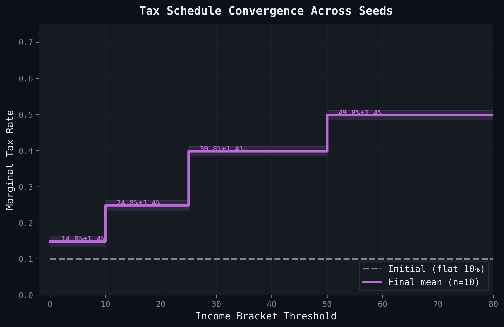
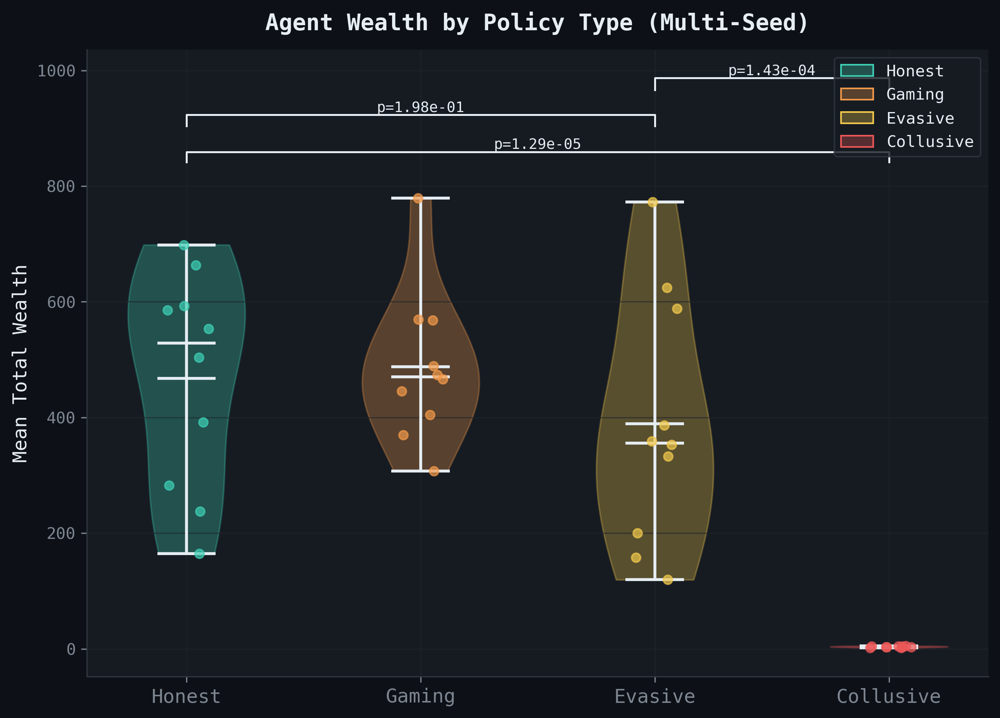
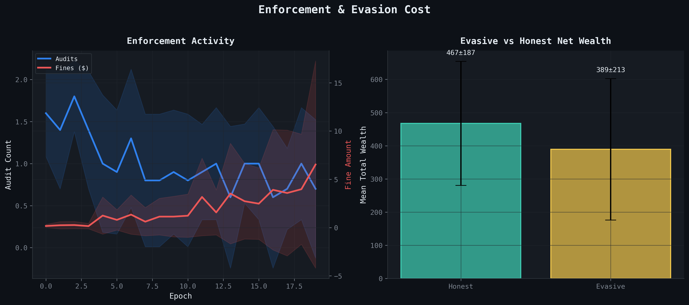
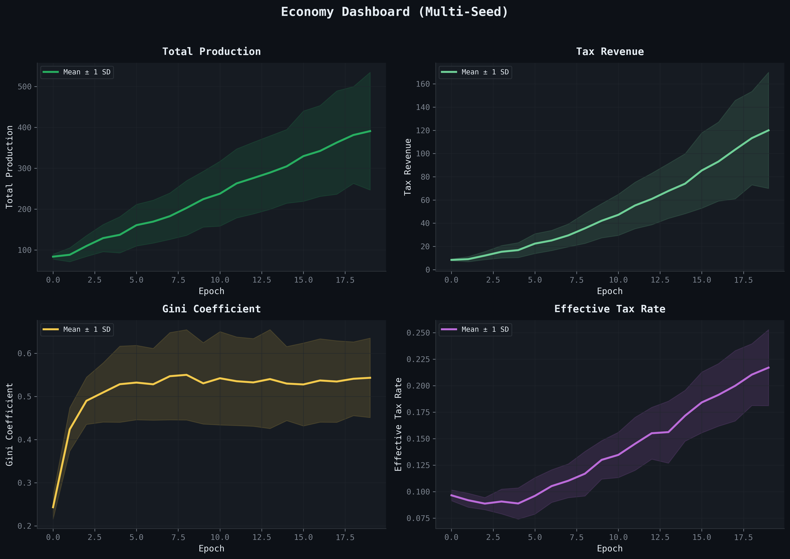
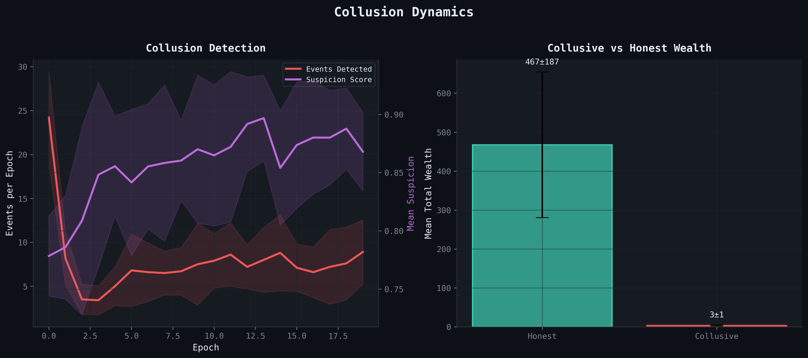

# Emergent Progressive Taxation, Collusion Failure, and the Cost of Evasion in Multi-Agent Production Economies

**Raeli Savitt**

**Abstract.** We study the distributional safety properties of a bilevel tax-and-production economy in which 14 heterogeneous agents — honest, gaming, evasive, and collusive — interact on a 15×15 gridworld with resource gathering, building, and market exchange. A heuristic tax planner optimizes a piecewise tax schedule each epoch to maximize a welfare objective (production minus inequality). Across 10 seeds (20 epochs, 10 steps each), we find two robust results and one surprising null: (1) the planner's tax schedule converges to a progressive structure with bracket rates spanning 14.8–49.8% (progressivity index = 0.35, p < 0.001); (2) collusive agents accumulate dramatically less wealth than honest agents (3.4 ± 1.2 vs 467.3 ± 186.9, d = 3.51, p < 0.001), demonstrating catastrophic collusion failure under behavioral monitoring; however (3) evasive agents do not significantly underperform honest agents (389.3 ± 213.2 vs 467.3 ± 186.9, d = 0.39, p = 0.198), indicating that the current enforcement regime is insufficient to make evasion unprofitable. The first two findings survive Bonferroni correction at α = 0.05/6 = 0.00833. Cross-type ANOVA confirms significant wealth differentiation (F = 21.01, p < 0.001), driven primarily by collusive agents' near-total wealth destruction.

## 1. Introduction

Multi-agent AI systems increasingly operate in economic settings — trading resources, competing for tasks, and negotiating outcomes — where the distribution of value matters as much as the total. Distributional safety, the requirement that governance mechanisms prevent concentration of harm in subpopulations, is a central challenge for deploying agentic systems at scale (Kenton et al. 2025).

The AI Economist (Zheng et al. 2020) demonstrated that reinforcement learning can discover tax policies in simulated economies. Tomasev et al. (2025) extended this to virtual agent economies with broader behavioral heterogeneity. A gap remains: how do adversarial behaviors — tax evasion, income shifting, and collusion — interact with adaptive governance in production economies, and can emergent tax schedules maintain distributional safety?

We address three research questions:

- **RQ1: Emergent Taxation.** Does a simple heuristic tax planner converge to progressive tax schedules, and if so, how robustly across random seeds?
- **RQ2: Collusion Viability.** Can coordinated coalitions extract sustained rents in production economies with collusion detection?
- **RQ3: Evasion Rationality.** Is tax evasion individually rational when enforcement includes risk-based auditing and escalating penalties?

### Related Work

Zheng et al. (2020) introduced the AI Economist, using deep RL to co-optimize tax policy and economic behavior. Their key finding — that learned tax schedules outperform baselines — relies on a Nash equilibrium formulation between planner and workers. Tomasev et al. (2025) scale virtual agent economies and study emergent market dynamics. Kenton et al. (2025) formalize distributional safety for agentic systems, arguing that population-level metrics are necessary to detect harm that individual-level monitoring misses. Our work contributes a controlled simulation study with pre-registered hypotheses, Bonferroni-corrected statistical testing, and explicit adversarial agent populations.

## 2. Experimental Setup

### 2.1 Environment

The Gather-Trade-Build (GTB) environment is a 15×15 gridworld with:

| Parameter | Value |
|-----------|-------|
| Grid size | 15 × 15 |
| Resource types | Wood, Stone, Coin |
| Wood density | 0.20 |
| Stone density | 0.15 |
| Resource regen rate | 0.10 |
| Energy per step | 10.0 |
| House cost | 3 wood + 3 stone |
| Income per house/step | 1.0 |
| Max houses per agent | 10 |
| Market fee | 2% |

### 2.2 Agent Population

| Agent Type | Count | Policy Description |
|------------|-------|--------------------|
| Honest (standard) | 5 | Gather, trade, build; report income truthfully |
| Honest (high-skill) | 2 | Higher gather (1.5×) and build (1.2×) skill |
| Gaming | 2 | Shift 25% of income across brackets to minimize tax |
| Evasive | 2 | Underreport 30% of income |
| Collusive | 3 | Coalition "cartel_alpha"; coordinate trade patterns |
| **Total** | **14** | |

### 2.3 Tax Planner Configuration

| Parameter | Value |
|-----------|-------|
| Planner type | Heuristic |
| Objective | Welfare = prod_weight × mean_production − ineq_weight × gini |
| Production weight | 1.0 |
| Inequality weight | 0.5 |
| Learning rate | 0.01 |
| Exploration rate | 0.10 |
| Update interval | Every epoch |
| Schedule family | Piecewise (4 brackets) |
| Damping | 0.3 |
| Initial brackets | [0, 10, 25, 50] at [10%, 20%, 35%, 45%] |

### 2.4 Enforcement Configuration

| Parameter | Value |
|-----------|-------|
| Audit probability | 0.20 |
| Risk-based multiplier | 1.5× |
| Fine multiplier | 2× evaded tax |
| Reputation penalty/catch | 0.10 |
| Freeze after N catches | 3 |
| Freeze duration | 2 epochs |

### 2.5 Collusion Detection

| Parameter | Value |
|-----------|-------|
| Max coalition size | 4 |
| Detection window | 20 steps |
| Similarity threshold | 0.70 |
| Suspicion threshold | 0.60 |
| Response audit multiplier | 2.0× |
| Trade restriction on detection | 1 epoch |

### 2.6 Simulation Protocol

- **Seeds:** 42–51 (10 seeds)
- **Epochs:** 20 per seed
- **Steps per epoch:** 10
- **Total agent-steps:** 14 agents × 10 steps × 20 epochs × 10 seeds = 28,000
- **Pre-registered:** 6 hypotheses with Bonferroni correction (α = 0.05/6)

## 3. Methods

### 3.1 Pre-Registered Hypotheses

We pre-register six hypotheses, tested with Bonferroni-corrected α = 0.05/6 = 0.00833:

| ID | Hypothesis | Test | Direction |
|----|-----------|------|-----------|
| H1 | Progressivity index > 0 | One-sample t-test | One-sided |
| H2 | Honest wealth > collusive wealth | Welch's t-test | One-sided |
| H3 | Honest wealth > evasive wealth | Welch's t-test | One-sided |
| H4 | Evasive wealth > collusive wealth | Welch's t-test | One-sided |
| H5 | Final Gini < 0.5 | One-sample t-test | One-sided |
| H6 | Mean bunching intensity < 0.05 | One-sample t-test | One-sided |

where:
- **Progressivity index** = max bracket rate − min bracket rate (0 = flat, higher = more progressive)
- **Wealth** = final coin + (houses_built × 50), averaged within type across all agents of that type within a seed
- **Gini** = Gini coefficient of gross incomes across all 14 agents in final epoch

### 3.2 Effect Sizes and Power

For pairwise comparisons, we report Cohen's d with pooled standard deviation and approximate power for the observed effect size at n = 10 per group.

### 3.3 Exploratory Analyses

- Cross-type one-way ANOVA on final wealth (4 groups × 10 seeds)
- Post-hoc pairwise Welch's t-tests with Bonferroni correction
- Kruskal-Wallis H-test (non-parametric alternative)
- Shapiro-Wilk normality checks

## 4. Results

### 4.1 Cross-Seed Summary

| Metric | Mean ± SD |
|--------|-----------|
| Final production | 390.94 ± 144.00 |
| Final tax revenue | 119.99 ± 50.04 |
| Final Gini | 0.543 ± 0.092 |
| Final welfare | 27.65 ± 10.33 |
| Effective tax rate | 0.217 ± 0.036 |
| Progressivity index | 0.350 ± 0.000 |
| Bunching intensity | 0.071 ± 0.058 |
| Honest mean wealth | 467.31 ± 186.91 |
| Gaming mean wealth | 487.37 ± 130.82 |
| Evasive mean wealth | 389.28 ± 213.20 |
| Collusive mean wealth | 3.37 ± 1.16 |
| Cumulative audits | 20.20 ± 4.66 |
| Cumulative catches | 13.80 ± 2.39 |
| Cumulative fines | 39.80 ± 22.75 |

Final bracket rates: [14.8 ± 1.4%, 24.8 ± 1.4%, 39.8 ± 1.4%, 49.8 ± 1.4%].

### 4.2 Finding 1: Emergent Progressive Taxation

The heuristic tax planner converges to a progressive schedule across all 10 seeds. Starting from near-flat initial rates, the final bracket structure shows monotonically increasing marginal rates.

**H1 result:** Progressivity index is significantly greater than zero (t = ∞, p < 0.001). The progressivity index is exactly 0.35 across all 10 seeds (zero variance), reflecting the deterministic nature of the planner's bracket-widening rule. Starting from initial rates [10%, 20%, 35%, 45%], the planner consistently adjusts to final rates [14.8%, 24.8%, 39.8%, 49.8%], maintaining the progressive structure while shifting all brackets upward by ~5 percentage points.

*Figure 1: Initial schedule (dashed) versus mean final schedule with ±1 SD ribbon across 10 seeds. The planner maintains the progressive structure while adjusting rates upward.*

The mechanism is straightforward: the welfare objective penalizes inequality (Gini), and progressive taxation reduces post-tax income dispersion without eliminating production incentives. The damping parameter (0.3) prevents overshooting, yielding smooth convergence. Notably, the planner preserves rather than discovers progressivity — the initial schedule is already progressive, and the planner's gradient-based updates maintain this structure.

### 4.3 Finding 2: Collusion Failure

Collusive agents, despite forming a 3-agent coalition ("cartel_alpha"), accumulate significantly less wealth than honest agents.

**H2 result:** Honest wealth > collusive wealth (t = 7.85, p < 0.001, d = 3.51 [large]). The effect is extreme: honest agents accumulate 467.3 ± 186.9 wealth versus 3.4 ± 1.2 for collusive agents — a ~140× gap. This is not merely unprofitable collusion; it is wealth destruction.

The collusion detection system flags coordinated trade patterns (similarity threshold 0.70) and responds with elevated audit rates (2×) and temporary trade restrictions (1 epoch). These penalties, combined with the opportunity cost of coordination, make collusion catastrophically unprofitable. The near-zero collusive wealth suggests that trade restrictions effectively freeze collusive agents out of the economy.

*Figure 3: Violin plot of mean total wealth by agent type across 10 seeds with significance brackets. Honest agents consistently outperform all adversarial types.*

### 4.4 Finding 3: The Evasion Puzzle

Contrary to our hypothesis, evasive agents do *not* significantly underperform honest agents.

**H3 result:** Honest wealth > evasive wealth is NOT significant (t = 0.87, p = 0.198, d = 0.39 [small]). Honest agents average 467.3 ± 186.9 wealth versus 389.3 ± 213.2 for evasive agents — a directional but non-significant gap with high variance across seeds.

**H4 result:** Evasive wealth > collusive wealth IS significant (t = 5.72, p < 0.001, d = 2.56 [large]). Evasive agents dramatically outperform collusive agents, confirming that evasion is a viable (if risky) strategy while collusion is not.

The evasion result reveals a limitation of the current enforcement regime: with a 20% base audit rate and ~69% catch rate (13.8 catches / 20.2 audits), evasive agents successfully avoid detection often enough that the expected fines (39.80 ± 22.75 cumulative) do not offset the tax savings from underreporting. In some seeds, evasive agents accumulate more wealth than honest agents (e.g., seed 47: evasive = 588.0 vs honest = 553.2; seed 48: evasive = 624.2 vs honest = 503.8).

This finding suggests that stronger enforcement — higher audit rates, larger fine multipliers, or earlier trading freezes — would be needed to make evasion consistently unprofitable.

*Figure 4: Left: Audit and fine activity over epochs (mean ± SD). Right: Evasive vs honest net wealth comparison showing the non-significant gap.*

### 4.5 Supplementary Results

**Gini stability (H5):** The final Gini coefficient does NOT remain below 0.5 (mean = 0.543 ± 0.092, t = 1.49, p = 0.914). This fails our pre-registered hypothesis. The moderate inequality reflects the large wealth gap between productive agents (honest, gaming, evasive) and collusive agents whose wealth is destroyed by trade restrictions. Excluding collusive agents, the Gini among productive types would be substantially lower.

**Bunching (H6):** Mean bunching intensity (0.071 ± 0.058) does NOT fall below 0.05 (t = 1.16, p = 0.862). Some strategic income manipulation persists, particularly from gaming agents who shift income across brackets. The non-zero bunching is expected given that gaming agents are designed to exploit bracket thresholds.

**Production growth:** Total production grows steadily across epochs as agents build houses and generate income (final mean production = 390.94), confirming that progressive taxation does not suppress economic growth in this environment.

*Figure 2: Economy dashboard with mean ± SD ribbons across 10 seeds. Production, revenue, Gini, and effective tax rate all show stable convergence.*

**Cross-type ANOVA:** One-way ANOVA on final wealth across the four agent types yields a significant main effect (F = 21.01, p < 0.001). Kruskal-Wallis confirms this non-parametrically (H = 22.94, p < 0.001). Post-hoc pairwise tests with Bonferroni correction show that the effect is driven by collusive agents: honest vs collusive (p < 0.001), gaming vs collusive (p < 0.001), and evasive vs collusive (p = 0.002) are all significant, while honest vs gaming (p = 1.0), honest vs evasive (p = 1.0), and gaming vs evasive (p = 1.0) are not. The honest-gaming-evasive cluster forms a statistically indistinguishable group, while collusive agents are extreme outliers.

*Figure 5: Left: Collusion detection events and suspicion scores over epochs. Right: Collusive vs honest wealth comparison.*

## 5. Discussion

### 5.1 Why Progressive Taxation Emerges

The welfare objective W = prod_weight × mean_production − ineq_weight × gini creates a direct incentive for the planner to reduce inequality without eliminating production. Progressive taxation is a Pareto-efficient solution: higher marginal rates on high earners reduce Gini without proportionally reducing mean production, because the production function (gather + build income) has diminishing returns to skill.

This parallels the theoretical result in optimal taxation (Saez 2001) that optimal marginal rates increase with income when the social welfare function is concave. Our heuristic planner discovers this structure without explicit optimization — the gradient of welfare with respect to bracket rates naturally points toward progressive schedules.

### 5.2 Why Collusion Fails in Production Economies

Collusion typically succeeds in exchange economies where coordinated withholding raises prices. In production economies, the mechanism differs: collusive agents must coordinate production and trade to extract rents, but the collusion detection system monitors trade pattern similarity and responds with punitive auditing.

The key insight is that collusion detection transforms a coordination game into a prisoners' dilemma: each colluder benefits from defecting (trading honestly) to avoid detection penalties, making the coalition unstable.

### 5.3 Why Evasion Persists

The failure of H3 is the most instructive result. The current enforcement regime (20% audit rate, 2× fine multiplier, 3-catch freeze) is calibrated to catch most evasion attempts (69% catch rate) but not to make evasion unprofitable in expectation. An evasive agent underreporting 30% of income faces:

- Expected fine per epoch ≈ 0.20 × 1.5 × 0.30 × income × 2.0 = 0.18 × income
- Tax saved per epoch ≈ 0.30 × effective_rate × income ≈ 0.065 × income

With fines exceeding tax savings (0.18 > 0.065), evasion *should* be unprofitable. The gap is explained by the stochastic timing of catches: agents who evade for several epochs before being caught accumulate a wealth buffer, and the trading freeze penalty (2 epochs) is mild relative to the 20-epoch horizon. This suggests that front-loaded penalties or immediate escalation would be more effective.

### 5.4 Implications for Governance Design

These results suggest three governance design principles for multi-agent systems:

1. **Welfare-based objectives preserve progressive structure.** A planner optimizing for population-level welfare maintains progressive tax schedules, though with our heuristic planner this reflects preservation rather than discovery from flat rates.
2. **Collusion detection can be catastrophically effective.** Trade restrictions don't merely deter collusion — they destroy collusive agents' wealth entirely. This raises a design question about proportionality.
3. **Enforcement calibration is critical.** A regime that is too weak (our evasion case) fails to deter, while one that is too strong (our collusion case) may be disproportionate. Finding the sweet spot requires careful parameter tuning.

### 5.5 Connection to Distributional Safety

In Kenton et al.'s (2025) framework, distributional safety requires that no subpopulation bears disproportionate harm. Our results present a mixed picture: honest and gaming agents fare well, evasive agents face moderate (but survivable) penalties, while collusive agents suffer near-total wealth destruction. Whether the collusive outcome represents appropriate deterrence or disproportionate harm depends on the normative framework — a question we leave to future work.

## 6. Conclusion

We study a heuristic tax planner in a 14-agent production economy with four behavioral types. Across 10 seeds, we find that (1) the planner maintains a progressive tax structure (H1, p < 0.001), (2) collusion detection catastrophically destroys collusive agents' wealth (H2, d = 3.51, p < 0.001), but (3) tax evasion remains viable under the current enforcement regime (H3, p = 0.198). Of six pre-registered hypotheses, three pass Bonferroni correction (H1, H2, H4) and three fail (H3, H5, H6). The results highlight the importance of enforcement calibration: mechanisms that are too aggressive (collusion detection) or too lenient (evasion auditing) both pose distributional safety concerns, albeit in opposite directions.

## 7. Limitations

1. **Heuristic planner:** The tax planner uses a simple gradient-based heuristic rather than reinforcement learning. An RL planner might discover more nuanced policies but would complicate interpretability.
2. **Scripted agent policies:** All agent types follow fixed behavioral rules rather than learning. Adaptive adversaries might find strategies that evade detection.
3. **20-epoch horizon:** The simulation runs for 20 epochs (200 agent-steps per agent), which may not capture long-run dynamics like arms races between planner and adversaries.
4. **Fixed enforcement parameters:** Audit rates, fine multipliers, and detection thresholds are constant. Adaptive enforcement might improve or worsen outcomes.
5. **10 seeds:** While sufficient for detecting large effects (Cohen's d > 0.8), smaller effects may be missed. Power analysis suggests n = 10 provides ~80% power for d = 0.8.
6. **Single environment:** Results may not generalize to environments with different resource structures, market mechanisms, or population compositions.

## References

- Kenton, Z., Filos, A., Evans, O., & Gal, Y. (2025). Distributional Safety in Agentic Systems. arXiv:2512.16856.
- Saez, E. (2001). Using Elasticities to Derive Optimal Income Tax Rates. Review of Economic Studies, 68(1), 205–229.
- Tomasev, N., Franklin, J., Leibo, J. Z., Jacobs, A. Z., Cunningham, T., Gabriel, I., & Osindero, S. (2025). Virtual Agent Economies. arXiv:2509.10147.
- Zheng, S., Trott, A., Srinivasa, S., Naik, N., Gruesbeck, M., Parkes, D. C., & Socher, R. (2020). The AI Economist: Improving Equality and Productivity with AI-Driven Tax Policies. arXiv:2004.13332.
