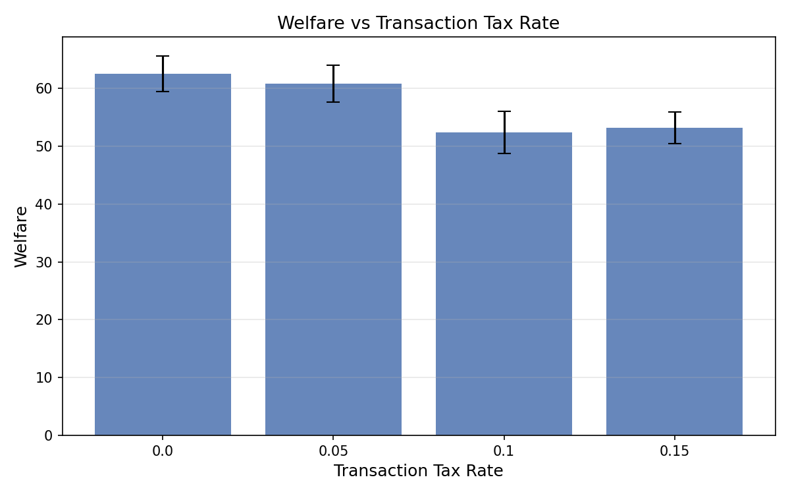
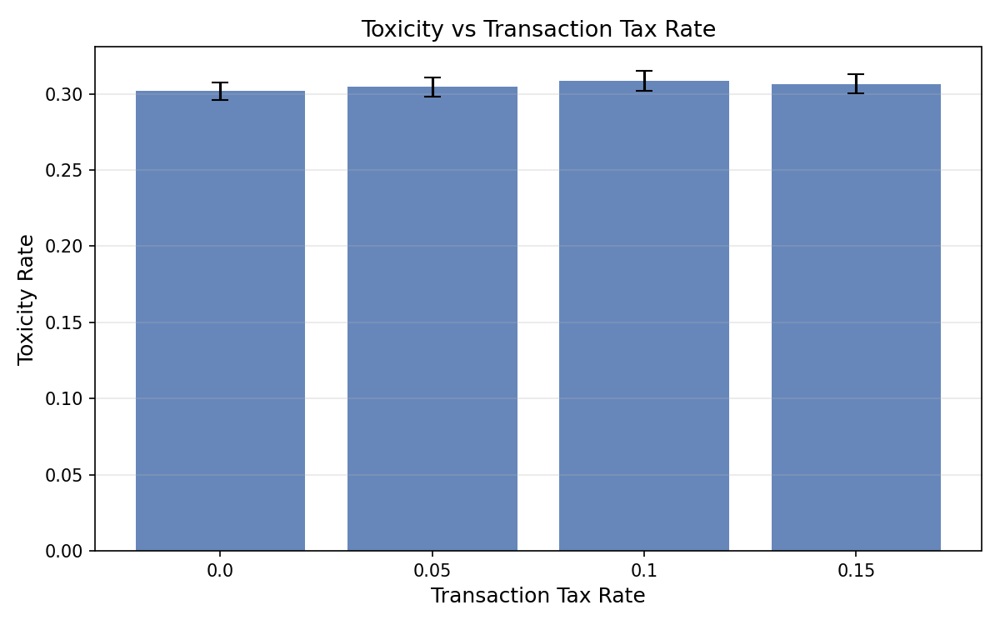
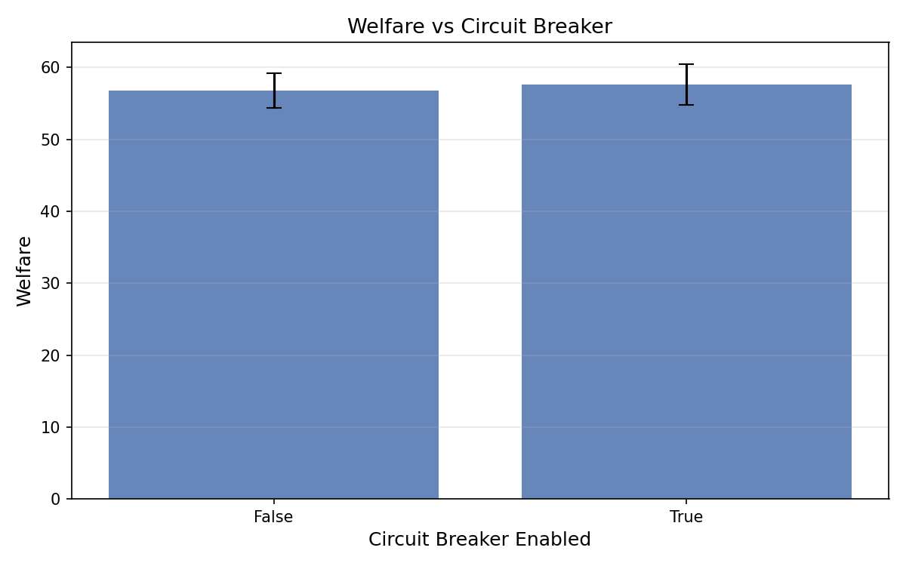
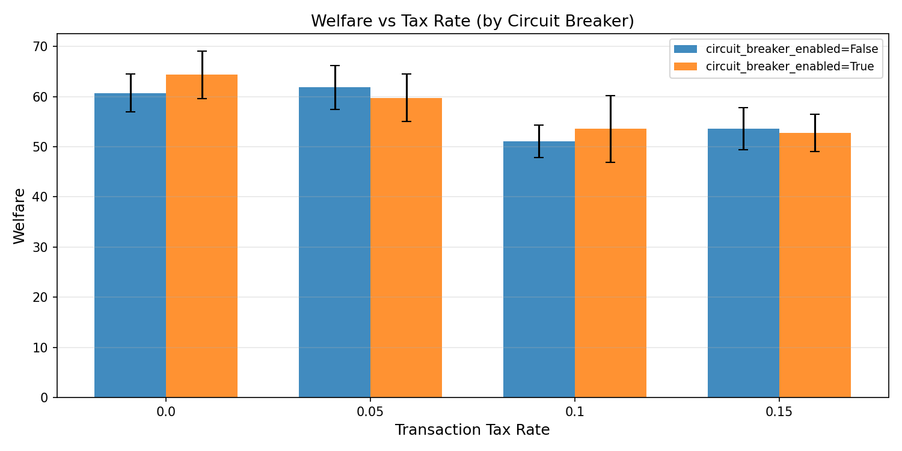
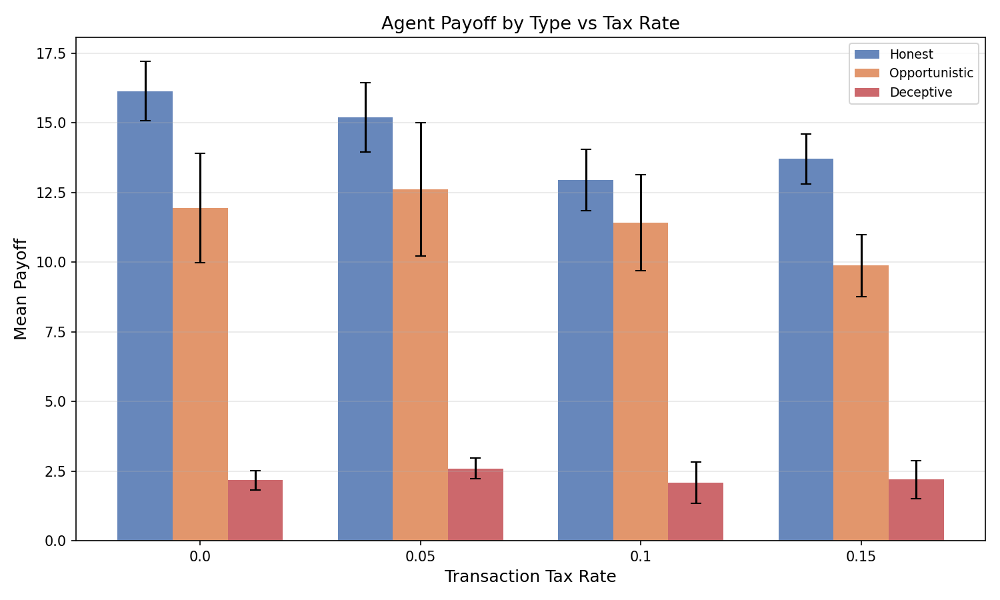
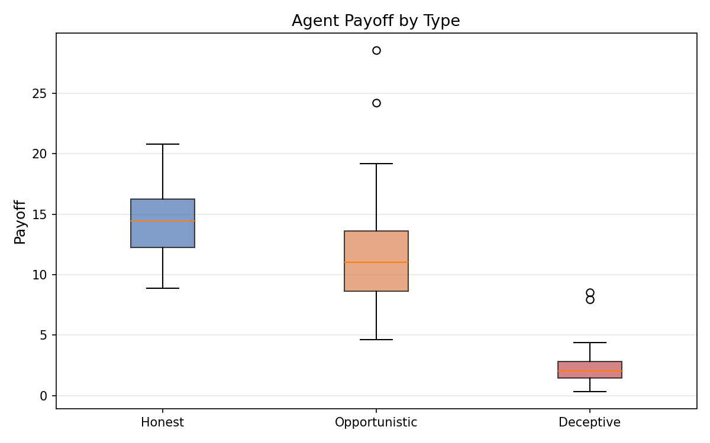
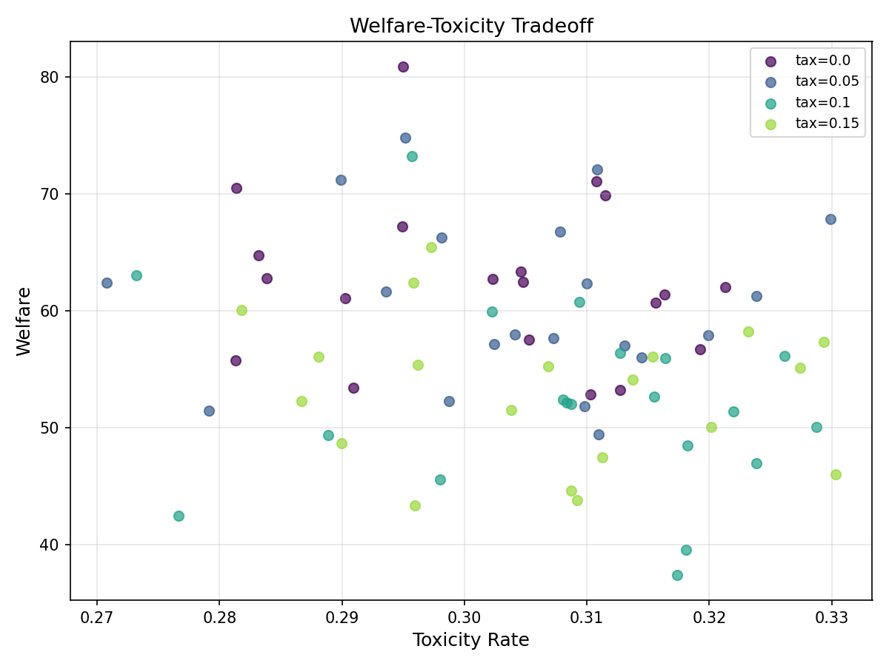

# Baseline Governance: Transaction Tax and Circuit Breaker Effects on Multi-Agent Welfare

**Authors:** SWARM Research Collective
**Date:** 2026-02-13
**Framework:** SWARM v0.1.0

## Abstract

We investigate the effects of transaction taxation and circuit breakers on welfare, toxicity, and distributional fairness in a mixed-agent simulation. Using the SWARM framework, we sweep tax rates (0%, 5%, 10%, 15%) and circuit breaker activation (enabled/disabled) across 80 runs (10 seeds per configuration) with 5 agents (3 honest, 1 opportunistic, 1 deceptive). We find that transaction taxes significantly reduce total welfare (d=1.41, p<0.0001 for 0% vs 15% tax), while circuit breakers have no statistically significant effect. The welfare reduction from taxation disproportionately affects honest agents (d=1.29, p=0.0002 for 0% vs 10% tax on honest payoff), while deceptive agents remain relatively unaffected. All welfare distributions pass Shapiro-Wilk normality tests, validating parametric analysis. Of 42 pre-registered hypotheses, 4 survive Bonferroni correction and 6 survive Benjamini-Hochberg correction.

## 1. Introduction

Governance mechanisms in multi-agent systems face a fundamental tension: interventions designed to reduce harmful behavior may impose deadweight costs that reduce overall welfare. Transaction taxes are a canonical governance lever — they increase the cost of interactions, potentially deterring low-value or exploitative exchanges, but also reducing the volume of beneficial interactions. Circuit breakers provide a qualitatively different mechanism: they halt activity when systemic risk indicators exceed thresholds, but may be inert in stable environments.

This study provides a controlled empirical characterization of these two governance levers in the SWARM baseline scenario, a minimal mixed-agent environment with 3 honest, 1 opportunistic, and 1 deceptive agent. We focus on three questions:

1. Does transaction taxation reduce welfare, and if so, is the effect monotonic in the tax rate?
2. Does circuit breaker activation affect welfare or toxicity in a stable baseline environment?
3. How do governance costs distribute across agent types — do they disproportionately burden honest or deceptive agents?

## 2. Methods

### 2.1 Scenario Configuration

| Parameter | Value |
|-----------|-------|
| Agents | 5 (3 honest, 1 opportunistic, 1 deceptive) |
| Epochs | 10 |
| Steps per epoch | 10 |
| Payoff: s_plus | 2.0 |
| Payoff: s_minus | 1.0 |
| Payoff: h (externality) | 2.0 |
| Payoff: theta (governance threshold) | 0.5 |
| Reputation decay | 1.0 (disabled) |
| Bandwidth cap | 10 |
| Staking | Disabled |
| Audit | Disabled |

### 2.2 Swept Parameters

| Parameter | Values |
|-----------|--------|
| `governance.transaction_tax_rate` | 0.0, 0.05, 0.10, 0.15 |
| `governance.circuit_breaker_enabled` | False, True |

Total configurations: 4 x 2 = 8. Seeds per configuration: 10. Total runs: 80.

### 2.3 Metrics

- **Welfare**: Cumulative payoff across all agents over all epochs
- **Toxicity rate**: E[1-p | accepted], expected harm from accepted interactions
- **Quality gap**: E[p | accepted] - E[p | rejected]; negative indicates adverse selection
- **Agent payoff**: Per-type mean payoff (honest, opportunistic, deceptive)

### 2.4 Statistical Methods

- Welch's t-test (unequal variance) for pairwise comparisons
- Mann-Whitney U as non-parametric robustness check
- Cohen's d for effect sizes (pooled SD)
- Bonferroni correction (alpha = 0.05/42 = 0.00119)
- Benjamini-Hochberg correction for false discovery rate
- Shapiro-Wilk normality validation on welfare distributions
- Paired t-test for agent-type stratification
- 42 total pre-registered hypotheses across all parameter-metric pairs

## 3. Results

### 3.1 Welfare by Tax Rate

| Tax Rate | Welfare (mean +/- SD) | Toxicity (mean +/- SD) | Quality Gap (mean +/- SD) | N |
|----------|----------------------|----------------------|--------------------------|---|
| 0.00 | 62.5 +/- 7.0 | 0.3018 +/- 0.0133 | 0.0094 +/- 0.0184 | 20 |
| 0.05 | 60.8 +/- 7.3 | 0.3045 +/- 0.0143 | 0.0146 +/- 0.0218 | 20 |
| 0.10 | 52.3 +/- 8.3 | 0.3084 +/- 0.0154 | 0.0101 +/- 0.0201 | 20 |
| 0.15 | 53.2 +/- 6.2 | 0.3066 +/- 0.0149 | 0.0133 +/- 0.0178 | 20 |

Transaction tax significantly reduces welfare. The effect is non-linear: a 5% tax produces a modest decline (62.5 to 60.8), while 10% and 15% produce a sharper drop (to 52.3 and 53.2 respectively). Toxicity is unaffected by taxation — all values cluster near 0.305 regardless of tax rate. Quality gap remains near zero and positive (no adverse selection) across all conditions.





### 3.2 Circuit Breaker Effect

| Circuit Breaker | Welfare (mean +/- SD) | Toxicity (mean +/- SD) | N |
|----------------|----------------------|----------------------|---|
| Disabled | 56.8 +/- 7.7 | 0.3061 +/- 0.0140 | 40 |
| Enabled | 57.6 +/- 9.2 | 0.3046 +/- 0.0150 | 40 |

Circuit breaker activation has no statistically significant effect on welfare (p>0.05) or toxicity. This is expected in a stable baseline environment where systemic risk indicators remain below circuit breaker thresholds.



### 3.3 Interaction Effects

The grouped analysis (tax rate x circuit breaker) confirms that the two governance levers operate independently. Welfare reduction from taxation is consistent regardless of circuit breaker status.



### 3.4 Significant Results (Bonferroni-corrected)

| Comparison | Metric | d | p | Survives |
|-----------|--------|---|---|----------|
| Tax 0% vs 15% | Welfare | 1.41 | 0.0001 | Bonferroni |
| Tax 0% vs 10% | Welfare | 1.33 | 0.0002 | Bonferroni |
| Tax 0% vs 10% | Honest payoff | 1.29 | 0.0002 | Bonferroni |
| Tax 5% vs 15% | Welfare | 1.13 | 0.0010 | Bonferroni |
| Tax 5% vs 10% | Welfare | 1.09 | 0.0015 | BH only |
| Tax 0% vs 15% | Honest payoff | 1.08 | 0.0016 | BH only |

All significant effects involve the transaction tax on welfare or honest payoff. No toxicity, quality gap, opportunistic, or deceptive payoff comparisons reach significance.

### 3.5 Agent-Type Stratification

| Agent Type | Mean Payoff |
|-----------|-------------|
| Honest | 14.50 |
| Opportunistic | 11.46 |
| Deceptive | 2.26 |

Pairwise comparisons (paired t-test):

| Comparison | Cohen's d | p-value |
|-----------|----------|---------|
| Honest vs Opportunistic | 0.84 | <0.0001 |
| Honest vs Deceptive | 5.73 | <0.0001 |
| Opportunistic vs Deceptive | 2.91 | <0.0001 |

Honest agents earn significantly more than all other types. Deceptive agents earn the least, suggesting that the baseline governance environment effectively penalizes deception even without explicit audit mechanisms.

### 3.6 Tax Impact by Agent Type

| Tax Rate | Honest (mean +/- SD) | Opportunistic (mean +/- SD) | Deceptive (mean +/- SD) |
|----------|---------------------|---------------------------|------------------------|
| 0.00 | 16.14 +/- 2.44 | 11.95 +/- 4.49 | 2.17 +/- 0.80 |
| 0.05 | 15.20 +/- 2.85 | 12.61 +/- 5.46 | 2.59 +/- 0.85 |
| 0.10 | 12.94 +/- 2.50 | 11.41 +/- 3.94 | 2.08 +/- 1.70 |
| 0.15 | 13.70 +/- 2.05 | 9.88 +/- 2.53 | 2.19 +/- 1.56 |

The welfare reduction from taxation is borne primarily by honest agents (16.14 to 12.94, a 20% decline from 0% to 10% tax). Deceptive agent payoff is unchanged across conditions (~2.2), making taxation regressive: it taxes productive behavior without reducing exploitative behavior.





### 3.7 Normality Validation

| Group | Shapiro-Wilk W | p-value | Normal? |
|-------|---------------|---------|---------|
| Tax 0% | 0.9370 | 0.2101 | Yes |
| Tax 5% | 0.9598 | 0.5403 | Yes |
| Tax 10% | 0.9708 | 0.7707 | Yes |
| Tax 15% | 0.9678 | 0.7087 | Yes |

All groups pass normality tests (p > 0.05), validating the use of parametric t-tests.



## 4. Discussion

### 4.1 Key Findings

**Transaction taxes reduce welfare without reducing toxicity.** The strongest finding is that taxation imposes a deadweight loss (d=1.41 for 0% vs 15%) while toxicity remains constant at ~0.305. This suggests that in a baseline environment, taxation does not selectively deter harmful interactions — it reduces interaction volume uniformly, affecting beneficial and harmful interactions equally.

**The tax burden falls disproportionately on honest agents.** Honest agents lose 20% of their payoff between 0% and 10% tax rates, while deceptive agents are unaffected. This is consistent with the theoretical prediction that agents who generate the most surplus (honest agents, through high-p interactions) pay the most in transaction taxes, while agents who generate little surplus (deceptive agents) have less to tax.

**Circuit breakers are inert in stable environments.** This is a null result, but an important one: circuit breakers are a latent governance mechanism that only activates under stress conditions. In a stable 5-agent, 10-epoch environment, systemic risk indicators never exceed thresholds. This motivates future studies under adversarial stress-testing conditions.

### 4.2 Non-linearity of Tax Effects

The welfare decline is not linear in tax rate. The jump from 5% to 10% (60.8 to 52.3, a 14% decline) is larger than from 0% to 5% (62.5 to 60.8, a 3% decline) or from 10% to 15% (52.3 to 53.2, essentially flat). This suggests a phase-transition-like threshold between 5% and 10% where tax costs exceed the marginal value of some interactions, causing agents to stop participating.

### 4.3 Implications for Governance Design

These results challenge the naive view that transaction taxes are a universal governance tool. In this environment:
- Taxes do not improve toxicity outcomes
- Taxes disproportionately harm honest agents
- The welfare cost of taxation is non-linear and potentially catastrophic above certain thresholds

More targeted governance mechanisms — such as reputation-weighted taxation, audit-based penalties, or staking requirements — may achieve better outcomes by selectively increasing costs for low-quality interactions while leaving high-quality interactions unaffected.

## 5. Limitations

1. **Small agent pool**: 5 agents limits the diversity of strategic interactions. Larger populations may exhibit different dynamics.
2. **Short time horizon**: 10 epochs may not capture long-term equilibrium effects of taxation.
3. **No reputation dynamics**: Reputation decay is disabled (rate=1.0), which removes a key feedback mechanism.
4. **Binary governance levers**: We test only on/off circuit breakers and fixed tax rates, not adaptive mechanisms.
5. **No network effects**: Agents interact in a complete graph; realistic systems have network structure.

## 6. Reproducibility

```bash
# Reproduce the sweep
python runs/20260213-173805_baseline_governance/run_sweep.py

# Reproduce the analysis
python runs/20260213-173805_baseline_governance/analyze.py

# Reproduce the plots
python runs/20260213-173805_baseline_governance/generate_plots.py
```

Scenario file: `scenarios/baseline.yaml`
Seeds: 200-209 (10 per configuration)
Total runs: 80 (4 tax rates x 2 circuit breaker states x 10 seeds)

## 7. References

[TODO]
