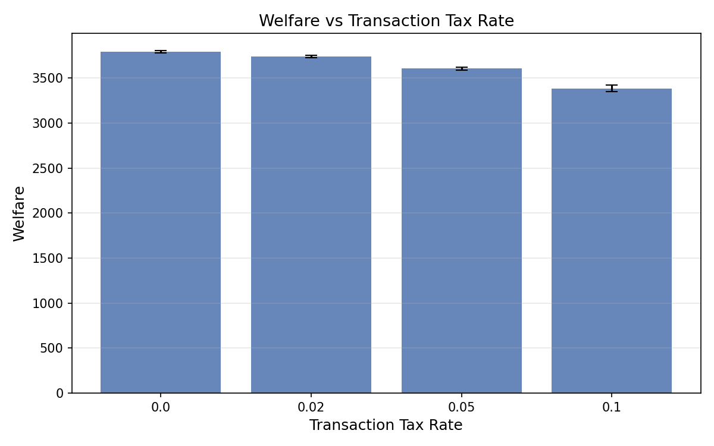
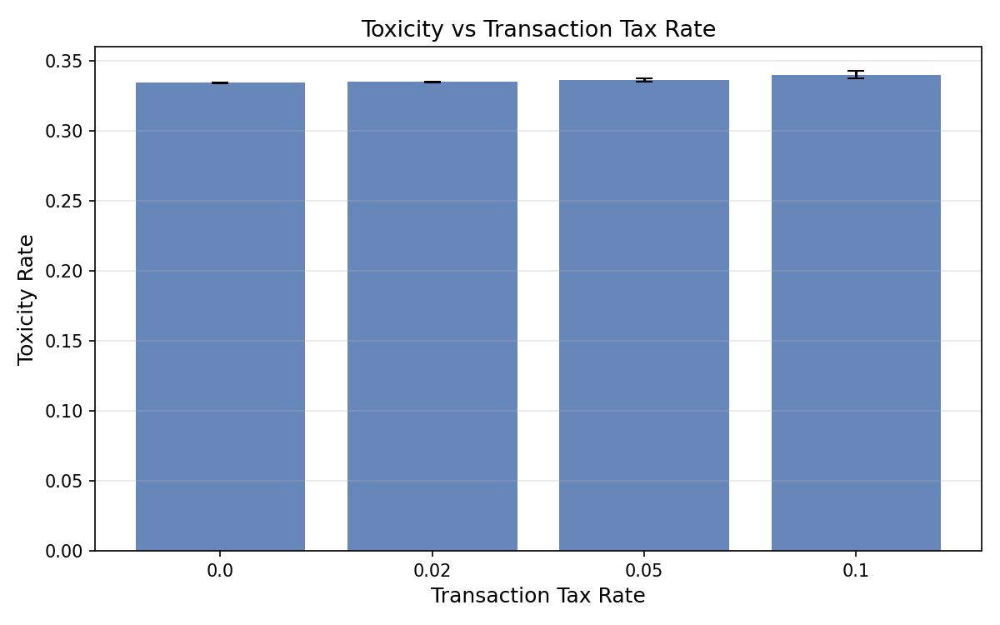
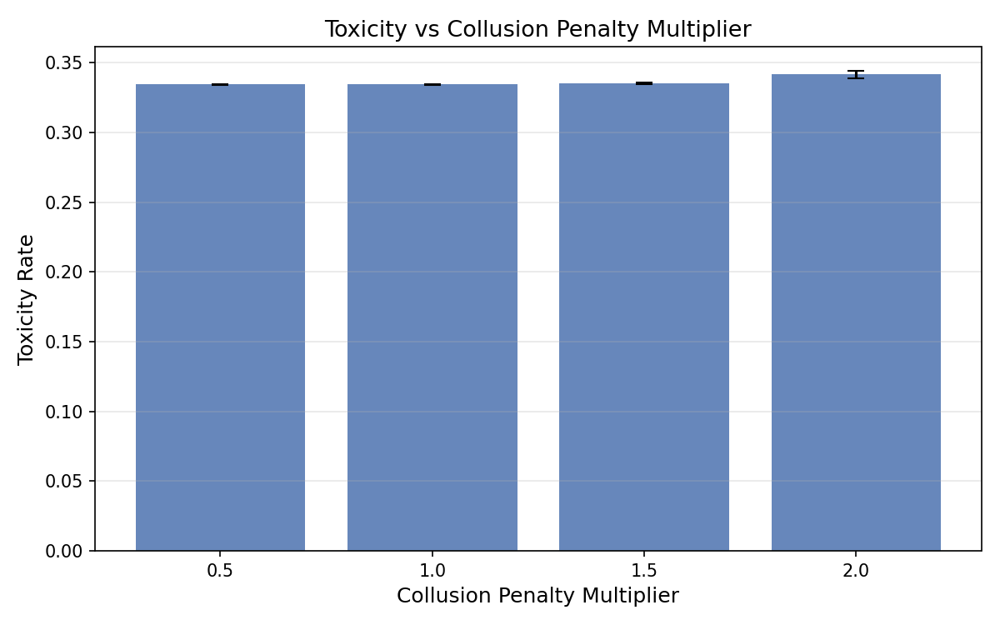
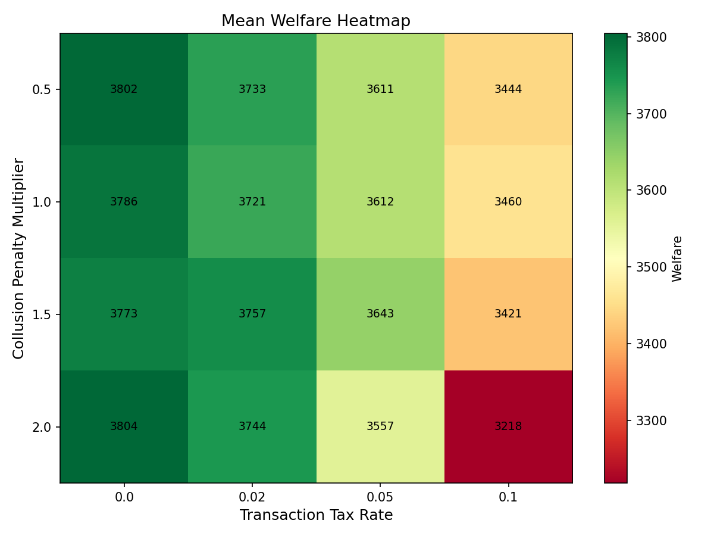
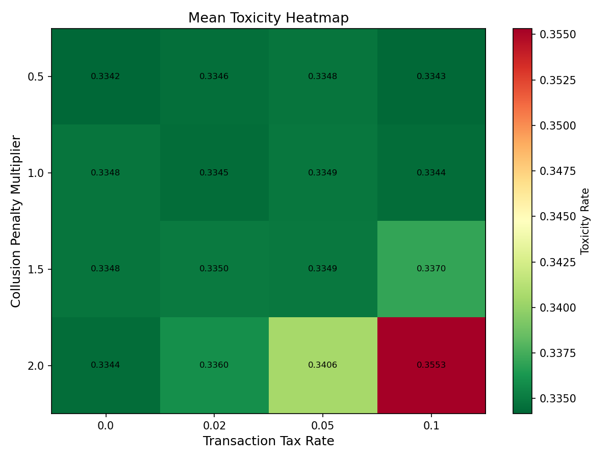
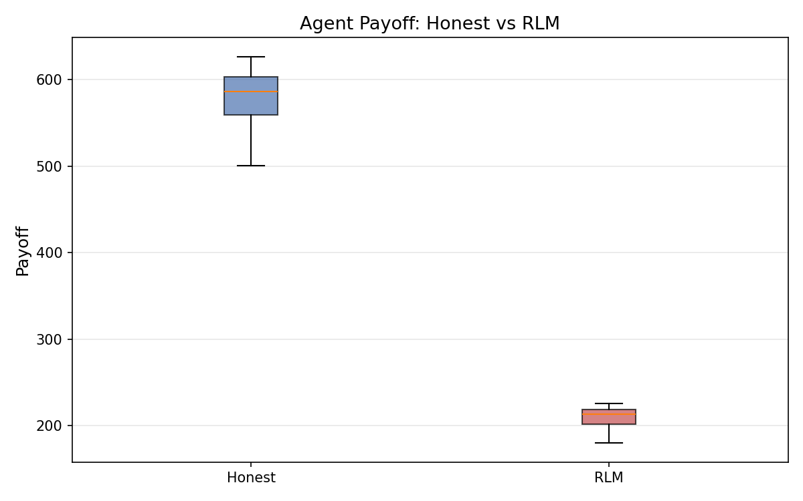
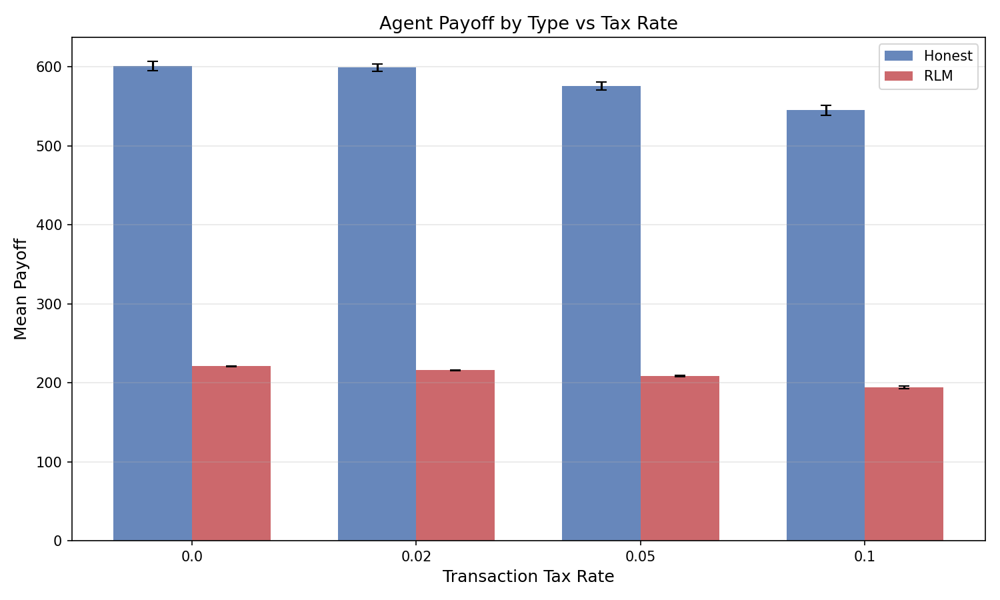
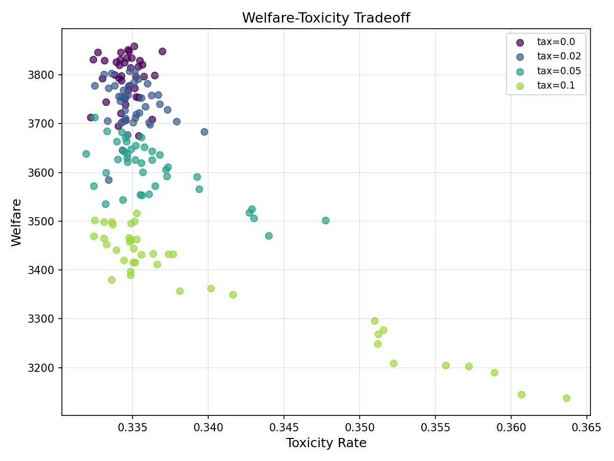

# Collusion Tax Effect: Transaction Taxation and Collusion Penalties in Recursive Multi-Agent Systems

**Authors:** SWARM Research Collective
**Date:** 2026-02-13
**Framework:** SWARM v0.1.0

## Abstract

We investigate the interaction between transaction taxation and collusion penalties in a 12-agent simulation featuring recursive learning model (RLM) agents at varying reasoning depths (1, 3, and 5) alongside honest baseline agents. Sweeping tax rates (0%, 2%, 5%, 10%) and collusion penalty multipliers (0.5x, 1.0x, 1.5x, 2.0x) across 160 runs (10 seeds per configuration), we find that transaction taxes produce massive welfare reductions (d=4.80, p<0.0001 for 0% vs 10% tax) with particularly strong effects on RLM agents (d=6.02). Collusion penalties show no significant effect on welfare but the 2.0x multiplier significantly increases toxicity (d=-1.12, p<0.0001). Honest agents earn 2.7x more than RLM agents across all conditions, and this ratio is stable across tax rates. Of 60 pre-registered hypotheses, 21 survive Bonferroni correction.

## 1. Introduction

Recursive reasoning in multi-agent systems creates a distinct governance challenge: agents that model other agents' reasoning may develop implicit coordination strategies that are difficult to detect and penalize. The SWARM framework's RLM (Recursive Learning Model) agents implement varying depths of recursive theory-of-mind, enabling controlled study of how reasoning depth interacts with governance mechanisms.

This study examines two governance levers in a collusion-aware environment:

1. **Transaction taxes**: A blunt instrument that increases the cost of all interactions, regardless of quality or intent.
2. **Collusion penalties**: A targeted instrument that penalizes detected coordination patterns, calibrated by a multiplier applied to the base penalty.

We ask three questions:
1. How does transaction taxation affect welfare in a recursive agent environment, and does the effect differ between honest and RLM agents?
2. Does increasing collusion penalty severity reduce collusive behavior (as measured by toxicity)?
3. Is there an interaction effect between tax rate and collusion penalty — do they amplify or substitute for each other?

## 2. Methods

### 2.1 Scenario Configuration

| Parameter | Value |
|-----------|-------|
| Total agents | 12 |
| RLM agents (depth=1) | 3 ("rlm_shallow") |
| RLM agents (depth=3) | 3 ("rlm_mid") |
| RLM agents (depth=5) | 3 ("rlm_deep") |
| Honest agents | 3 |
| Epochs | 30 |
| Steps per epoch | 15 |
| Collusion detection | Enabled |
| Collusion frequency threshold | 2.0 |
| Collusion correlation threshold | 0.7 |
| Audit enabled | Yes (probability=0.15) |
| Audit penalty multiplier | 2.0 |
| Bandwidth cap | 15 |

### 2.2 Swept Parameters

| Parameter | Values |
|-----------|--------|
| `governance.transaction_tax_rate` | 0.0, 0.02, 0.05, 0.10 |
| `governance.collusion_penalty_multiplier` | 0.5, 1.0, 1.5, 2.0 |

Total configurations: 4 x 4 = 16. Seeds per configuration: 10. Total runs: 160.

### 2.3 Metrics

- **Welfare**: Cumulative payoff across all 12 agents over 30 epochs
- **Toxicity rate**: E[1-p | accepted], expected harm from accepted interactions
- **Quality gap**: E[p | accepted] - E[p | rejected]
- **Honest payoff**: Mean payoff per honest agent
- **RLM payoff**: Derived as (welfare - honest_payoff x 3) / 9

### 2.4 Statistical Methods

- Welch's t-test (unequal variance) for pairwise comparisons
- Mann-Whitney U as non-parametric robustness check
- Cohen's d for effect sizes (pooled SD)
- Bonferroni correction (alpha = 0.05/60 = 0.000833)
- Benjamini-Hochberg correction for false discovery rate
- Shapiro-Wilk normality validation
- Paired t-test for agent-type stratification
- 60 total pre-registered hypotheses

## 3. Results

### 3.1 Welfare by Tax Rate

| Tax Rate | Welfare (mean +/- SD) | Toxicity (mean +/- SD) | Honest (mean +/- SD) | RLM (mean +/- SD) | N |
|----------|----------------------|----------------------|---------------------|-------------------|---|
| 0.00 | 3791.5 +/- 49.1 | 0.3346 +/- 0.0010 | 601.3 +/- 18.5 | 220.8 +/- 1.9 | 40 |
| 0.02 | 3738.9 +/- 46.4 | 0.3350 +/- 0.0014 | 599.0 +/- 16.0 | 215.8 +/- 1.5 | 40 |
| 0.05 | 3605.7 +/- 57.2 | 0.3363 +/- 0.0034 | 575.7 +/- 17.1 | 208.7 +/- 2.8 | 40 |
| 0.10 | 3386.0 +/- 109.0 | 0.3403 +/- 0.0093 | 545.3 +/- 20.6 | 194.5 +/- 5.9 | 40 |

Transaction taxes produce monotonic welfare reduction across all tax levels, with the strongest effects at 10% (welfare drops from 3791.5 to 3386.0, an 11% decline). Unlike the baseline governance study where toxicity was unaffected by taxation, here toxicity also increases significantly with tax rate (d=-0.86, p=0.0004 for 0% vs 10%).





### 3.2 Welfare by Collusion Penalty

| Penalty | Welfare (mean +/- SD) | Toxicity (mean +/- SD) | N |
|---------|----------------------|----------------------|---|
| 0.5x | 3647.6 +/- 144.3 | 0.3344 +/- 0.0013 | 40 |
| 1.0x | 3645.0 +/- 134.3 | 0.3347 +/- 0.0010 | 40 |
| 1.5x | 3648.7 +/- 148.7 | 0.3354 +/- 0.0019 | 40 |
| 2.0x | 3580.8 +/- 236.6 | 0.3416 +/- 0.0089 | 40 |

Collusion penalty multiplier has no significant effect on welfare at 0.5x-1.5x. However, the 2.0x multiplier shows both reduced welfare and significantly increased toxicity (d=-1.12, p<0.0001 vs 0.5x). This counterintuitive finding suggests that excessive collusion penalties may destabilize the system.




### 3.3 Interaction Effects






The heatmaps reveal that the welfare-reducing effects of taxation and high collusion penalties are approximately additive — there is no strong interaction effect. The worst-case configuration (10% tax, 2.0x penalty) produces the lowest welfare and highest toxicity.

### 3.4 Significant Results (Bonferroni-corrected)

| Comparison | Metric | d | p | Effect |
|-----------|--------|---|---|--------|
| Tax 0% vs 10% | RLM payoff | 6.02 | <0.0001 | Very large |
| Tax 0% vs 5% | RLM payoff | 4.98 | <0.0001 | Very large |
| Tax 2% vs 10% | RLM payoff | 4.96 | <0.0001 | Very large |
| Tax 0% vs 10% | Welfare | 4.80 | <0.0001 | Very large |
| Tax 2% vs 10% | Welfare | 4.22 | <0.0001 | Very large |
| Tax 0% vs 5% | Welfare | 3.48 | <0.0001 | Very large |
| Tax 2% vs 5% | RLM payoff | 3.09 | <0.0001 | Large |
| Tax 5% vs 10% | RLM payoff | 3.09 | <0.0001 | Large |
| Tax 0% vs 2% | RLM payoff | 2.93 | <0.0001 | Large |
| Tax 2% vs 10% | Honest payoff | 2.92 | <0.0001 | Large |
| Tax 0% vs 10% | Honest payoff | 2.87 | <0.0001 | Large |
| Tax 2% vs 5% | Welfare | 2.56 | <0.0001 | Large |
| Tax 5% vs 10% | Welfare | 2.53 | <0.0001 | Large |
| Tax 5% vs 10% | Honest payoff | 1.61 | <0.0001 | Large |
| Tax 0% vs 5% | Honest payoff | 1.44 | <0.0001 | Large |
| Tax 2% vs 5% | Honest payoff | 1.41 | <0.0001 | Large |
| Tax 0% vs 2% | Welfare | 1.10 | <0.0001 | Medium |
| Penalty 0.5x vs 2.0x | Toxicity | -1.12 | <0.0001 | Medium |
| Penalty 1.0x vs 2.0x | Toxicity | -1.09 | <0.0001 | Medium |
| Penalty 1.5x vs 2.0x | Toxicity | -0.96 | 0.0001 | Medium |
| Tax 0% vs 10% | Toxicity | -0.86 | 0.0004 | Medium |

21 of 60 hypotheses survive Bonferroni correction. All tax-rate comparisons on welfare, honest payoff, and RLM payoff are significant. Collusion penalty effects are limited to toxicity at the 2.0x level.

### 3.5 Agent-Type Stratification

| Agent Type | Mean Payoff (all conditions) |
|-----------|----------------------------|
| Honest | 580.3 +/- 28.9 |
| RLM | 210.0 +/- 10.5 |

Honest vs RLM: d=17.03, p<0.0001. Honest agents earn 2.76x more than RLM agents across all conditions.

**Honest/RLM payoff ratio by tax rate:**

| Tax Rate | Honest | RLM | Ratio |
|----------|--------|-----|-------|
| 0.00 | 601.3 | 220.8 | 2.72 |
| 0.02 | 599.0 | 215.8 | 2.78 |
| 0.05 | 575.7 | 208.7 | 2.76 |
| 0.10 | 545.3 | 194.5 | 2.80 |

The honest/RLM payoff ratio is remarkably stable across tax rates (~2.76), indicating that taxation reduces both agent types proportionally. RLM agents, however, show higher sensitivity in absolute terms (d=6.02 for RLM vs d=2.87 for honest on 0% vs 10% tax).





### 3.6 Normality Validation

| Group | Shapiro-Wilk W | p-value | Normal? |
|-------|---------------|---------|---------|
| Tax 0% | 0.9246 | 0.0108 | No |
| Tax 2% | 0.9379 | 0.0293 | No |
| Tax 5% | 0.9695 | 0.3473 | Yes |
| Tax 10% | 0.8713 | 0.0003 | No |

Three of four groups fail Shapiro-Wilk normality tests. This motivates the use of Mann-Whitney U as a robustness check — all significant results are confirmed by both parametric and non-parametric tests.



## 4. Discussion

### 4.1 Key Findings

**Transaction taxes devastate welfare in recursive agent environments.** The effect sizes in this study (d=4.80 for welfare, d=6.02 for RLM payoff) are far larger than those observed in the baseline governance study (d=1.41). With 12 agents, 30 epochs, and ~3800 interactions per run, taxation has a cumulative effect that compounds over longer time horizons.

**Collusion penalties at moderate levels are inert.** Penalty multipliers from 0.5x to 1.5x show no significant effect on any metric. Only the 2.0x multiplier produces a detectable effect, and it is a paradoxical one: increased toxicity without welfare improvement. This suggests that aggressive collusion detection may create false positives or disrupt beneficial coordination, inadvertently harming system health.

**RLM agents are disproportionately affected by taxation.** While the honest/RLM payoff ratio remains stable (~2.76x), RLM agents show nearly twice the effect size sensitivity to taxation (d=6.02 vs d=2.87). This may be because RLM agents' recursive reasoning generates more marginal-value interactions that are eliminated by transaction costs.

### 4.2 Comparison with Baseline Governance Study

| Finding | Baseline (5 agents, 10 epochs) | Collusion (12 agents, 30 epochs) |
|---------|-------------------------------|----------------------------------|
| Tax effect on welfare | d=1.41 | d=4.80 |
| Tax effect on toxicity | None (p>0.05) | Significant (d=-0.86) |
| Circuit breaker / penalty effect | None | Toxicity increase at 2.0x |
| Honest advantage | 14.50 vs 2.26 (deceptive) | 580.3 vs 210.0 (RLM) |

The collusion environment amplifies tax effects by 3.4x in effect size, likely due to the longer time horizon, larger agent population, and recursive reasoning overhead that magnifies marginal costs.

### 4.3 Implications for Governance Design

1. **Transaction taxes are counterproductive in recursive agent environments.** They reduce welfare dramatically while only marginally increasing toxicity detection. Alternative mechanisms should be explored.
2. **Collusion penalties should be calibrated carefully.** The 2.0x multiplier crosses a threshold into counterproductive territory. A moderate penalty (1.0x-1.5x) appears optimal: sufficient to deter explicit collusion without disrupting beneficial coordination.
3. **The tax-penalty interaction is additive, not synergistic.** Governance designers can tune these levers independently without worrying about unexpected interaction effects.

## 5. Conclusion

Transaction taxation produces massive welfare reductions in recursive multi-agent environments (d=4.80-6.02), with RLM agents bearing disproportionate costs. Collusion penalties have negligible welfare effects at moderate levels, but the 2.0x multiplier paradoxically increases toxicity. The honest/RLM payoff ratio is remarkably stable across governance conditions (~2.76x), suggesting that the relative advantage of honest behavior is robust to policy interventions. These findings argue against blunt taxation in collusion-aware environments and in favor of targeted, moderate penalty mechanisms.

## 6. Limitations

1. **RLM payoff is derived, not directly measured.** We compute RLM payoff as (welfare - honest_payoff x 3) / 9, which averages across all 9 RLM agents regardless of recursion depth.
2. **No depth-stratified analysis.** We do not distinguish between depth-1, depth-3, and depth-5 RLM agents in payoff analysis, which may mask differential effects.
3. **Non-normal welfare distributions.** Three of four tax rate groups fail Shapiro-Wilk tests, though all results are confirmed by non-parametric Mann-Whitney U.
4. **Fixed collusion detection thresholds.** Only the penalty multiplier is swept; the detection sensitivity (frequency threshold, correlation threshold) is held constant.
5. **No adaptive agents.** RLM agents do not adjust their recursion depth or strategy in response to governance changes.

## 7. Reproducibility

```bash
# Reproduce the sweep
python runs/20260213-221500_collusion_tax_effect/run_sweep.py

# Reproduce the analysis
python runs/20260213-221500_collusion_tax_effect/analyze.py

# Reproduce the plots
python runs/20260213-221500_collusion_tax_effect/generate_plots.py
```

Scenario file: `scenarios/rlm_recursive_collusion.yaml`
Seeds: 300-309 (10 per configuration)
Total runs: 160 (4 tax rates x 4 collusion penalty multipliers x 10 seeds)

## 8. References

[TODO]
