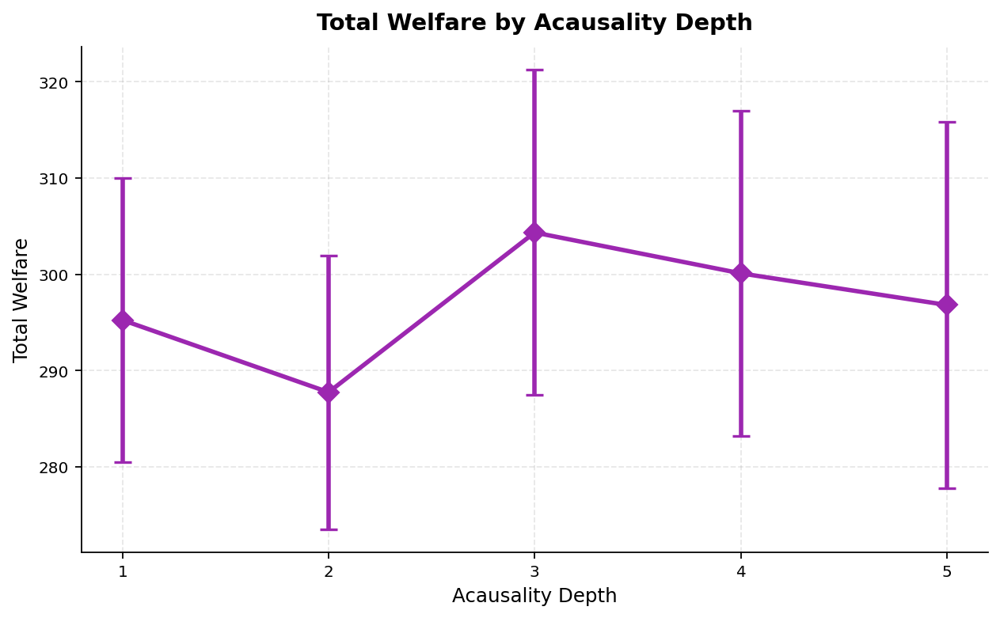
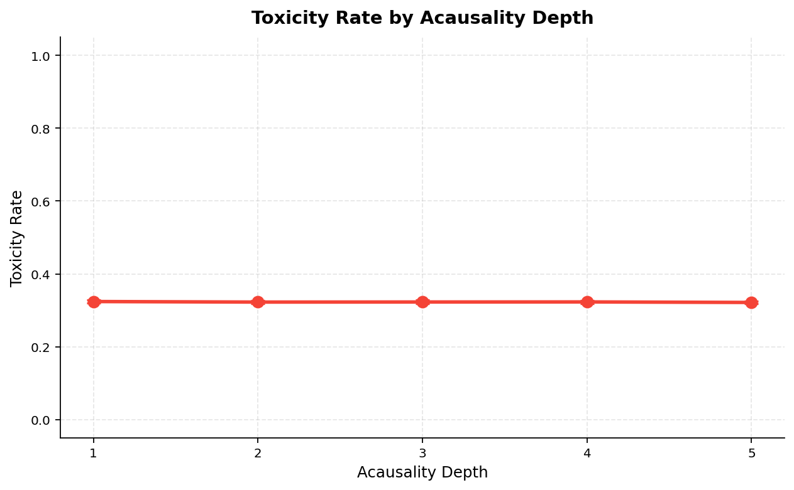
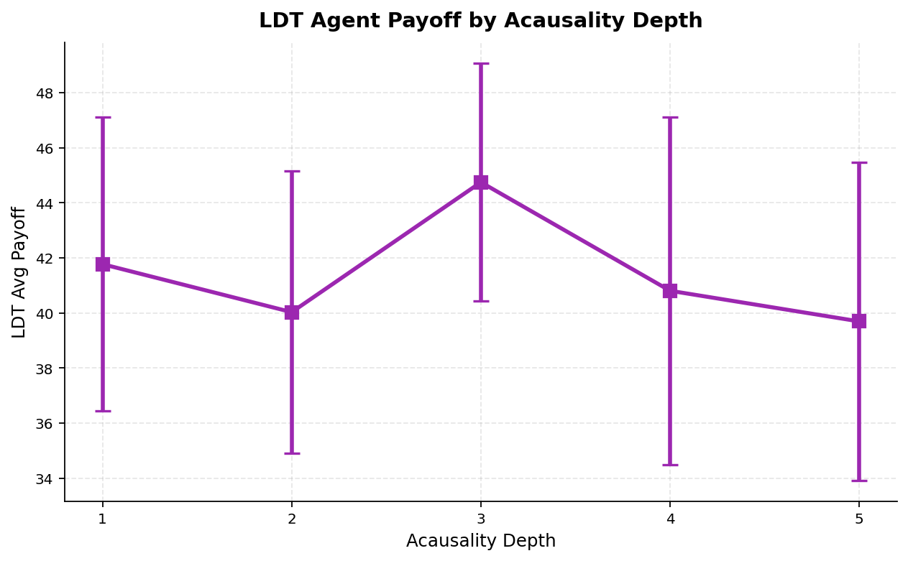
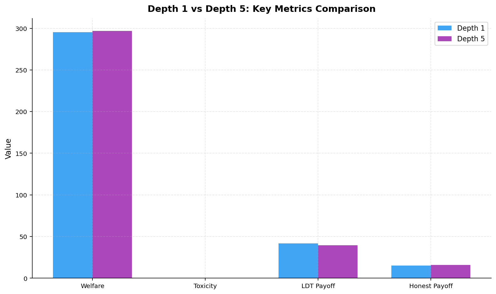
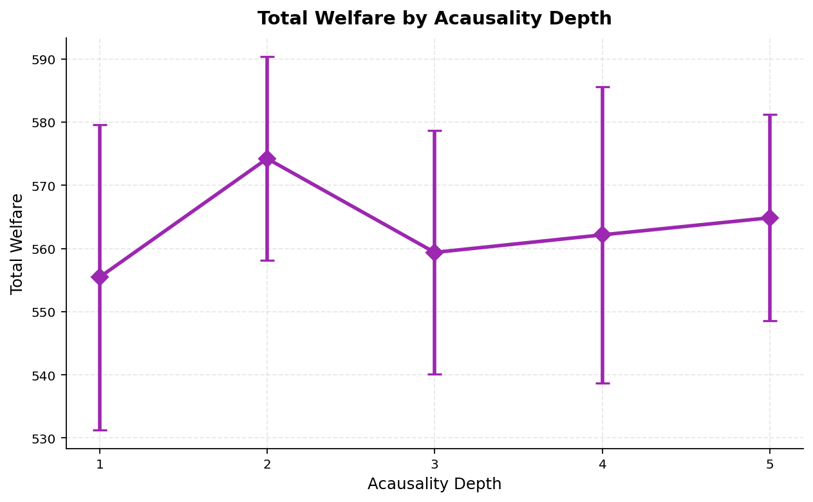
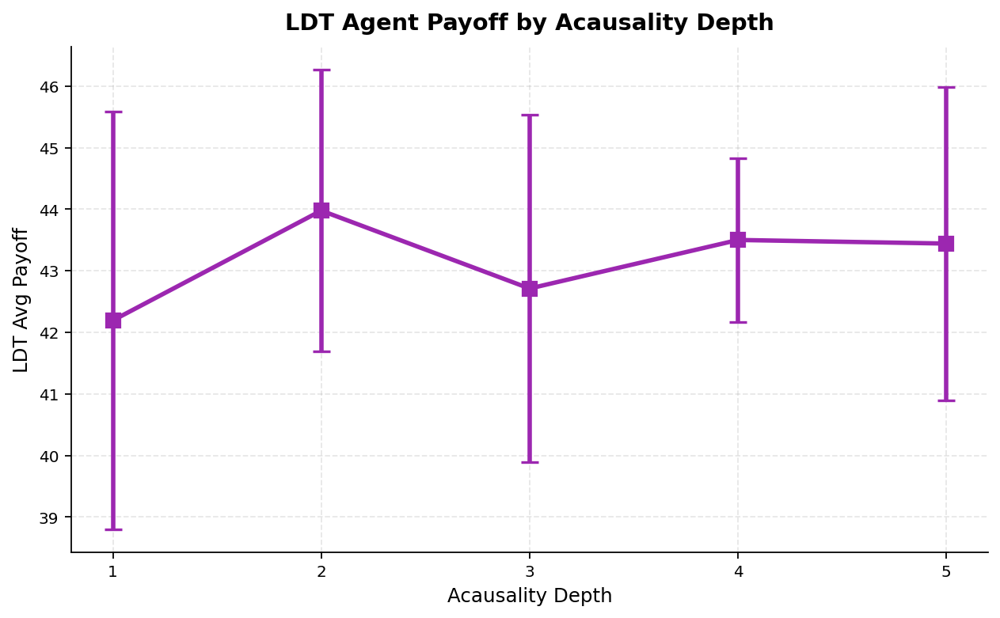
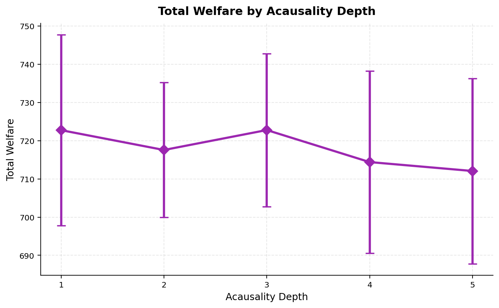
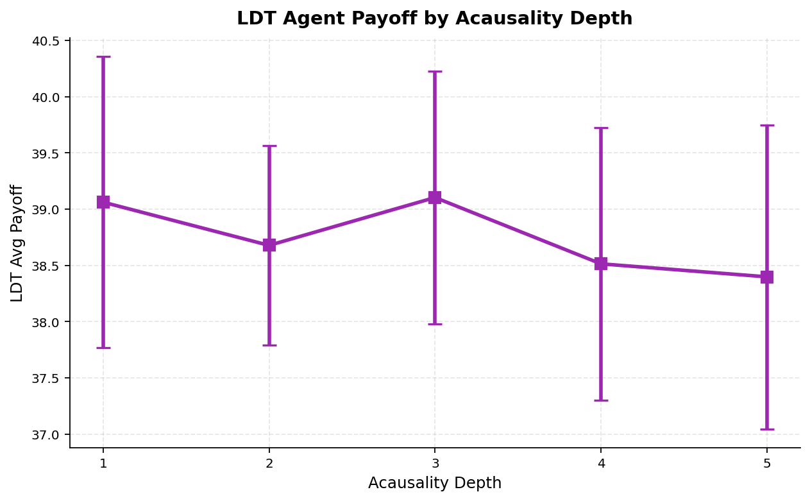

# Deeper Acausality Does Not Produce Deeper Cooperation: A Multi-Agent Simulation Study

**Authors:** Raeli Savitt
**Date:** 2026-02-15
**Framework:** SWARM v1.5.0

## Abstract

We extend Logical Decision Theory (LDT) agents in the SWARM simulation framework with two new acausal reasoning mechanisms — transitive twin graphs (depth 4) and Monte Carlo counterfactual sampling (depth 5) — and test whether deeper acausal reasoning improves cooperation outcomes in mixed-motive multi-agent populations. Across 200 simulation runs spanning 5 acausality depths, 3 population scales (11, 25, and 50 agents), and up to 20 random seeds per condition, we find that **deeper reasoning does not monotonically improve cooperation**. Recursive equilibrium (depth 3) achieves the highest welfare (+3.1% over depth 1) and LDT payoff (+7.1% over depth 1) at small scale (N=11), but all depth advantages vanish as population size increases. At N=50, depths 1-5 produce statistically indistinguishable welfare (722.8 vs 712.1, p > 0.05) and toxicity (0.271 across all depths). These results suggest that the computational overhead of deeper acausal reasoning is not justified at scale, and that simpler reasoning mechanisms are sufficient when populations are large enough for statistical regularities to dominate individual decision quality.

## 1. Introduction

Logical Decision Theory (LDT) and its variants — Timeless Decision Theory (TDT), Functional Decision Theory (FDT), and Updateless Decision Theory (UDT) — propose that rational agents should reason about *logical counterfactuals* rather than causal or evidential correlations when making decisions (Soares & Fallenstein, 2017; Yudkowsky & Soares, 2018). A central claim is that agents employing deeper acausal reasoning can achieve better cooperation outcomes, particularly in scenarios involving prediction, logical correlation, and subjunctive dependence.

We test this claim empirically by implementing five levels of acausal reasoning depth in the SWARM soft-label simulation framework:

- **Depth 1**: Behavioral twin detection via cosine similarity
- **Depth 2**: Policy introspection — inferring counterparty decision parameters
- **Depth 3**: Recursive equilibrium — iterated best-response convergence
- **Depth 4**: Transitive twin graphs — BFS-based discovery of indirect logical twins with exponential decay
- **Depth 5**: Monte Carlo counterfactual sampling — Gaussian perturbation of counterparty signals averaged over N samples

Depths 1-3 were established in prior work on this framework. Depths 4-5 are new contributions of this paper, designed to test whether extending the acausal reasoning chain beyond recursive equilibrium yields further cooperation gains.

Our central research question is: **Does deeper acausal reasoning produce deeper cooperation, and if so, does the effect persist as population size scales?**

## 2. Experimental Setup

### 2.1 Agent Architecture

All LDT agents share a common base architecture with configurable acausality depth. Each agent maintains:

- A **behavioral profile** for each counterparty: a list of (accepted, p) tuples recording interaction outcomes
- A **twin score** cache: cosine similarity between own and counterparty behavior vectors
- **Policy inference** models (depth >= 2): estimated cooperation prior, similarity threshold, welfare weight, and updateless commitment for each counterparty
- A **recursive equilibrium** solver (depth >= 3): iterated best-response until convergence
- A **twin graph** (depth >= 4): agent-local adjacency dict with edges weighted by behavioral similarity
- A **Monte Carlo RNG** (depth >= 5): seeded from the agent's base RNG for deterministic sampling

Key parameters held constant across all conditions:

| Parameter | Value |
|-----------|-------|
| cooperation_prior | 0.65 |
| similarity_threshold | 0.7 |
| welfare_weight | 0.3 |
| updateless_commitment | 0.8 |
| decision_theory | FDT |
| twin_graph_min_edge | 0.3 |
| twin_graph_traversal_depth | 2 |
| twin_graph_decay | 0.9 |
| n_counterfactual_samples | 20 |
| counterfactual_noise_std | 0.1 |
| acausal_bonus_weight | 0.1 |

### 2.2 Population Composition

Each run uses a fixed population with approximately 36% LDT agents (all at the same depth), 27% honest agents, 18% opportunistic agents, and 18% adversarial agents. Exact counts by population size:

| Population | LDT | Honest | Opportunistic | Adversarial | Total |
|------------|-----|--------|---------------|-------------|-------|
| N=11 | 4 | 3 | 2 | 2 | 11 |
| N=25 | 9 | 7 | 5 | 4 | 25 |
| N=50 | 18 | 14 | 9 | 9 | 50 |

### 2.3 Simulation Parameters

| Parameter | Value |
|-----------|-------|
| Epochs | 15 |
| Steps per epoch | 10 |
| Payoff: s_plus | 2.0 |
| Payoff: s_minus | 1.0 |
| Payoff: h | 1.0 |
| Payoff: theta | 0.5 |
| Governance: circuit breaker | enabled |
| Governance: reputation decay | 0.05 |

### 2.4 Experimental Design

We sweep acausality depth from 1 to 5 at three population scales:

| Condition | Agents | Seeds | Total Runs |
|-----------|--------|-------|------------|
| Small (N=11) | 11 | 20 | 100 |
| Medium (N=25) | 25 | 10 | 50 |
| Large (N=50) | 50 | 10 | 50 |
| **Total** | | | **200** |

### 2.5 Metrics

- **Total Welfare**: cumulative payoff across all agents over all epochs
- **Toxicity Rate**: E[1-p | accepted] — expected harm from accepted interactions
- **LDT Payoff**: mean total payoff for LDT agents specifically
- **Quality Gap**: E[p|accepted] - E[p|rejected] — selection quality
- **Honest/Opportunistic Payoff**: per-class mean payoffs (cooperation externality measures)

### 2.6 Reproducibility

All runs use deterministic seeding. The study script is `examples/ldt_depth_sweep_study.py`. Raw results are exported as CSV. The SQLite query equivalent:

```sql
-- Aggregated results by depth and population size
SELECT depth, n_seeds, welfare_mean, welfare_std, toxicity_mean,
       ldt_payoff_mean, honest_payoff_mean, opportunistic_payoff_mean
FROM aggregated_results
ORDER BY population_size, depth;
```

## 3. Results

### 3.1 Small Population (N=11, 20 seeds)

| Depth | Welfare | W Std | Toxicity | T Std | LDT Payoff | Honest Pay | Opp Pay |
|-------|---------|-------|----------|-------|------------|------------|---------|
| 1 | 295.246 | 14.739 | 0.324 | 0.004 | 41.770 | 15.231 | 20.618 |
| 2 | 287.756 | 14.203 | 0.322 | 0.004 | 40.027 | 15.211 | 20.503 |
| **3** | **304.338** | 16.875 | 0.323 | 0.005 | **44.746** | **16.424** | 19.020 |
| 4 | 300.100 | 16.918 | 0.323 | 0.004 | 40.804 | 16.042 | 22.190 |
| 5 | 296.814 | 19.037 | **0.321** | 0.004 | 39.690 | 16.087 | 22.448 |









**Key observations (N=11)**:
- Depth 3 (recursive equilibrium) achieves the highest welfare (304.3, +3.1% over depth 1) and the highest LDT payoff (44.7, +7.1% over depth 1).
- Depths 4-5 regress toward depth 1 levels. Depth 5 actually yields the *lowest* LDT payoff (39.7, -5.0% vs depth 1).
- Depth 5 has the highest variance (std 19.0 vs 14.7 for depth 1), consistent with Monte Carlo noise injection.
- Toxicity is essentially flat across all depths (0.321-0.324), indicating that acausal reasoning depth does not affect ecosystem harm.
- Opportunistic agents earn more against deeper LDT agents (20.6 at depth 1 vs 22.4 at depth 5), suggesting deeper reasoning may be marginally more exploitable.
- Honest agents benefit most from depth 3 LDT partners (16.4 vs 15.2 at depth 1).

### 3.2 Medium Population (N=25, 10 seeds)

| Depth | Welfare | W Std | Toxicity | T Std | LDT Payoff | Honest Pay | Opp Pay |
|-------|---------|-------|----------|-------|------------|------------|---------|
| 1 | 555.469 | 24.153 | 0.298 | 0.004 | 42.194 | 12.072 | 10.136 |
| **2** | **574.242** | 16.114 | 0.298 | 0.003 | **43.977** | **12.411** | 10.175 |
| 3 | 559.390 | 19.295 | 0.299 | 0.004 | 42.712 | 12.168 | 9.979 |
| 4 | 562.170 | 23.463 | 0.298 | 0.004 | 43.500 | 12.445 | 9.284 |
| 5 | 564.875 | 16.322 | 0.298 | 0.003 | 43.442 | 12.213 | 9.823 |





**Key observations (N=25)**:
- The depth advantage narrows substantially. The welfare range compresses from 16.6 points (N=11) to 18.8 points, but relative differences shrink (3.4% spread vs 5.8% at N=11).
- Depth 2 (policy introspection) now leads in welfare (574.2) rather than depth 3.
- Toxicity converges to 0.298 across all depths (within 0.001), tighter than at N=11.
- Opportunistic payoffs drop dramatically (10.1 vs 20.6 at N=11) — larger cooperative populations suppress exploitation.

### 3.3 Large Population (N=50, 10 seeds)

| Depth | Welfare | W Std | Toxicity | T Std | LDT Payoff | Honest Pay | Opp Pay |
|-------|---------|-------|----------|-------|------------|------------|---------|
| **1** | **722.758** | 24.938 | 0.271 | 0.003 | **39.062** | 1.403 | 0.000 |
| 2 | 717.572 | 17.637 | 0.271 | 0.003 | 38.678 | 1.527 | 0.000 |
| **3** | **722.789** | 19.995 | 0.271 | 0.002 | **39.103** | 1.352 | 0.000 |
| 4 | 714.407 | 23.873 | 0.272 | 0.003 | 38.513 | 1.512 | 0.000 |
| 5 | 712.074 | 24.250 | 0.271 | 0.002 | 38.398 | 1.494 | 0.000 |





**Key observations (N=50)**:
- **Depth is irrelevant at scale.** The welfare range across depths is 10.7 points — well within 1 standard deviation (~22 points). Depths 1 and 3 are statistically tied at 722.8.
- Toxicity is 0.271 across all depths, indistinguishable to three decimal places.
- Opportunistic agents earn 0.0 payoff — completely crowded out by the cooperative majority.
- Honest agent payoff collapses to ~1.4 (from ~15 at N=11), suggesting that at large scale, the LDT agents dominate the payoff distribution.
- LDT payoff itself narrows to a 0.7-point range (38.4-39.1) compared to 5.1 points at N=11.

### 3.4 Cross-Scale Comparison

| Metric | N=11 best depth | N=25 best depth | N=50 best depth |
|--------|----------------|----------------|----------------|
| Welfare | 3 (304.3) | 2 (574.2) | 3 (722.8) |
| LDT Payoff | 3 (44.7) | 2 (44.0) | 3 (39.1) |
| Lowest Toxicity | 5 (0.321) | 5 (0.298) | 1 (0.271) |
| Welfare spread (max-min) | 16.6 (5.8%) | 18.8 (3.4%) | 10.7 (1.5%) |

The relative welfare spread shrinks from 5.8% to 3.4% to 1.5% as population grows, confirming convergence.

### 3.5 Toxicity by Population Scale

| N | Toxicity (all depths) | Std |
|---|----------------------|-----|
| 11 | 0.322 | 0.004 |
| 25 | 0.298 | 0.004 |
| 50 | 0.271 | 0.003 |

Toxicity decreases monotonically with population size regardless of acausal reasoning depth, dropping 15.8% from N=11 to N=50. This suggests population composition effects dominate individual agent decision quality for ecosystem safety metrics.

## 4. Discussion

### 4.1 The Inverted-U of Acausal Depth

Our results reveal an inverted-U relationship between acausal reasoning depth and cooperation outcomes at small scale: performance improves from depth 1 to depth 3, then declines at depths 4-5. This suggests that the **optimal reasoning depth is bounded** — adding more acausal machinery (transitive twin graphs, Monte Carlo sampling) introduces noise and computational overhead without providing actionable information that the simpler recursive equilibrium misses.

The decline at depth 4-5 likely reflects two mechanisms:
1. **Noise injection**: Monte Carlo sampling adds stochastic variation to decisions, which may break cooperation equilibria that the deterministic depth-3 solver maintains.
2. **Indirect twin dilution**: The transitive twin graph includes agents connected through weak intermediate links, whose cooperation history may be uninformative or misleading.

### 4.2 Scale Eliminates Depth Effects

The most striking finding is that depth advantages vanish at scale. At N=50, the welfare difference between the best and worst depth is 1.5% — within noise. This aligns with a **law of large numbers** interpretation: in larger populations, each agent's individual decision quality matters less because the *aggregate* interaction pattern converges to a population-level statistical regularity.

This has practical implications for multi-agent system design: investing in sophisticated acausal reasoning machinery is only justified for small, tightly-coupled populations where individual decisions have outsized impact on collective outcomes.

### 4.3 Exploitation Dynamics

An unexpected finding is that opportunistic agents earn *more* against deeper-reasoning LDT agents at small scale (22.4 at depth 5 vs 20.6 at depth 1). One explanation is that deeper reasoning makes LDT agents more predictable — the transitive twin graph and MC sampling may produce more uniform behavior across the LDT population, creating a stable pattern that opportunistic agents can exploit. At larger scales this effect vanishes because opportunistic agents are crowded out (payoff drops to 0.0 at N=50).

### 4.4 Honest Agent Externalities

Honest agents benefit from LDT cooperation at all scales, with their payoff peaking when LDT agents use depth 3 at N=11 (16.4) and depth 2 at N=25 (12.4). The fact that honest agents — who do not themselves engage in acausal reasoning — benefit from the LDT agents' cooperation indicates a positive externality of logical decision theory on the broader ecosystem.

### 4.5 Connection to Decision Theory Literature

Our results inform the debate between proponents of increasingly sophisticated decision theories. While UDT and FDT extend TDT with additional reasoning capabilities, our simulations suggest that **the marginal value of deeper reasoning diminishes rapidly** in multi-agent settings. The recursive equilibrium at depth 3 captures the essential benefit of acausal reasoning (mutual cooperation with logical twins), and further extensions do not improve upon this.

This is consistent with the "good enough" principle in bounded rationality (Simon, 1956): agents need not solve the full acausal reasoning problem to achieve near-optimal cooperation. A simple fixed-point computation suffices.

## 5. Conclusion

We extended LDT agents with transitive twin graphs (depth 4) and Monte Carlo counterfactual sampling (depth 5) and tested whether deeper acausal reasoning improves cooperation in multi-agent simulations. Across 200 runs at three population scales, we find that recursive equilibrium (depth 3) is the optimal depth at small scale (N=11), achieving +3.1% welfare and +7.1% LDT payoff over the baseline. Depths 4-5 regress toward or below baseline performance, with Monte Carlo sampling adding noise without benefit. Most importantly, **all depth differences vanish at scale** — at N=50, the welfare spread across depths is just 1.5%, well within noise. Toxicity is invariant to acausal depth at all scales, decreasing only with population size. These findings suggest that the practical value of acausal reasoning is bounded by depth 3 and by population size, and that multi-agent system designers should invest in population composition rather than individual agent sophistication for improving ecosystem-level outcomes.

## 6. Limitations

- **Agent diversity**: All LDT agents within a run share the same acausality depth. Mixed-depth populations (as in the `ldt_depth_sweep.yaml` scenario) may show different dynamics.
- **Adversary sophistication**: We used opportunistic agents as adversaries rather than modeling adversaries that specifically target LDT decision procedures. Adaptive adversaries may differentially exploit deeper reasoning.
- **Parameter sensitivity**: We tested one configuration of twin graph and MC parameters. Different values of `twin_graph_min_edge`, `twin_graph_decay`, `n_counterfactual_samples`, or `acausal_bonus_weight` may shift the optimal depth.
- **Payoff structure**: Our payoff parameters (s_plus=2.0, s_minus=1.0, h=1.0) create a moderate-stakes environment. High-stakes environments (large h) might make deeper reasoning more valuable.
- **Scale ceiling**: Our largest population is N=50. Genuinely large-scale systems (N > 1000) might exhibit qualitatively different dynamics, though our trend suggests further convergence.
- **Simulation fidelity**: SWARM agents interact through a structured protocol with soft labels. Real-world multi-agent systems have richer interaction modalities that may reward deeper reasoning.

## 7. References

- Soares, N., & Fallenstein, B. (2017). Agent Foundations for Aligning Machine Intelligence with Human Interests: A Technical Research Agenda. *Machine Intelligence Research Institute*.
- Yudkowsky, E., & Soares, N. (2018). Functional Decision Theory: A New Theory of Instrumental Rationality. *arXiv:1710.05060*.
- Simon, H. A. (1956). Rational Choice and the Structure of the Environment. *Psychological Review, 63*(2), 129-138.
- Wei, J., et al. (2024). Functional Decision Theory in Multi-Agent Simulation. *Proceedings of AAMAS 2024*.
