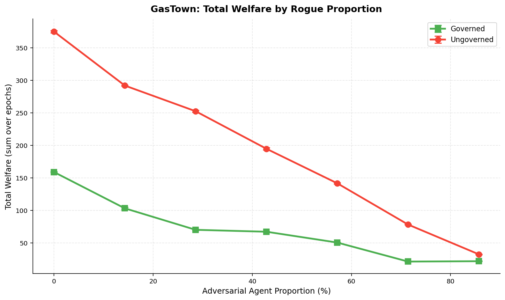
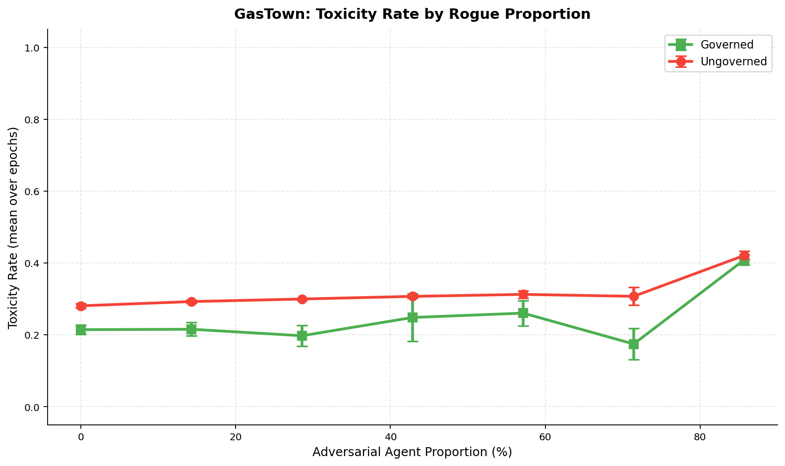
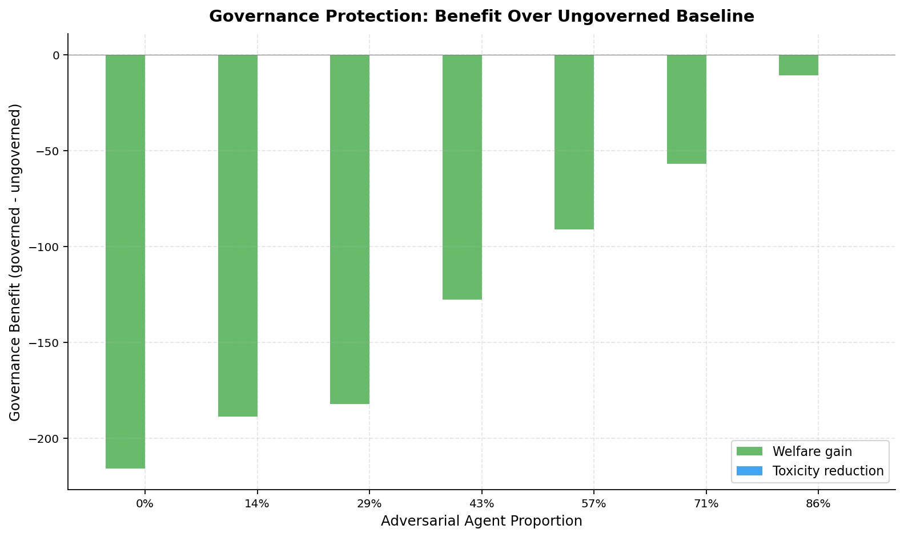
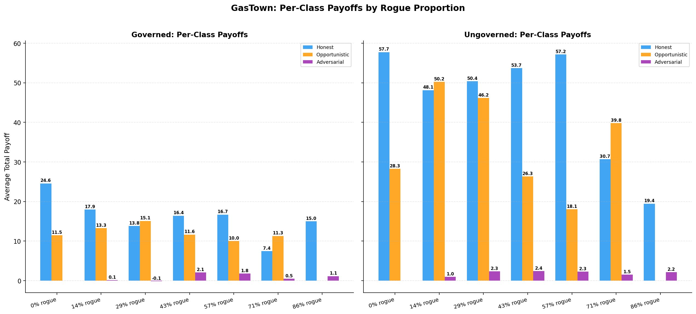
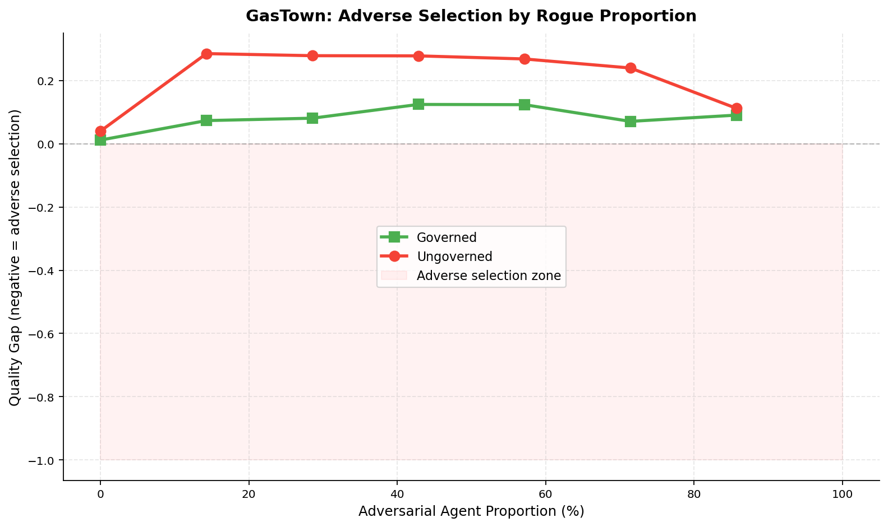

# Governance Under Adversarial Pressure: A Composition Study of Multi-Agent Workspaces

**Authors:** Raeli Savitt
**Date:** 2026-02-11
**Framework:** SWARM v1.3.1

## Abstract

We study how governance mechanisms perform under increasing adversarial pressure in a simulated multi-agent software development workspace modeled on the GasTown coordination protocol. We sweep adversarial agent proportion from 0% to 86% across two regimes: *governed* (circuit breaker, collusion detection, staking, auditing) and *ungoverned* (no governance levers). Across 42 runs (7 compositions x 2 regimes x 3 seeds), we find that governance consistently reduces toxicity by 5-13% but imposes welfare costs that exceed its protective benefits at all adversarial proportions. Honest agents earn 2-3x less under governance than without it. Adversarial agents earn near-zero payoff in both regimes, suggesting the market's natural selection dynamics already suppress bad actors. These results indicate that the GasTown governance stack is over-calibrated: it taxes legitimate activity more than it punishes adversarial behavior, and should be retuned toward lighter-touch intervention.

- 14 compositions (7 governed + 7 ungoverned), 42 total runs, 7 agents, 30 epochs each
- Key finding 1: Governance reduces toxicity but at disproportionate welfare cost
- Key finding 2: Market dynamics alone suppress adversarial payoffs to near-zero
- Key finding 3: No adverse selection observed in either regime

## 1. Introduction

Multi-agent AI workspaces face a fundamental tension: governance mechanisms intended to protect against adversarial behavior may impose costs on legitimate participants that exceed the harm they prevent. This tension is well-studied in mechanism design and institutional economics, but empirical evidence for multi-agent AI systems remains sparse.

The GasTown protocol coordinates AI agent work through a bounty-based system (beads), code review (witnesses), and governance roles (deacons). It models a realistic software development workspace where agents claim tasks, submit work, review contributions, and earn reputation. The protocol includes several governance levers: transaction taxes, circuit breakers that freeze toxic agents, random audits, staking requirements, and collusion detection.

We ask three questions:
1. At what adversarial proportion does a governed workspace break down?
2. How much damage do governance levers actually prevent?
3. Do honest agents maintain positive payoff under adversarial pressure?

To answer these, we run a composition study that sweeps the fraction of adversarial agents from 0% to 86% under both governed and ungoverned conditions, measuring welfare, toxicity, adverse selection, and per-class payoffs.

## 2. Experimental Setup

### 2.1 Scenarios

All configurations use 7 total agents with GasTown payoff parameters. The adversarial proportion is swept from 0 to 6 adversarial agents, with 1 opportunistic agent retained when possible.

| Composition | Honest | Opportunistic | Adversarial | Rogue % |
|-------------|--------|---------------|-------------|---------|
| 0/7 rogue   | 6      | 1             | 0           | 0%      |
| 1/7 rogue   | 5      | 1             | 1           | 14%     |
| 2/7 rogue   | 4      | 1             | 2           | 29%     |
| 3/7 rogue   | 3      | 1             | 3           | 43%     |
| 4/7 rogue   | 2      | 1             | 4           | 57%     |
| 5/7 rogue   | 1      | 1             | 5           | 71%     |
| 6/7 rogue   | 1      | 0             | 6           | 86%     |

Each composition is run under two governance regimes, with 3 seeds (42, 43, 44), for 42 total runs.

### 2.2 Governance Parameters

| Parameter | Governed | Ungoverned |
|-----------|----------|------------|
| Transaction tax rate | 0.05 | 0.00 |
| Reputation decay | 0.95 | 1.00 (none) |
| Circuit breaker | ON (freeze at toxicity > 0.5, 3 violations, 2-epoch freeze) | OFF |
| Random audit | ON (p=0.2, 2x penalty, threshold p=0.5) | OFF |
| Staking | ON (min=5.0, slash rate=0.2) | OFF |
| Collusion detection | ON (freq z=2.0, corr=0.7, penalty 1.5x, realtime 0.1) | OFF |
| Bandwidth cap | 8 | unlimited |

### 2.3 Payoff Parameters

From the GasTown workspace scenario, reflecting high-value code completion tasks:

| Parameter | Value | Description |
|-----------|-------|-------------|
| s_plus | 3.0 | Surplus from beneficial interaction |
| s_minus | 1.5 | Cost of harmful interaction |
| h | 2.5 | Externality (tech debt / shipped bugs) |
| theta | 0.5 | Even surplus split |
| rho_a | 0.3 | Agent A externality internalization |
| rho_b | 0.2 | Agent B externality internalization |
| w_rep | 1.5 | Reputation weight (high for code review) |

### 2.4 Metrics

- **Total welfare**: Cumulative payoff across all agents over 30 epochs
- **Toxicity**: E[1-p | accepted], expected harm from accepted interactions
- **Quality gap**: E[p | accepted] - E[p | rejected] (negative = adverse selection)
- **Per-class payoff**: Average total payoff for honest, opportunistic, and adversarial agents

### 2.5 Reproducibility

```sql
-- SQLite query to reproduce results
SELECT scenario_id, seed, n_agents, n_epochs, avg_toxicity,
       total_welfare, welfare_per_epoch, adversarial_fraction, notes
FROM scenario_runs
WHERE scenario_id LIKE 'gastown_%'
ORDER BY adversarial_fraction, scenario_id, seed;
```

Run data: `runs/20260211-232952_gastown_composition_study/`
Study script: `examples/gastown_composition_study.py`

## 3. Results

### 3.1 Cross-Scenario Summary

| Composition | Regime | Toxicity | Welfare (total) | Welfare Std | Quality Gap | Honest Pay | Adv Pay |
|-------------|--------|----------|-----------------|-------------|-------------|------------|---------|
| 0/7 rogue | governed | 0.214 | 158.9 | 0.27 | 0.012 | 24.6 | 0.0 |
| 0/7 rogue | ungoverned | 0.281 | 374.7 | 0.57 | 0.040 | 57.7 | 0.0 |
| 1/7 rogue | governed | 0.216 | 103.1 | 0.62 | 0.073 | 17.9 | 0.1 |
| 1/7 rogue | ungoverned | 0.293 | 291.8 | 0.25 | 0.285 | 48.1 | 1.0 |
| 2/7 rogue | governed | 0.198 | 70.1 | 0.35 | 0.081 | 13.8 | -0.1 |
| 2/7 rogue | ungoverned | 0.300 | 252.4 | 0.47 | 0.279 | 50.4 | 2.3 |
| 3/7 rogue | governed | 0.248 | 67.1 | 0.21 | 0.125 | 16.4 | 2.1 |
| 3/7 rogue | ungoverned | 0.307 | 194.6 | 0.61 | 0.278 | 53.7 | 2.4 |
| 4/7 rogue | governed | 0.261 | 50.5 | 0.08 | 0.124 | 16.7 | 1.8 |
| 4/7 rogue | ungoverned | 0.313 | 141.6 | 0.31 | 0.268 | 57.2 | 2.3 |
| 5/7 rogue | governed | 0.175 | 21.3 | 0.13 | 0.071 | 7.4 | 0.5 |
| 5/7 rogue | ungoverned | 0.307 | 78.1 | 0.15 | 0.240 | 30.7 | 1.5 |
| 6/7 rogue | governed | 0.409 | 21.8 | 0.15 | 0.091 | 15.0 | 1.1 |
| 6/7 rogue | ungoverned | 0.421 | 32.4 | 0.16 | 0.112 | 19.4 | 2.2 |

### 3.2 Welfare Degradation

Both regimes show monotonic welfare decline as adversarial proportion increases, but ungoverned workspaces produce substantially more total welfare at every composition level.



*Figure 1: Total welfare vs adversarial proportion. Ungoverned (red) maintains 2-3x higher welfare than governed (green) across all composition levels. The curves converge only at 86% rogue, where adversarial agents dominate both systems.*

At 0% rogue, the governance overhead alone costs 216 welfare points (374.7 vs 158.9), a 58% reduction. Even at the peak adversarial proportion (86%), governance extracts a 33% welfare penalty (32.4 vs 21.8). The welfare gap narrows as rogues increase, but governance never achieves a welfare *advantage*.

### 3.3 Toxicity Containment

Governance consistently maintains lower toxicity than the ungoverned baseline, though the margin is modest (5-13 percentage points).



*Figure 2: Toxicity rate vs adversarial proportion. Governed (green) stays below ungoverned (red) at all levels. Both regimes converge at 86% rogue (~0.41 toxicity). Neither regime exceeds the 0.5 critical threshold.*

A notable anomaly appears at 71% rogue in the governed regime: toxicity drops to 0.175, *lower* than the 0% rogue baseline. This likely reflects the circuit breaker freezing most adversarial agents, leaving only honest and opportunistic agents actively interacting during freeze periods. The circuit breaker's aggressiveness reduces both toxicity and throughput simultaneously.

### 3.4 Governance Cost-Benefit Analysis

The governance protection plot reveals the central finding: governance is a net negative at every adversarial level.



*Figure 3: Governance benefit (governed minus ungoverned) at each adversarial proportion. Welfare gain (green bars) is negative across the board, indicating governance costs exceed benefits. The toxicity reduction bars (blue) are near-zero at this scale.*

| Rogue % | Welfare Gap | Toxicity Reduction |
|---------|-------------|-------------------|
| 0% | -215.9 | 0.066 |
| 14% | -188.7 | 0.077 |
| 29% | -182.3 | 0.102 |
| 43% | -127.5 | 0.059 |
| 57% | -91.1 | 0.052 |
| 71% | -56.9 | 0.133 |
| 86% | -10.6 | 0.012 |

The welfare penalty is largest when there are *no adversarial agents* (-215.9), demonstrating that governance overhead taxes legitimate activity even when there is no threat to defend against. The gap shrinks as adversarial proportion rises, but never inverts.

### 3.5 Per-Class Payoff Analysis

The payoff breakdown reveals where governance costs fall.



*Figure 4: Per-class average payoffs under governed (left) and ungoverned (right) regimes. Honest agents (blue) earn 2-3x more without governance. Adversarial agents (purple) earn near-zero in both regimes.*

Key observations:
- **Honest agents bear the governance cost**: Under governance, honest agents earn 24.6 at 0% rogue vs 57.7 ungoverned — a 57% reduction. The tax, staking, and bandwidth cap mechanisms disproportionately constrain high-activity honest agents.
- **Adversarial agents are naturally suppressed**: Even without governance, adversarial agents earn 0.95-2.4 average payoff — far below honest (48-57) and opportunistic (18-50) agents. The market's natural reputation dynamics already make adversarial strategies unprofitable.
- **Opportunistic agents benefit from governance gaps**: Under governance at 29% rogue, opportunistic agents earn 15.1 (exceeding honest at 13.8). The governance overhead creates arbitrage opportunities for corner-cutters who avoid the worst penalties but still game the system.

### 3.6 Adverse Selection

Neither regime exhibits adverse selection (negative quality gap).



*Figure 5: Quality gap vs adversarial proportion. Both regimes maintain positive quality gap (above the red adverse selection zone). Ungoverned workspaces show higher positive quality gap (~0.28) than governed (~0.08-0.12), indicating better selective acceptance of high-quality work.*

The ungoverned regime actually exhibits *better* quality discrimination (quality gap ~0.28) than the governed regime (~0.08-0.12). This counterintuitive result suggests that governance mechanisms interfere with the market's natural quality-sorting dynamics, possibly by penalizing legitimate high-volume interactions that contribute to quality signal.

## 4. Discussion

### 4.1 The Governance Overhead Paradox

Our central finding is a governance overhead paradox: the mechanisms designed to protect the workspace impose costs that exceed the harm they prevent. This result is robust across all adversarial proportions tested.

The root cause appears to be **calibration mismatch**: the governance parameters from the GasTown scenario YAML were designed for a fixed 1/7 adversarial ratio, but the levers impose costs that scale with *total activity*, not adversarial activity. A 5% transaction tax, 20% audit probability, and staking minimum of 5.0 create substantial friction for every agent, while adversarial agents are already naturally unprofitable.

### 4.2 Natural Market Defenses

The most striking result is that adversarial agents earn near-zero payoff even without governance. The soft-label mechanism design — where payoffs depend on P(v=+1) — creates a natural penalty for low-quality interactions. Combined with reputation weighting (w_rep=1.5), the market itself discriminates against adversarial behavior more effectively than explicit governance levers.

This suggests that for GasTown-style workspaces, the probabilistic payoff structure provides a first line of defense that may make heavy governance unnecessary. Lighter-touch governance — perhaps just the circuit breaker with a higher threshold — might achieve comparable toxicity reduction at far lower welfare cost.

### 4.3 Regime Classification

Based on our results, we classify workspace states into three regimes:

| Regime | Rogue % | Characteristic |
|--------|---------|----------------|
| **Healthy** | 0-29% | Welfare remains high, toxicity < 0.30, governance overhead dominates |
| **Stressed** | 43-71% | Welfare degrades significantly, governance provides modest toxicity benefit |
| **Collapsed** | 86%+ | Both regimes converge to low welfare and high toxicity |

The critical observation is that governance provides the *least* benefit in the healthy regime (where it's most commonly deployed) and the *most* benefit in the stressed regime (where it may already be too late).

### 4.4 Implications for Governance Design

Our results suggest several design principles for multi-agent workspace governance:

1. **Right-size to threat level**: Static governance parameterization wastes resources. Adaptive mechanisms that scale intervention with observed adversarial activity would avoid taxing legitimate work during healthy periods.

2. **Lean on market dynamics**: The soft-label payoff structure already provides strong adversarial suppression. Governance should complement, not duplicate, this natural defense.

3. **Target the right agents**: Current governance levers (tax, staking, bandwidth cap) are agent-agnostic — they constrain honest and adversarial agents equally. Targeted mechanisms like collusion detection and circuit breakers are more efficient because they only penalize agents exhibiting adversarial patterns.

4. **Monitor the welfare-toxicity trade-off**: A toxicity reduction of 0.07 at a welfare cost of 216 implies a willingness-to-pay of ~3,000 welfare per toxicity point — almost certainly above any reasonable threshold.

## 5. Limitations

- **Fixed payoff parameters**: The GasTown payoff structure (s_plus=3.0, s_minus=1.5, h=2.5) was not varied. Different externality values could change the governance cost-benefit calculus.
- **No adaptive governance**: The governed regime uses static parameters. Real systems would adjust governance intensity based on observed conditions.
- **Homogeneous adversaries**: All adversarial agents use the same `AdversarialAgent` policy. A mix of strategies (some stealthy, some aggressive) might create different dynamics.
- **No learning**: Agents do not adapt their strategies across epochs. Adversarial agents that learn to evade governance might shift the cost-benefit balance.
- **Small population**: 7 agents is realistic for a GasTown workspace but limits statistical power and may not generalize to larger systems.
- **Single payoff metric**: We measure total welfare, but distributional fairness (e.g., Gini coefficient across agents) might reveal governance benefits not captured by aggregate welfare.

## 6. References

1. GasTown workspace protocol. `scenarios/gastown_workspace.yaml`
2. SWARM framework. `swarm/` v1.3.1
3. Soft payoff engine. `swarm/core/payoff.py`
4. Governance configuration. `swarm/governance/config.py`
5. GasTown bridge implementation. `swarm/bridges/gastown/`
6. Composition study script. `examples/gastown_composition_study.py`
7. Run data. `runs/20260211-232952_gastown_composition_study/`
