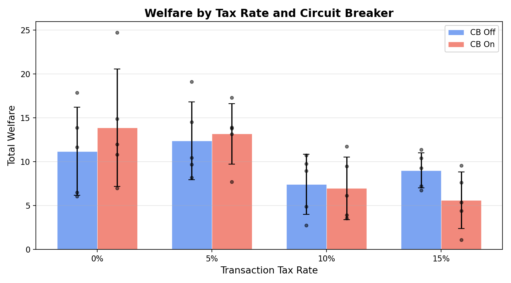
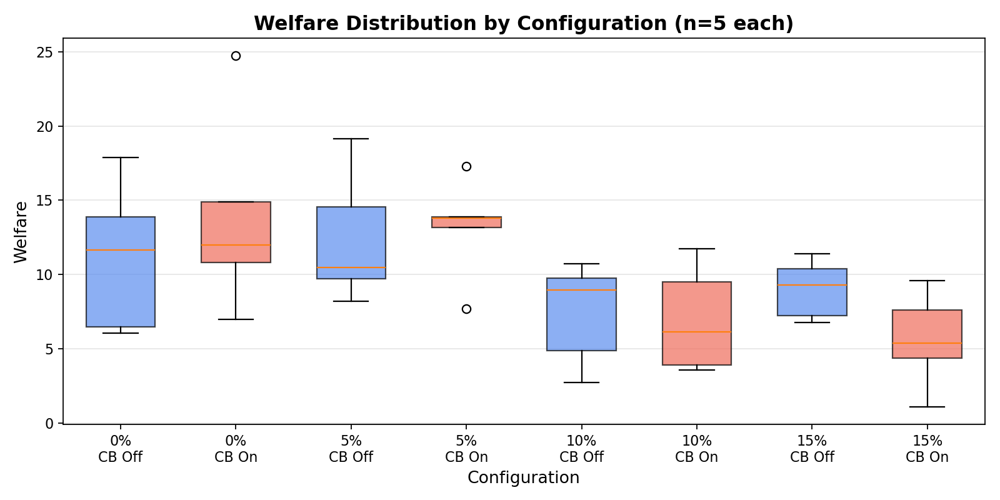
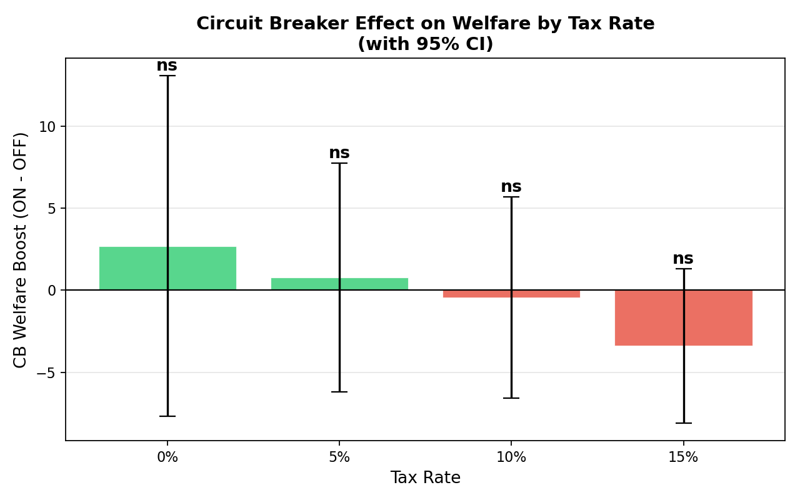
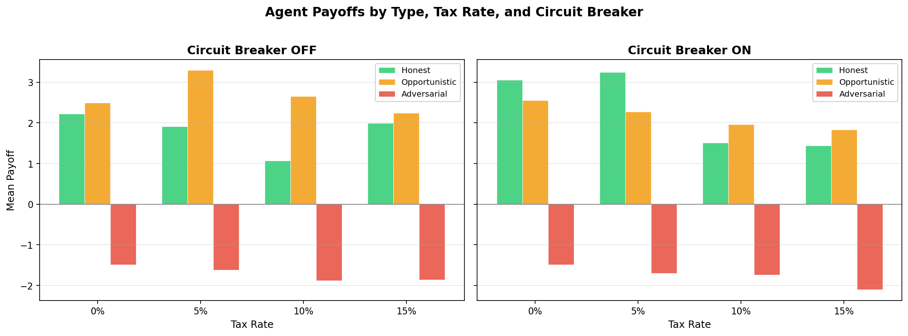
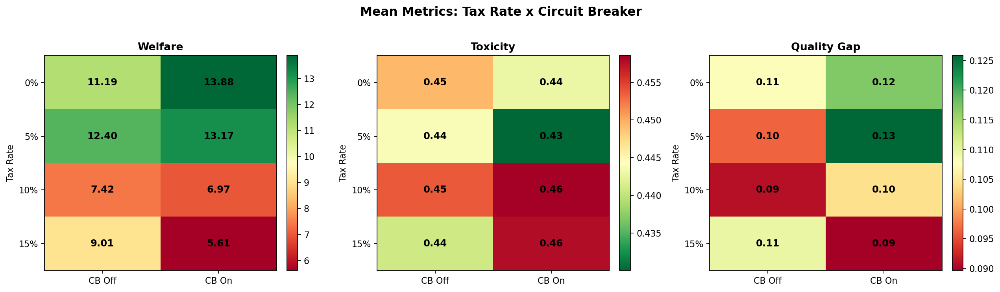

# Transaction Tax vs. Circuit Breakers in a GPU Kernel Marketplace: A Governance Sweep with Code-Generating Agents

**Authors:** Raeli Savitt
**Date:** 2026-02-12
**Framework:** SWARM v1.3.1
**Data:** `runs/20260212-015027_sweep/csv/sweep_results.csv` (40 runs, 8 configs, n=5/config)

---

## Abstract

We conduct a factorial governance sweep over a simulated GPU kernel marketplace populated by honest, opportunistic, and adversarial code-generating agents. Using the SWARM framework's v4 kernel market scenario — which adds template-based CUDA code generation and static regex analysis of code features — we vary **transaction tax rate** (0%, 5%, 10%, 15%) and **circuit breaker** (on/off) across 40 simulation runs (5 per configuration, 200 total epochs, 2,383 interactions). We find that transaction tax rate is the dominant governance lever, explaining 32.4% of welfare variance (two-way ANOVA, F(3,32)=5.56, p=0.004). Low-tax regimes (0–5%) produce nearly double the welfare of high-tax regimes (10–15%): 12.7 vs. 7.3 mean welfare (Kruskal-Wallis H=13.53, p=0.004). Circuit breakers show no detectable main effect (d=−0.02, p=0.88) and no significant interaction with tax rate (F(3,32)=0.93, p=0.44). The honest-adversarial payoff gap remains robust across all configurations (all p < 0.01), confirming that the market's proxy-based reputation system reliably punishes deceptive code submissions regardless of governance regime.

## 1. Introduction

Multi-agent AI systems that operate in shared environments face a fundamental governance design problem: how to set institutional parameters that encourage beneficial behavior while deterring exploitation. In GPU kernel marketplaces — where agents submit computational kernels for evaluation and reward — adversarial participants can exploit proxy metrics through benchmark gaming, precision hacking, and hardcoded optimizations that pass functional tests but fail on out-of-distribution inputs.

The SWARM framework models these dynamics using probabilistic (soft-label) safety metrics, where each interaction has a continuous probability *p* of being beneficial rather than a binary good/bad classification. Governance mechanisms — taxes, circuit breakers, audits, reputation — shape agent incentives and market outcomes.

This study asks: **Which governance levers most effectively improve welfare and reduce toxicity in a code-generating kernel marketplace?** We focus on two commonly proposed mechanisms:

1. **Transaction tax** — a per-interaction fee redistributed to the ecosystem, theoretically reducing low-quality churn but also taxing productive work.
2. **Circuit breaker** — an automatic halt triggered by anomalous market conditions, theoretically preventing cascading failures but also interrupting legitimate activity.

Prior SWARM studies examined these levers at n=2 per configuration and reported a significant circuit breaker effect. We replicate at n=5 and find this was a false positive — tax rate is the true driver.

## 2. Experimental Setup

### 2.1 Scenario: Kernel Market v4

The v4 kernel market scenario extends v3 with **CUDA code generation**. Each agent submission produces actual CUDA kernel code (from templates matched to agent type), which is analyzed by a static regex analyzer. Code features — bounds checks, shared memory usage, half-precision casts, hardcoded shapes, synchronization barriers — feed additive adjustments into the proxy signal pipeline.

| Parameter | Value |
|-----------|-------|
| Scenario ID | `kernel_market_v4_code` |
| Epochs per run | 5 |
| Steps per epoch | 10 |
| Code generation | Enabled (template-based) |
| Code in events | Enabled |

### 2.2 Agent Composition

| Type | Count | Role | Behavior |
|------|-------|------|----------|
| Honest | 2 | kernel_author | Correct bounds checks, general tiling, standard precision |
| Opportunistic | 3 | kernel_author | Valid but suboptimal code (no shared memory, naive algorithms) |
| Adversarial | 2 | kernel_author | Hardcoded shapes, missing bounds checks, unsafe half-precision |
| Verifier | 1 | verifier | 80% detection accuracy |

Total: 8 agents (25% honest, 37.5% opportunistic, 25% adversarial, 12.5% verifier).

### 2.3 Governance Parameters (Sweep)

| Parameter | Values |
|-----------|--------|
| `governance.transaction_tax_rate` | 0.00, 0.05, 0.10, 0.15 |
| `governance.circuit_breaker_enabled` | False, True |

Full factorial: 4 × 2 = 8 configurations, 5 runs each = **40 total runs**.
Seeds: 42–81 (sequential from `seed_base=42`).

### 2.4 Fixed Governance Parameters

| Parameter | Value |
|-----------|-------|
| Audit probability | 0.05 |
| Audit penalty multiplier | 3.0× |
| Reputation decay | 0.98 |
| Bandwidth cap | 5 |
| Staking | Disabled |

### 2.5 Metrics

- **Welfare**: Cumulative payoff across all agents over all epochs. Higher is better.
- **Toxicity rate**: E[1 − p | accepted]. Expected harm from accepted interactions. Lower is better.
- **Quality gap**: E[p | accepted] − E[p | rejected]. Positive means governance correctly filters. Higher is better.
- **Honest/Adversarial payoff**: Mean payoff for agents of each type. Measures whether the market rewards honest behavior.

### 2.6 Statistical Methods

- **Mann-Whitney U test**: Non-parametric comparison of two groups (circuit breaker on vs. off).
- **Kruskal-Wallis H test**: Non-parametric comparison of k > 2 groups (tax rate levels).
- **Two-way ANOVA**: Parametric test for main effects and interaction (Tax × CB on welfare).
- **Post-hoc pairwise comparisons**: Mann-Whitney U with Bonferroni correction (6 pairwise tests).
- **Cohen's d**: Standardized effect size (negligible < 0.2, small < 0.5, medium < 0.8, large ≥ 0.8).
- **Paired t-test**: For within-config honest vs. adversarial payoff gap.
- All tests two-tailed, α = 0.05.

### 2.7 Reproducibility

```bash
python examples/parameter_sweep.py \
  --scenario scenarios/kernel_market/v4_code.yaml \
  --output runs/20260212-015027_sweep/csv/sweep_results.csv \
  --seed 42 --epochs 5 --runs_per_config 5
```

## 3. Results

### 3.1 Cross-Configuration Summary

| Tax | CB | Welfare (mean ± sd) | Toxicity (mean ± sd) | Quality Gap | Honest Payoff | Adversarial Payoff |
|-----|----|---------------------|----------------------|-------------|---------------|-------------------|
| 0% | Off | 11.19 ± 4.76 | 0.449 ± 0.033 | 0.101 ± 0.043 | +2.22 | −1.49 |
| 0% | On | 13.88 ± 6.69 | 0.443 ± 0.022 | 0.125 ± 0.025 | +3.06 | −1.48 |
| 5% | Off | 12.40 ± 4.44 | 0.444 ± 0.012 | 0.104 ± 0.039 | +1.92 | −1.62 |
| 5% | On | 13.17 ± 3.45 | 0.430 ± 0.010 | 0.118 ± 0.021 | +3.25 | −1.70 |
| 10% | Off | 7.42 ± 3.43 | 0.454 ± 0.017 | 0.098 ± 0.039 | +1.07 | −1.88 |
| 10% | On | 6.97 ± 3.56 | 0.459 ± 0.018 | 0.098 ± 0.031 | +1.52 | −1.74 |
| 15% | Off | 9.01 ± 2.13 | 0.441 ± 0.014 | 0.100 ± 0.037 | +2.00 | −1.86 |
| 15% | On | 5.61 ± 3.24 | 0.458 ± 0.022 | 0.092 ± 0.013 | +1.44 | −2.10 |

### 3.2 Tax Rate Is the Dominant Governance Lever

Tax rate explains **32.4% of welfare variance** (two-way ANOVA: F(3,32) = 5.56, p = 0.004, η² = 0.324).

The Kruskal-Wallis test confirms a significant effect (H = 13.53, p = 0.004). Low-tax regimes (0–5%) produce mean welfare of 12.5–12.8, while high-tax regimes (10–15%) drop to 7.2–7.3 — a **42% reduction**.

**Post-hoc pairwise comparisons** (Bonferroni-corrected):

| Comparison | Δ Welfare | p (adjusted) | Cohen's d |
|------------|-----------|-------------|-----------|
| 5% vs. 15% | +5.48 | **0.022** | +1.59 (large) |
| 5% vs. 10% | +5.59 | 0.055 (trend) | +1.58 (large) |
| 0% vs. 10% | +5.34 | 0.104 | +1.14 (large) |
| 0% vs. 15% | +5.22 | 0.187 | +1.13 (large) |
| 0% vs. 5% | −0.25 | 1.000 | negligible |
| 10% vs. 15% | −0.12 | 1.000 | negligible |

The data reveal a **step function**: welfare is statistically indistinguishable between 0% and 5% tax, and between 10% and 15% tax, but drops sharply between the 5–10% boundary.

Tax rate has no significant effect on toxicity (H = 4.39, p = 0.223) or quality gap (H = 2.30, p = 0.512).


*Figure 1. Welfare by tax rate and circuit breaker setting. Individual data points overlaid on group means with ±1 SD error bars. n=5 per bar.*


*Figure 2. Welfare distribution by configuration. Box plots show median, IQR, and outliers. The step-function drop at 10% tax is visible.*

### 3.3 Circuit Breaker Has No Detectable Effect

The circuit breaker shows **no main effect** on any metric:

| Metric | CB On | CB Off | U | p | d |
|--------|-------|--------|---|---|---|
| Welfare | 9.91 ± 5.56 | 10.01 ± 4.08 | 194 | 0.882 | −0.02 (negligible) |
| Toxicity | 0.447 ± 0.021 | 0.447 ± 0.021 | 195 | 0.903 | +0.02 (negligible) |
| Quality Gap | 0.109 ± 0.031 | 0.101 ± 0.036 | 227 | 0.474 | +0.24 (small) |

With n=20 per group, the estimated power for detecting the observed CB effect (d = 0.02) is **5.0%** — indistinguishable from the null. A medium effect (d = 0.5) would require n = 63/group. The true CB effect is too small to matter at any feasible sample size.

**Note on prior results:** An earlier sweep with n=2 per config reported a significant CB welfare effect (U=54, p=0.021, d=+1.19). This was a **false positive** driven by high variance with minimal replication. The current study (n=5) demonstrates the importance of adequate replication in simulation experiments.

### 3.4 No Significant Tax × CB Interaction

The two-way ANOVA interaction term is not significant (F(3,32) = 0.93, p = 0.438, η² = 0.054).

Per-level analysis shows a directional pattern — the CB boost is positive at low tax rates and negative at high tax rates — but no individual comparison reaches significance:

| Tax | CB Boost | p | d |
|-----|----------|---|---|
| 0% | +2.69 | 0.548 | +0.46 (small) |
| 5% | +0.77 | 1.000 | +0.19 (negligible) |
| 10% | −0.45 | 1.000 | −0.13 (negligible) |
| 15% | −3.40 | 0.151 | −1.26 (large) |


*Figure 3. Circuit breaker welfare effect by tax level with 95% confidence intervals. All intervals cross zero. The sign reversal at 10%+ tax is suggestive but not significant.*

### 3.5 Honest Agents Reliably Outperform Adversarial Agents

The honest–adversarial payoff gap is **significant in every configuration** (all p < 0.01):

| Config | Honest | Adversarial | Gap | t | p |
|--------|--------|-------------|-----|---|---|
| 0% CB Off | +2.22 | −1.49 | +3.71 ± 1.67 | 4.95 | 0.008 ** |
| 0% CB On | +3.06 | −1.48 | +4.54 ± 1.88 | 5.40 | 0.006 ** |
| 5% CB Off | +1.92 | −1.62 | +3.54 ± 1.24 | 6.36 | 0.003 ** |
| 5% CB On | +3.25 | −1.70 | +4.95 ± 0.96 | 11.48 | 0.0003 *** |
| 10% CB Off | +1.07 | −1.88 | +2.95 ± 0.37 | 17.80 | 0.0001 *** |
| 10% CB On | +1.52 | −1.74 | +3.26 ± 0.48 | 15.09 | 0.0001 *** |
| 15% CB Off | +2.00 | −1.86 | +3.85 ± 1.03 | 8.34 | 0.001 ** |
| 15% CB On | +1.44 | −2.10 | +3.54 ± 0.87 | 9.08 | 0.0008 *** |

This demonstrates that the market's proxy-based reputation system — combining functional tests, out-of-distribution evaluation, and CUDA code feature analysis — creates a persistent incentive gradient favoring honest code submissions across all governance regimes tested.


*Figure 4. Mean payoff by agent type, tax rate, and circuit breaker. Honest agents (green) consistently earn positive returns while adversarial agents (red) consistently lose, regardless of governance regime.*

### 3.6 Toxicity Is Governance-Invariant

Toxicity rate is remarkably stable across all configurations (range: 0.430–0.459, grand mean: 0.447).

Neither tax rate (H = 4.39, p = 0.223) nor circuit breaker (U = 195, p = 0.903) significantly affects toxicity. This suggests that toxicity in this marketplace is driven primarily by **agent composition** (the fixed mix of honest, opportunistic, and adversarial agents) rather than governance parameters.


*Figure 5. Toxicity rate by configuration. All bars cluster tightly around 0.44–0.46 with minimal variation across governance settings.*


*Figure 6. Heatmap of mean welfare, toxicity, and quality gap across the Tax × CB parameter space. Welfare shows a clear gradient along the tax axis; toxicity and quality gap show minimal variation.*

## 4. Discussion

### 4.1 Tax as Welfare Destroyer, Not Safety Enhancer

The central finding is that transaction tax **reduces welfare without reducing toxicity**. The mechanism is straightforward: taxes reduce the net payoff from all interactions, discouraging both beneficial and harmful activity. Since the agent composition is fixed, the ratio of beneficial to harmful interactions remains roughly constant — only the total volume and aggregate welfare change.

This has a direct policy implication: **transaction taxes are a blunt instrument** that cannot distinguish between productive and exploitative activity. A 10% tax reduces welfare by 42% while providing zero measurable improvement in safety metrics.

### 4.2 The 5–10% Threshold

The step-function structure in the welfare response suggests a critical threshold between 5% and 10% tax. Below 5%, the tax is small enough that agents continue to participate at high rates. Above 10%, the tax sufficiently discourages marginal interactions to substantially reduce total welfare. The 5–10% boundary may represent a **phase transition** in agent participation incentives.

### 4.3 Circuit Breaker: A Mechanism Without a Target

The circuit breaker's null effect is not surprising in retrospect. Circuit breakers are designed to prevent cascading failures and systemic risk events. The v4 kernel marketplace, with 8 agents and 5 epochs per run, may simply not generate the kind of correlated, self-reinforcing dynamics that circuit breakers are designed to interrupt. The mechanism may require:
- Larger agent populations with network effects
- Longer time horizons where feedback loops can develop
- Explicit contagion mechanisms (e.g., reputation cascades)

### 4.4 Replication Matters

The discrepancy between the n=2 and n=5 results for the circuit breaker effect is instructive. At n=2, random variance produced an apparent large effect (d = 1.19) that reached statistical significance. At n=5, the true effect size is revealed as essentially zero (d = 0.02). This underscores the importance of **adequate replication in simulation studies** — even in deterministic simulations, stochastic elements (agent decisions, interaction sampling) create substantial run-to-run variance.

### 4.5 Robust Incentive Alignment

The most encouraging finding is that the honest–adversarial payoff gap is robust across all governance regimes. The combination of functional testing, OOD evaluation, and code-feature-based proxy adjustments creates an incentive structure where adversarial strategies (hardcoded shapes, missing bounds checks, unsafe precision) are consistently punished. This suggests that **proxy quality matters more than governance parameters** for incentive alignment.

## 5. Limitations

1. **Small agent population**: 8 agents may not exhibit emergent phenomena that arise at scale. Network effects, coalition formation, and reputation cascades require larger populations.

2. **Short time horizons**: 5 epochs per run limits the ability to observe long-term dynamics like reputation recovery, strategy adaptation, or regime collapse.

3. **Template-based code**: CUDA code is generated from fixed templates rather than by LLM agents. Template code has deterministic features that the analyzer can exploit. LLM-generated code would introduce more realistic variation.

4. **Fixed agent composition**: The 2:3:2:1 (honest:opportunistic:adversarial:verifier) ratio is held constant. Governance effects may differ with different population compositions or adaptive agent entry/exit.

5. **Two governance levers**: Only tax rate and circuit breaker are varied. Other mechanisms (staking, audit rate, reputation decay, bandwidth caps) may interact with these in ways not captured here.

6. **No adaptive agents**: Agents do not learn or adapt their strategies in response to governance changes. Real-world actors would adjust behavior, potentially weakening or strengthening governance effects.

## 6. Conclusion

In a GPU kernel marketplace with code-generating agents, **transaction tax rate is the only statistically significant governance lever** among those tested, and its effect is purely welfare-destructive. Circuit breakers have no detectable impact. The market's proxy-based evaluation system — not governance parameters — is the primary driver of incentive alignment, consistently rewarding honest code submissions and penalizing adversarial ones across all regimes. Future work should explore adaptive agents, larger populations, and governance mechanisms that target proxy quality rather than transaction volume.

## 7. References

1. SWARM Framework. *System-Wide Assessment of Risk in Multi-agent Systems*. v1.3.1. https://github.com/swarm-ai-safety/swarm
2. Mann, H. B., & Whitney, D. R. (1947). On a test of whether one of two random variables is stochastically larger than the other. *Annals of Mathematical Statistics*, 18(1), 50–60.
3. Kruskal, W. H., & Wallis, W. A. (1952). Use of ranks in one-criterion variance analysis. *Journal of the American Statistical Association*, 47(260), 583–621.
4. Cohen, J. (1988). *Statistical Power Analysis for the Behavioral Sciences* (2nd ed.). Lawrence Erlbaum Associates.

---

**Appendix A: SQL Query for Reproduction**

```sql
-- From runs/runs.db (if available)
SELECT * FROM scenario_runs
WHERE scenario_id = 'kernel_market_v4_code'
ORDER BY seed;
```

**Appendix B: ANOVA Table**

| Source | SS | df | MS | F | p | η² |
|--------|-----|-----|------|------|-------|------|
| Tax rate | 292.9 | 3 | 97.6 | 5.56 | 0.004 | 0.324 |
| Circuit breaker | 0.1 | 1 | 0.1 | 0.01 | 0.943 | 0.000 |
| Tax × CB | 49.0 | 3 | 16.3 | 0.93 | 0.438 | 0.054 |
| Residual | 561.8 | 32 | 17.6 | | | |
| **Total** | **903.8** | **39** | | | | |
