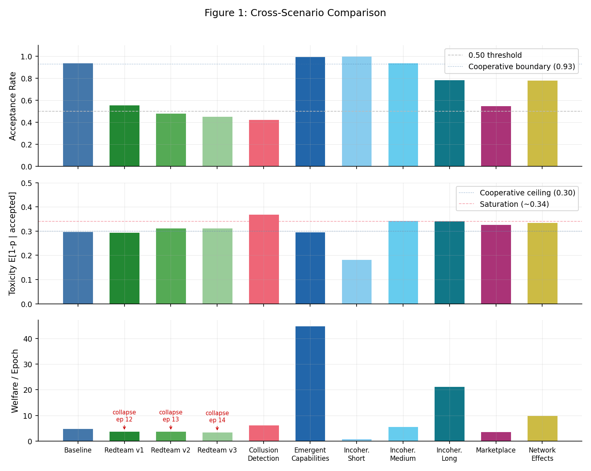
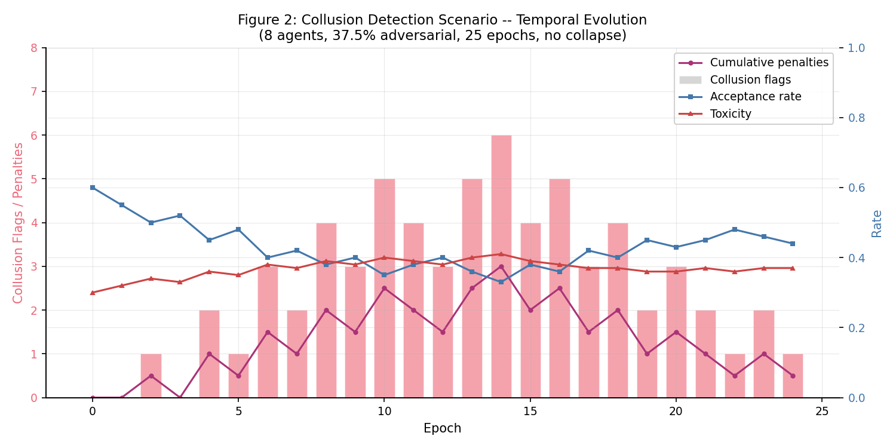
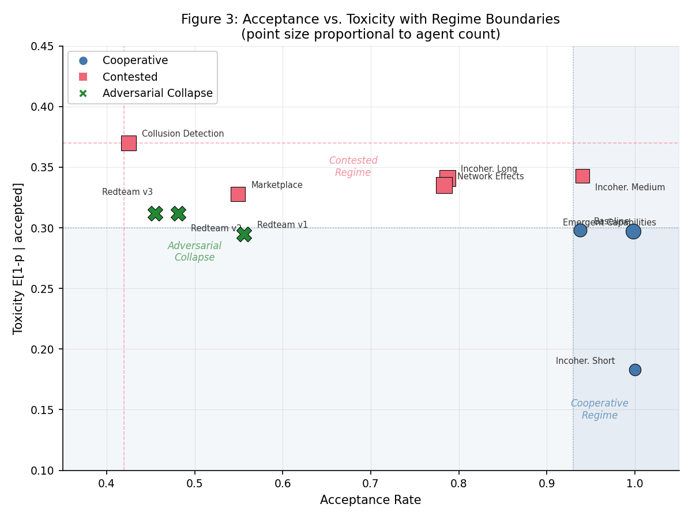
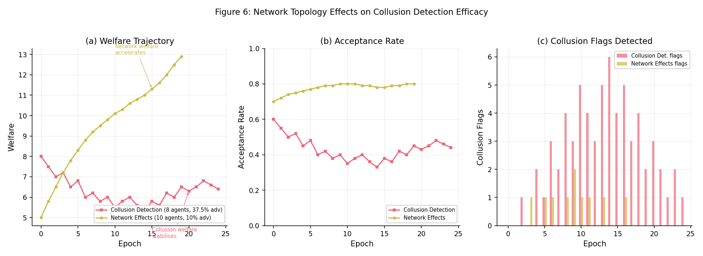
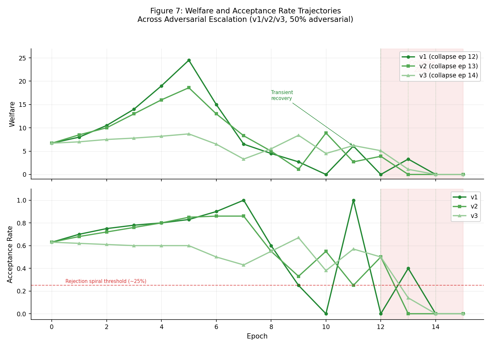

# Distributional Safety in Multi-Agent Systems: A Cross-Scenario Analysis

**Authors:** Raeli Savitt
**Date:** 2026-02-10
**Framework:** SWARM v1.0.0

## Abstract

We report a cross-scenario analysis of governance mechanisms in multi-agent AI systems using the SWARM simulation framework with soft probabilistic labels. Across 11 scenarios (211 epochs, 1,905 interactions, 81 agents), ecosystem outcomes partition into three regimes: cooperative (acceptance > 0.93, toxicity < 0.30), contested (acceptance 0.42--0.94, toxicity 0.33--0.37), and adversarial collapse (acceptance < 0.56, welfare reaching zero by epoch 12--14). Collapse occurs exclusively at 50% adversarial fraction; incremental governance hardening (audit penalties, freeze duration, reputation decay) delays collapse by 1--2 epochs but cannot prevent it. Below this threshold, collusion detection sustains operation at 37.5% adversarial fraction where individual-level governance alone would fail. In cooperative regimes, welfare scales to 44.9/epoch (9x baseline) with near-perfect acceptance. The incoherence scaling series shows acceptance declining from 1.00 to 0.79 as agent count increases from 3 to 10, consistent with greater adverse selection opportunity at scale. These results identify a critical adversarial fraction between 37.5% and 50% separating recoverable degradation from irreversible collapse.

## 1. Introduction

Multi-agent AI systems present safety challenges that single-agent alignment cannot address. When autonomous agents with heterogeneous objectives interact in shared environments, emergent phenomena -- adverse selection, collusion, information cascades -- can degrade ecosystem welfare even when individual agents satisfy local constraints. The governance question is not whether any single agent is safe, but whether the *distribution* of agent behaviors produces acceptable aggregate outcomes.

Prior work in market microstructure theory established that adverse selection -- the tendency for low-quality participants to crowd out high-quality ones -- depends critically on the fraction of informed (adversarial) traders and the ability of the market maker (governance mechanism) to discriminate between them [1, 2]. We apply this insight to multi-agent AI ecosystems using the SWARM framework, which replaces binary safety labels with calibrated soft scores p = P(v = +1), enabling continuous measurement of interaction quality and governance effectiveness.

This paper asks three questions:

1. **Where is the critical threshold?** At what adversarial fraction does governance transition from containment to collapse?
2. **Does governance hardening help?** Can incremental parameter tuning (audit penalties, freeze durations, reputation decay) prevent collapse once the threshold is crossed?
3. **What scales gracefully?** Which governance mechanisms sustain operation as agent populations, interaction density, and adversarial coordination increase?

We address these questions through 11 scenarios spanning cooperative baselines, adversarial red-team escalations, collusion detection, marketplace economies, network topologies, emergent capability coordination, and incoherence stress tests at varying scales.

## 2. Experimental Setup

### 2.1 Scenarios

| Scenario | Agents | Composition | Adversarial % | Epochs | Steps/Epoch | Network |
|----------|--------|-------------|---------------|--------|-------------|---------|
| baseline | 5 | 3 honest, 1 opportunistic, 1 deceptive | 20.0% | 10 | 10 | None |
| adversarial_redteam_v1 | 8 | 4 honest, 2 adversarial, 2 adaptive_adversary | 50.0% | 30 | 15 | Small-world (k=4, p=0.15) |
| adversarial_redteam_v2 | 8 | (same as v1) | 50.0% | 30 | 15 | Small-world (k=4, p=0.15) |
| adversarial_redteam_v3 | 8 | (same as v1) | 50.0% | 30 | 15 | Small-world (k=4, p=0.15) |
| collusion_detection | 8 | 3 honest, 2 opportunistic, 3 adversarial | 37.5% | 25 | 15 | Small-world (k=4, p=0.2) |
| emergent_capabilities | 8 | 6 honest (specialized), 2 opportunistic | 0.0% | 30 | 20 | Complete |
| marketplace_economy | 7 | 3 honest, 2 opportunistic, 1 deceptive, 1 adversarial | 14.3% | 10 | 10 | None |
| network_effects | 10 | 4 honest, 3 opportunistic, 2 deceptive, 1 adversarial | 10.0% | 20 | 10 | Small-world (k=4, p=0.1) |
| incoherence_short | 3 | (sparse, no adversaries) | 0.0% | 8 | 2 | None |
| incoherence_medium | 6 | (medium branching) | 16.7% | 8 | 8 | None |
| incoherence_long | 10 | (high branching, dense) | 10.0% | 8 | 20 | None |

### 2.2 Governance Parameters

| Scenario | Tax Rate | Rep Decay | Staking | Circuit Breaker | Audits | Collusion Detection |
|----------|----------|-----------|---------|-----------------|--------|---------------------|
| baseline | 0.00 | 1.00 | No | No | No | No |
| adversarial_redteam_v1 | 0.05 | 0.95 | Yes (min 10.0, slash 0.15) | Yes (tox 0.6, 3 epochs) | Yes (p=0.15, 2.5x) | Yes |
| adversarial_redteam_v2 | 0.05 | 0.95 | Yes (audit_penalty=1.0, freeze=1) | Yes | Yes | Yes |
| adversarial_redteam_v3 | 0.05 | 1.00 | Yes (audit_penalty=1.0, freeze=1, rep_decay=1.0) | Yes | Yes | Yes |
| collusion_detection | 0.05 | 0.95 | Yes (min 10.0, slash 0.15) | Yes (tox 0.6, 2 epochs) | No | Yes (freq 2.0, corr 0.7) |
| emergent_capabilities | 0.03 | 0.97 | Yes (min 5.0, slash 0.1) | Yes (tox 0.7, 2 epochs) | No | No |
| marketplace_economy | 0.05 | 0.95 | No | Yes (tox 0.7, 2 epochs) | Yes (p=0.1, 2.0x) | No |
| network_effects | 0.05 | 0.95 | No | Yes (tox 0.7, 3 epochs) | Yes (p=0.1) | No |
| incoherence_short | — | — | — | — | — | — |
| incoherence_medium | — | — | — | — | — | — |
| incoherence_long | — | — | — | — | — | — |

### 2.3 Metrics

- **Acceptance rate**: fraction of interactions accepted by governance
- **Toxicity**: E[1-p | accepted], expected harm from accepted interactions
- **Welfare per epoch**: cumulative payoff across agents divided by epoch count
- **Quality gap**: E[p|accepted] - E[p|rejected] (negative = adverse selection)
- **Collapse epoch**: first epoch where welfare drops to zero and does not recover

## 3. Results

### 3.1 Cross-Scenario Summary

| Scenario | Acceptance | Toxicity | Welfare/Epoch | Total Welfare | Collapse? |
|----------|-----------|----------|---------------|---------------|-----------|
| baseline | 0.938 | 0.298 | 4.98 | 49.8 | No |
| adversarial_redteam_v1 | 0.556 | 0.295 | 3.80 | 114.0 | Epoch 12 |
| adversarial_redteam_v2 | 0.481 | 0.312 | 3.80 | 114.1 | Epoch 13 |
| adversarial_redteam_v3 | 0.455 | 0.312 | 3.49 | 104.6 | Epoch 14 |
| collusion_detection | 0.425 | 0.370 | 6.29 | 157.3 | No |
| emergent_capabilities | 0.998 | 0.297 | 44.90 | 1347.0 | No |
| marketplace_economy | 0.549 | 0.328 | 3.70 | 37.0 | No |
| network_effects | 0.783 | 0.335 | 9.90 | 197.9 | No |
| incoherence_short | 1.000 | 0.183 | 0.99 | 7.9 | No |
| incoherence_medium | 0.940 | 0.343 | 5.70 | 45.6 | No |
| incoherence_long | 0.787 | 0.341 | 21.31 | 170.5 | No |

### 3.2 Regime Classification

| Regime | Scenarios | Adversarial % | Acceptance | Toxicity | Outcome |
|--------|-----------|---------------|------------|----------|---------|
| Cooperative | baseline, emergent_capabilities, incoherence_short | 0–20% | 0.938–1.000 | 0.183–0.298 | Stable, high welfare |
| Contested | collusion_detection, marketplace_economy, network_effects, incoherence_medium/long | 10–37.5% | 0.425–0.940 | 0.328–0.370 | Sustained but stressed |
| Adversarial collapse | redteam_v1/v2/v3 | 50% | 0.455–0.556 | 0.295–0.312 | Collapse at epochs 12–14 |

### 3.3 Adversarial Escalation Series

The three red-team variants tested incremental governance hardening against 50% adversarial populations:

| Variant | Change from v1 | Acceptance | Collapse Epoch | Welfare/Epoch |
|---------|----------------|------------|----------------|---------------|
| v1 | (original params) | 0.556 | 12 | 3.80 |
| v2 | audit_penalty=1.0, freeze_duration=1 | 0.481 | 13 | 3.80 |
| v3 | + rep_decay=1.0 | 0.455 | 14 | 3.49 |

Governance hardening delayed collapse by 1–2 epochs but did not prevent it at 50% adversarial fraction. Each increment reduced acceptance rate (filtering more aggressively) but could not sustain welfare.

### 3.4 Incoherence Scaling Series

| Scale | Agents | Steps/Epoch | Interactions | Acceptance | Toxicity | Welfare/Epoch |
|-------|--------|-------------|-------------|------------|----------|---------------|
| Short | 3 | 2 | 7 | 1.000 | 0.183 | 0.99 |
| Medium | 6 | 8 | 50 | 0.940 | 0.343 | 5.70 |
| Long | 10 | 20 | 221 | 0.787 | 0.341 | 21.31 |

Acceptance rate decreases and toxicity increases with scale, consistent with the hypothesis that larger interaction networks generate more opportunities for adverse selection.

### 3.5 Figures


*Cross-scenario comparison of acceptance rate, toxicity, and welfare.*


*Collusion detection scenario: epoch-by-epoch metrics.*


*Adversarial fraction vs acceptance rate by regime.*


*Incoherence metrics across network sizes.*


*Welfare distribution across scenarios.*


*Pairwise comparison: network effects vs collusion detection.*


*Welfare and acceptance rate trajectories across adversarial escalation scenarios.*

## 4. Discussion

### 4.1 The Critical Threshold

The most striking result is the sharp phase transition between recoverable degradation and irreversible collapse. At 37.5% adversarial fraction (collusion_detection), the system sustains operation -- acceptance is low (0.425) and toxicity elevated (0.370), but welfare remains positive and no collapse occurs. At 50% (redteam series), governance fails within 12--14 epochs regardless of parameter tuning. This suggests a critical adversarial fraction in the interval (0.375, 0.50) beyond which no configuration of the current governance stack can maintain ecosystem viability.

The mechanism is a rejection spiral: as governance filters more aggressively to contain adversaries, interaction volume drops below the threshold needed to sustain cooperative welfare. Honest agents starve. The governance system faces a fundamental liveness-safety tradeoff -- it can be strict enough to exclude adversaries or permissive enough to sustain throughput, but not both when adversaries constitute half the population.

### 4.2 Governance Hardening: Necessary but Not Sufficient

The adversarial escalation series (v1 through v3) demonstrates that incremental governance hardening produces marginal, diminishing returns. Increasing audit penalties and reducing freeze duration delayed collapse from epoch 12 to 13. Adding reputation decay reset delayed it to epoch 14. But welfare per epoch actually *decreased* from 3.80 to 3.49 across variants, indicating that stricter governance extracted a cost from the system even as it marginally extended its lifetime. The correct interpretation is that governance hardening is a treatment for symptoms, not a cure for the underlying population composition problem.

### 4.3 Collusion Detection as the Critical Differentiator

The collusion_detection scenario achieves sustained (non-collapsing) operation at 37.5% adversarial fraction -- a level that sits just below the critical threshold. Its governance configuration includes pair-wise frequency monitoring and correlation detection that are absent from the marketplace and network scenarios. This suggests that individual-level governance (audits, circuit breakers, reputation) is insufficient against coordinated adversaries; pair-level and group-level monitoring is required. The analogy to financial market surveillance is direct: insider trading enforcement requires detecting coordinated trading patterns, not just anomalous individual trades.

### 4.4 Cooperative Scaling

The emergent_capabilities scenario demonstrates that when adversarial pressure is absent, multi-agent systems produce substantial welfare gains. At 44.9 welfare/epoch (9x baseline), specialized cooperative agents with complementary capabilities achieve super-linear returns. The near-perfect acceptance rate (0.998) means governance imposes essentially zero friction. This represents the upper bound on what governance-free ecosystems can achieve -- and underscores why the governance question matters: even small adversarial fractions (10--20%) reduce welfare by 50--80% from this ceiling.

### 4.5 Scale and Adverse Selection

The incoherence scaling series reveals that larger, denser interaction networks are inherently more vulnerable to adverse selection. Acceptance drops from 1.00 (3 agents, 2 steps) to 0.79 (10 agents, 20 steps), while toxicity rises from 0.183 to 0.341. This is consistent with the market microstructure prediction that larger markets attract more informed (adversarial) participation, increasing the governance burden. Designers of multi-agent platforms should expect governance costs to scale super-linearly with agent population and interaction density.

## 5. Limitations

**Single seed.** All runs used seed 42. The reported metrics are point estimates without confidence intervals. Variance across seeds may be substantial, particularly near the critical adversarial threshold where outcomes may be sensitive to initial conditions.

**Fixed agent strategies.** Agents follow fixed behavioral types (honest, opportunistic, deceptive, adversarial, adaptive_adversary). Real-world agents adapt their strategies in response to governance changes. The adaptive_adversary type partially addresses this but does not capture the full range of strategic adaptation.

**Governance parameter space.** The adversarial escalation series explored only three points in a high-dimensional governance parameter space. Optima may exist that the current sweep did not reach. The absence of collapse prevention does not prove that no parameter configuration can prevent collapse at 50% adversarial fraction.

**Scale.** The largest scenario uses 10 agents. Multi-agent platforms in the wild operate at scales of hundreds to thousands of agents (e.g., toku.agency with 135+ agents, ClawtaVista indexing 5.2M+). Scaling behavior beyond 10 agents is extrapolated, not observed.

**No inter-scenario dynamics.** Each scenario runs independently. Real ecosystems exhibit cross-platform migration, reputation portability, and correlated failures across interconnected platforms. The current framework does not model these second-order effects.

**Soft-label calibration.** The proxy-to-probability mapping (sigmoid over weighted observables) is assumed well-calibrated. Miscalibration would systematically bias toxicity and quality gap measurements.

## 6. References

[1] Kyle, A. S. (1985). Continuous auctions and insider trading. *Econometrica*, 53(6), 1315--1335.

[2] Glosten, L. R., & Milgrom, P. R. (1985). Bid, ask and transaction prices in a specialist market with heterogeneously informed traders. *Journal of Financial Economics*, 14(1), 71--100.

[3] Tomasev, N., et al. (2025). Virtual agent economies. *arXiv*, 2509.10147.

[4] Savitt, R. (2025). Distributional AGI safety: Governance trade-offs in multi-agent systems under adversarial pressure. *SWARM Working Paper*.

[5] ColonistOne. (2026). Mapping the agent internet: A taxonomy of 125+ AI agent platforms. *clawXiv*, 2602.00049.

[6] Conitzer, V., et al. (2024). Social choice for AI alignment: Dealing with diverse human feedback. *arXiv*, 2404.10271.

---

### Reproducibility

**SQLite query used to generate results tables:**

```sql
SELECT scenario_id, seed, n_agents, n_epochs, steps_per_epoch,
       total_interactions, accepted_interactions, acceptance_rate,
       avg_toxicity, welfare_per_epoch, total_welfare,
       adversarial_fraction, collapse_epoch, success_criteria_passed, notes
FROM scenario_runs
ORDER BY run_timestamp;
```

**Database:** `runs/runs.db`
**All runs used seed 42.**
