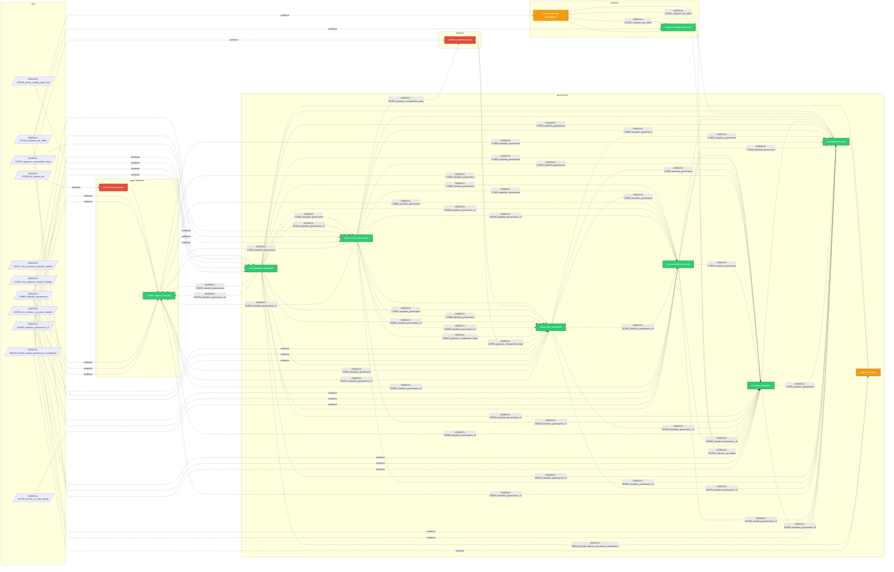

# Claim relationship and evidence dependency graph

Auto-generated by `scripts/claim-graph.py`.

```mermaid
graph LR
    subgraph agent_behavior["agent-behavior"]
        claim_rlhf_persona_invariant["rlhf-persona-invariant"]
        claim_smarter_agents_earn_less["smarter-agents-earn-less"]
    end
    subgraph collusion["collusion"]
        claim_collusion_penalty_destabilizes["collusion-penalty-destabilizes"]
        claim_collusion_wealth_destruction["collusion-wealth-destruction"]
    end
    subgraph governance["governance"]
        claim_circuit_breakers_dominate["circuit-breakers-dominate"]
        claim_governance_cost_paradox["governance-cost-paradox"]
        claim_quality_gate_dominates["quality-gate-dominates"]
        claim_staking_backfires["staking-backfires"]
        claim_tax_dominates_cb_kernel["tax-dominates-cb-kernel"]
        claim_tax_phase_transition["tax-phase-transition"]
        claim_tax_welfare_tradeoff["tax-welfare-tradeoff"]
    end
    subgraph memory["memory"]
        claim_memory_promotion_gate["memory-promotion-gate"]
    end
    subgraph runs["runs"]
        20260211_000149_kernel_market_governance_comparison[/"20260211-000149_kernel_market_governance_comparison"/]
        20260210_235049_kernel_market_audit_rate[/"20260210-235049_kernel_market_audit_rate"/]
        20260213_173805_baseline_governance[/"20260213-173805_baseline_governance"/]
        20260213_202050_baseline_governance_v2[/"20260213-202050_baseline_governance_v2"/]
        20260213_221500_collusion_tax_effect[/"20260213-221500_collusion_tax_effect"/]
        20260211_232952_gastown_composition_study[/"20260211-232952_gastown_composition_study"/]
        20260211_234038_pi_claude_live[/"20260211-234038_pi_claude_live"/]
        20260210_225121_rlm_recursive_collusion_seed42[/"20260210-225121_rlm_recursive_collusion_seed42"/]
        20260210_212323_rlm_collusion_sweep_10seeds[/"20260210-212323_rlm_collusion_sweep_10seeds"/]
        20260210_225330_rlm_memory_as_power_seed42[/"20260210-225330_rlm_memory_as_power_seed42"/]
        20260214_113750_kernel_v4_code_sweep[/"20260214-113750_kernel_v4_code_sweep"/]
    end

    claim_circuit_breakers_dominate -.- claim_staking_backfires
    claim_circuit_breakers_dominate -.- claim_tax_welfare_tradeoff
    claim_collusion_penalty_destabilizes -.- claim_tax_welfare_tradeoff
    claim_collusion_wealth_destruction -.- claim_collusion_penalty_destabilizes
    claim_governance_cost_paradox -.- claim_tax_welfare_tradeoff
    claim_governance_cost_paradox -.- claim_quality_gate_dominates
    claim_memory_promotion_gate -.- claim_quality_gate_dominates
    claim_quality_gate_dominates -.- claim_circuit_breakers_dominate
    claim_rlhf_persona_invariant -.- claim_smarter_agents_earn_less
    claim_smarter_agents_earn_less -.- claim_circuit_breakers_dominate
    claim_tax_dominates_cb_kernel -.- claim_tax_welfare_tradeoff
    claim_tax_dominates_cb_kernel -.- claim_circuit_breakers_dominate
    claim_tax_dominates_cb_kernel -.- claim_tax_phase_transition
    claim_tax_phase_transition -.- claim_tax_welfare_tradeoff
    claim_tax_welfare_tradeoff -.- claim_staking_backfires
    claim_circuit_breakers_dominate -..->|20260211-000149_kernel_market_governance_comparison| claim_staking_backfires
    claim_circuit_breakers_dominate -..->|20260213-173805_baseline_governance| claim_governance_cost_paradox
    claim_circuit_breakers_dominate -..->|20260213-173805_baseline_governance| claim_quality_gate_dominates
    claim_circuit_breakers_dominate -..->|20260213-173805_baseline_governance| claim_smarter_agents_earn_less
    claim_circuit_breakers_dominate -..->|20260213-173805_baseline_governance| claim_tax_dominates_cb_kernel
    claim_circuit_breakers_dominate -..->|20260213-173805_baseline_governance| claim_tax_phase_transition
    claim_circuit_breakers_dominate -..->|20260213-173805_baseline_governance| claim_tax_welfare_tradeoff
    claim_governance_cost_paradox -..->|20260213-173805_baseline_governance| claim_quality_gate_dominates
    claim_governance_cost_paradox -..->|20260213-173805_baseline_governance| claim_smarter_agents_earn_less
    claim_governance_cost_paradox -..->|20260213-173805_baseline_governance| claim_tax_dominates_cb_kernel
    claim_governance_cost_paradox -..->|20260213-173805_baseline_governance| claim_tax_phase_transition
    claim_governance_cost_paradox -..->|20260213-173805_baseline_governance| claim_tax_welfare_tradeoff
    claim_quality_gate_dominates -..->|20260213-173805_baseline_governance| claim_smarter_agents_earn_less
    claim_quality_gate_dominates -..->|20260213-173805_baseline_governance| claim_tax_dominates_cb_kernel
    claim_quality_gate_dominates -..->|20260213-173805_baseline_governance| claim_tax_phase_transition
    claim_quality_gate_dominates -..->|20260213-173805_baseline_governance| claim_tax_welfare_tradeoff
    claim_smarter_agents_earn_less -..->|20260213-173805_baseline_governance| claim_tax_dominates_cb_kernel
    claim_smarter_agents_earn_less -..->|20260213-173805_baseline_governance| claim_tax_phase_transition
    claim_smarter_agents_earn_less -..->|20260213-173805_baseline_governance| claim_tax_welfare_tradeoff
    claim_tax_dominates_cb_kernel -..->|20260213-173805_baseline_governance| claim_tax_phase_transition
    claim_tax_dominates_cb_kernel -..->|20260213-173805_baseline_governance| claim_tax_welfare_tradeoff
    claim_tax_phase_transition -..->|20260213-173805_baseline_governance| claim_tax_welfare_tradeoff
    claim_circuit_breakers_dominate -..->|20260213-202050_baseline_governance_v2| claim_governance_cost_paradox
    claim_circuit_breakers_dominate -..->|20260213-202050_baseline_governance_v2| claim_quality_gate_dominates
    claim_circuit_breakers_dominate -..->|20260213-202050_baseline_governance_v2| claim_smarter_agents_earn_less
    claim_circuit_breakers_dominate -..->|20260213-202050_baseline_governance_v2| claim_tax_dominates_cb_kernel
    claim_circuit_breakers_dominate -..->|20260213-202050_baseline_governance_v2| claim_tax_phase_transition
    claim_circuit_breakers_dominate -..->|20260213-202050_baseline_governance_v2| claim_tax_welfare_tradeoff
    claim_governance_cost_paradox -..->|20260213-202050_baseline_governance_v2| claim_quality_gate_dominates
    claim_governance_cost_paradox -..->|20260213-202050_baseline_governance_v2| claim_smarter_agents_earn_less
    claim_governance_cost_paradox -..->|20260213-202050_baseline_governance_v2| claim_tax_dominates_cb_kernel
    claim_governance_cost_paradox -..->|20260213-202050_baseline_governance_v2| claim_tax_phase_transition
    claim_governance_cost_paradox -..->|20260213-202050_baseline_governance_v2| claim_tax_welfare_tradeoff
    claim_quality_gate_dominates -..->|20260213-202050_baseline_governance_v2| claim_smarter_agents_earn_less
    claim_quality_gate_dominates -..->|20260213-202050_baseline_governance_v2| claim_tax_dominates_cb_kernel
    claim_quality_gate_dominates -..->|20260213-202050_baseline_governance_v2| claim_tax_phase_transition
    claim_quality_gate_dominates -..->|20260213-202050_baseline_governance_v2| claim_tax_welfare_tradeoff
    claim_smarter_agents_earn_less -..->|20260213-202050_baseline_governance_v2| claim_tax_dominates_cb_kernel
    claim_smarter_agents_earn_less -..->|20260213-202050_baseline_governance_v2| claim_tax_phase_transition
    claim_smarter_agents_earn_less -..->|20260213-202050_baseline_governance_v2| claim_tax_welfare_tradeoff
    claim_tax_dominates_cb_kernel -..->|20260213-202050_baseline_governance_v2| claim_tax_phase_transition
    claim_tax_dominates_cb_kernel -..->|20260213-202050_baseline_governance_v2| claim_tax_welfare_tradeoff
    claim_tax_phase_transition -..->|20260213-202050_baseline_governance_v2| claim_tax_welfare_tradeoff
    claim_collusion_penalty_destabilizes -..->|20260213-221500_collusion_tax_effect| claim_collusion_wealth_destruction
    claim_collusion_penalty_destabilizes -..->|20260213-221500_collusion_tax_effect| claim_tax_phase_transition
    claim_collusion_wealth_destruction -..->|20260213-221500_collusion_tax_effect| claim_tax_phase_transition
    claim_governance_cost_paradox -..->|20260211-232952_gastown_composition_study| claim_memory_promotion_gate
    claim_governance_cost_paradox -..->|20260211-232952_gastown_composition_study| claim_quality_gate_dominates
    claim_memory_promotion_gate -..->|20260211-232952_gastown_composition_study| claim_quality_gate_dominates
    20260211_000149_kernel_market_governance_comparison -..->|evidence| claim_circuit_breakers_dominate
    20260211_000149_kernel_market_governance_comparison -..->|evidence| claim_staking_backfires
    20260210_235049_kernel_market_audit_rate -..->|evidence| claim_circuit_breakers_dominate
    20260213_173805_baseline_governance -..->|evidence| claim_circuit_breakers_dominate
    20260213_173805_baseline_governance -..->|evidence| claim_governance_cost_paradox
    20260213_173805_baseline_governance -..->|evidence| claim_quality_gate_dominates
    20260213_173805_baseline_governance -..->|evidence| claim_smarter_agents_earn_less
    20260213_173805_baseline_governance -..->|evidence| claim_tax_dominates_cb_kernel
    20260213_173805_baseline_governance -..->|evidence| claim_tax_phase_transition
    20260213_173805_baseline_governance -..->|evidence| claim_tax_welfare_tradeoff
    20260213_202050_baseline_governance_v2 -..->|evidence| claim_circuit_breakers_dominate
    20260213_202050_baseline_governance_v2 -..->|evidence| claim_governance_cost_paradox
    20260213_202050_baseline_governance_v2 -..->|evidence| claim_quality_gate_dominates
    20260213_202050_baseline_governance_v2 -..->|evidence| claim_smarter_agents_earn_less
    20260213_202050_baseline_governance_v2 -..->|evidence| claim_tax_dominates_cb_kernel
    20260213_202050_baseline_governance_v2 -..->|evidence| claim_tax_phase_transition
    20260213_202050_baseline_governance_v2 -..->|evidence| claim_tax_welfare_tradeoff
    20260213_221500_collusion_tax_effect -..->|evidence| claim_collusion_penalty_destabilizes
    20260213_221500_collusion_tax_effect -..->|evidence| claim_collusion_wealth_destruction
    20260213_221500_collusion_tax_effect -..->|evidence| claim_tax_phase_transition
    20260211_232952_gastown_composition_study -..->|evidence| claim_governance_cost_paradox
    20260211_232952_gastown_composition_study -..->|evidence| claim_memory_promotion_gate
    20260211_232952_gastown_composition_study -..->|evidence| claim_quality_gate_dominates
    20260211_234038_pi_claude_live -..->|evidence| claim_rlhf_persona_invariant
    20260210_225121_rlm_recursive_collusion_seed42 -..->|evidence| claim_smarter_agents_earn_less
    20260210_212323_rlm_collusion_sweep_10seeds -..->|evidence| claim_smarter_agents_earn_less
    20260210_225330_rlm_memory_as_power_seed42 -..->|evidence| claim_smarter_agents_earn_less
    20260214_113750_kernel_v4_code_sweep -..->|evidence| claim_tax_dominates_cb_kernel

    style claim_circuit_breakers_dominate fill:#2ecc71,stroke:#333,color:#fff
    style claim_collusion_penalty_destabilizes fill:#f39c12,stroke:#333,color:#fff
    style claim_collusion_wealth_destruction fill:#2ecc71,stroke:#333,color:#fff
    style claim_governance_cost_paradox fill:#2ecc71,stroke:#333,color:#fff
    style claim_memory_promotion_gate fill:#e74c3c,stroke:#333,color:#fff
    style claim_quality_gate_dominates fill:#2ecc71,stroke:#333,color:#fff
    style claim_rlhf_persona_invariant fill:#e74c3c,stroke:#333,color:#fff
    style claim_smarter_agents_earn_less fill:#2ecc71,stroke:#333,color:#fff
    style claim_staking_backfires fill:#f39c12,stroke:#333,color:#fff
    style claim_tax_dominates_cb_kernel fill:#2ecc71,stroke:#333,color:#fff
    style claim_tax_phase_transition fill:#2ecc71,stroke:#333,color:#fff
    style claim_tax_welfare_tradeoff fill:#2ecc71,stroke:#333,color:#fff
```

<!-- topics: claims, evidence, graph, methods -->
